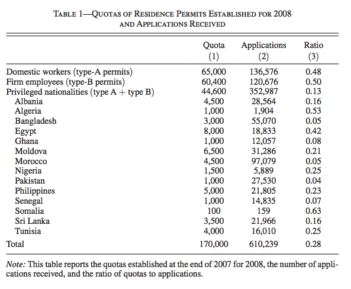
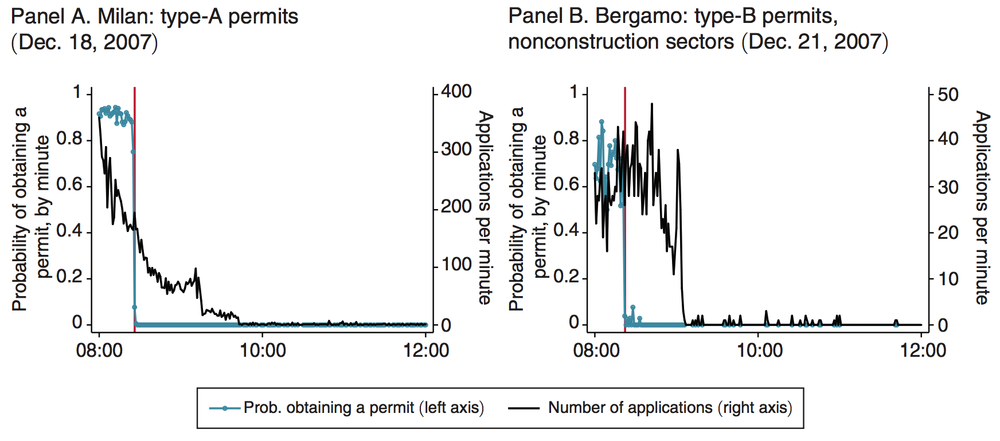
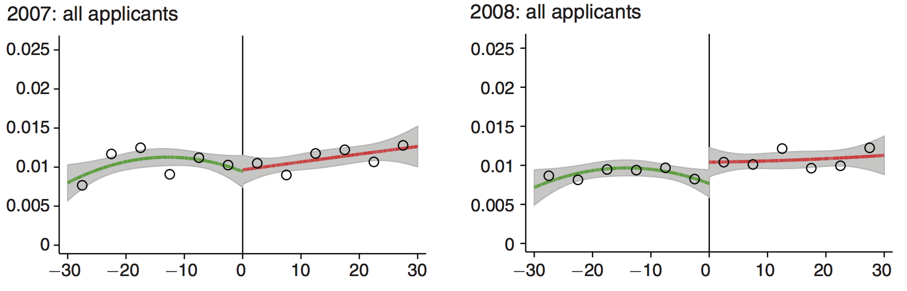

layout: true

<div class="my-footer"></div> 

---

```{r setup, include=FALSE,warning=FALSE,message=FALSE}
options(htmltools.dir.version = FALSE)
knitr::opts_chunk$set(
  message = FALSE,
  warning = FALSE,
  dev = "svg",
  cache = TRUE,
  fig.align = "center"
  #fig.width = 11,
  #fig.height = 5
)

# define vars
om = par("mar")
lowtop = c(om[1],om[2],0.1,om[4])

overwrite = FALSE

library(tidyverse)
library(ggplot2)
library(grid)
library(pBrackets) 
library(emo)
library(viridis)

  # set seed
set.seed(1234)

```

layout: true

<div class="my-footer"></div> 

---

# Regression Discontinuity Design (RDD)

* We have seen one "program evaluation" method in the last lecture: __difference-in-differences__.

--

* In this lecture, we will cover another popular and rigorous program evaluation method: __regression discontinuity__.

--

* Starting point: subjects are not randomly allocated to treatment `r emo::ji("warning")`

--

* Many arbitrary rules in life:
  
--
  
  - In North Carolina, you used to have to have reached the age of five by October 16 in the relevant year to be eligible to enter kindergarten [(Cook and Kang, 2016)](https://pubs.aeaweb.org/doi/pdfplus/10.1257/app.20140323);
  
--
  
  - In the US, a new born baby weighing less than 1,500 grams is considered to be of "very low birth weight" [(Almond et al., 2010)](https://academic.oup.com/qje/article/125/2/591/1882183).

--

* __RDD:__ allocation to treatment is ***as good as random***!

---

# An Example: Alcohol Consumption and Mortality

## I've created a set of slides with this new example (which is a Sharp RDD and for which data is available but I've let the other slides I'd made using the Pinotti paper example at the end)

--

* Imagine you are in assessing the __causal__ impact of alcohol consumption on mortality.

--

* Why is this not that straightforward? Why can't you just regress alcohol consumption on dying age and cause of death?

--

* Recent [paper](http://masteringmetrics.com/wp-content/uploads/2015/01/Carpenter-and-Dobkin-2009.pdf) by Christopher Carpenter and Carlos Dobkin entitled "The Effect of Alcohol Consumption on Mortality: Regression Discontinuity Evidence from the Minimum Drinking Age"

--

* Estimates the effect of alcohol consumption on mortality in the United States.

---

# Institutional Details

* In the US, alcohol consumption is prohibited before the age of 21.

* Debate on whether the minimum legal drinking age (MLDA) should be lowered to 18, as was the case in the Vietnam-era.


--

## Discontinuity Feature

* 21 year old birthday creates a __cutoff__.

--

* How different are individuals *just before* and *just after* their 21st birthday, other than legal access to alcohol?

--

* `r emo::ji("point_right")` This is a regression discontinuity design!

---

# Carpenter and Dobkin's data: `masteringmetrics` package

* Let's take a closer at their data
```{r, echo = TRUE, eval = TRUE}
# install package containing data
devtools::install_github("jrnold/masteringmetrics",
                         subdir = "masteringmetrics")

library(masteringmetrics) # load package
data("mlda", package = "masteringmetrics") # load data
```

* This dataset contains death rates (and their causes) for different age groups (`agecell`) between 19 and 23.

* Let's first reshape this dataset to make it more easily exploitable:
```{r, echo = TRUE, eval = TRUE}
mlda_long <- mlda %>%
  select(-contains("fitted")) %>%        # drop "fitted" variables
  pivot_longer(cols = -agecell,          # column to not reshape
               names_to = "death_cause", # new variable containing death causes
               values_to = "death_rate") # new variable containing death rates by cause
```

---

class: inverse

# Task 1 (10 minutes)

* Take a look at the dataset and list the variables.

* How many age cells are there?

* Plot the death rate for all causes (`all`) as a function of age (`agecell`). Does anything seem striking?

* Create a `facet_grid` ggplot with death rates for all causes (`mva`), motor vehicle-related causes (`mva`) and alcohol-related causes (`alcohol`) as a function of age.  
(*Hint:* you need to filter the death causes first and then create the plot. Use the `scales = "free_y"` option in `facet_grid()`)

* Create a dummy variable for individuals over 21 years old.

* Compute the average death rate (`all`), the average motor vehicle-related death rate (`mva`) and the average alcohol-related death rate (`alcohol`) for individuals under and over 21 years old. What does this simple comparison suggest?

* Make the same comparisons but keeping only age cells striclty between 20 and 22. Does this restriction change anything?

---

# Graphical Results: (Sharp) Discontinuity

```{r, echo = FALSE, eval = TRUE, fig.height = 5, fig.width = 10}
rdd_run <- mlda_long %>%
  mutate(over21 = (agecell >= 21)) %>%
  ggplot(aes(x = agecell, y = over21, color = over21)) + geom_point() + geom_line() +
  geom_vline(xintercept = 21, linetype = "longdash") +
  labs(x = "Age", y = "Above LMDA") +
  scale_colour_viridis_d() +
  theme_bw(base_size = 16) + theme(legend.position="none")
rdd_run
```

---

# Graphical Results: All Death Rates

```{r, echo = FALSE, eval = TRUE, fig.height = 5, fig.width = 10}
mlda <- mlda %>%
  mutate(over21 = as.factor(agecell >= 21))
rdd_fit <- lm(all ~ agecell+over21, mlda)
mlda$all_fitted <- predict(rdd_fit, mlda)
rdd_plot <- mlda %>%
  ggplot(aes(x = agecell, y = all, color = over21)) + geom_point() +
    geom_line(data = mlda %>% filter(agecell < 21), aes(x = agecell, y = all_fitted), color = viridis_pal()(2)[1]) +
  geom_line(data = mlda %>% filter(agecell >= 21), aes(x = agecell, y = all_fitted), color = viridis_pal()(2)[2]) +
  geom_vline(xintercept = 21, linetype = "longdash") +
  labs(x = "Age", y = "Death rate from all causes (per 100,000)") +
  scale_colour_viridis_d(name = "Experimental Condition",
                        breaks=c("FALSE", "TRUE"), labels = c("Control", "Treatment")) +
  theme_bw(base_size = 16) + theme(legend.position="top")
rdd_plot
```

---

# Graphical Results: All Death Rates

```{r, echo = FALSE, eval = TRUE, fig.height = 5, fig.width = 10}
bracketsGrob <- function(...){
l <- list(...)
e <- new.env()
e$l <- l
  grid:::recordGrob(  {
    do.call(grid.brackets, l)
  }, e)
}

b1 <- bracketsGrob(21, mlda$all_fitted[mlda$agecell<21 & mlda$agecell>20.99], 21, mlda$all_fitted[mlda$agecell==21],
                   h = 0.75, lwd=1.5, col="black")

rdd_plot +
  annotation_custom(b1,xmin= 0, xmax=1, ymin=0, ymax=1) +
  annotate("text", x = 20.65, y = 96, label = "Treatment\nEffect", colour = "black", size = 6)
```

---

# RDD Setup

* *Research question:* impact of alcohol consumption on mortality

* __Treatment variable__: $D_a$

  - $D_a$ = 1 if individual is over 21 years old, $D_a$ = 0 if not.

  - $D_a$ is a function of the individual's age, $a$.

* The __cutoff__ age $21$ separates those who can drink legally and those who can't:
  $$
  D_a = \begin{cases}\begin{array}{lcl}
  1 \quad \text{if } a \geq 21 \\\
  0 \quad \text{if } a < 21
  \end{array}\end{cases}
  $$

* __Running variable__: variable that determines treatment, in this case $a$.

---

# RDD features

* Treatment status is a __deterministic__ function of $a$ $\rightarrow$ we know the assignment rule

* Treatment status is a __discontinuous__ function of $a$ $\rightarrow$ there is some cutoff level

--

## Two types of RDD

* __Sharp RDD__: the running variable *fully* determines assignment to treatment.

* __Fuzzy RDD__: the running variable *partially* determine assignement to treatment.

We will only cover __Sharp RDD__ in this course.

---

# Sharp RDD

* Writing in regression form, we have
    $$DEATHRATE_a = \alpha + \delta D_a + \beta a + \varepsilon_i,$$
  where $DEATHRATE_a$ is the death rate at age $a$ (defined in months relative to the 21st birthday), $D_a$ is the treatment dummy, and $a$ is age (again, defined relative the 21st birthday).

--

  $\rightarrow$ $\delta$ captures the **jump in death rate** between individuals above and below 21 years old.

--

* The RDD estimator exploits a discontinuity at $a = 21$ in the conditional expectation function:
    $$\delta = \lim_{a \to 21^+} E[DEATHRATE_a^1|a = 21] - \lim_{a \to 21^-} E[DEATHRATE_a^0|a = 21]$$
    where $\lim_{a\to 21^+}$ means $a$ *approaches* $21$ *from above*.
    
---

class: inverse

# Task 2 (5 minutes)

* Estimate the following model on all death causes. Does the RDD coefficient correspond to the graphical illustration? 
$$DEATHRATE_a = \alpha + \delta D_a + \beta a + \varepsilon_i,$$

--

```{r, echo = TRUE, eval = TRUE}
mlda <- mlda %>%
  mutate(over21 = factor(agecell >= 21))
rd <- lm(all ~ agecell + over21, mlda)
```
```{r, echo = FALSE, eval = TRUE}
knitr::kable(coef(summary(rd)), format = 'html', digits = 2)
```

--

* Interpretation?

---

# Local Average Treatment Effect (LATE)

* The RD estimator is a __local average treatment effect__.

* It only tells you the impact of treatment $D$ on outcome $Y$ ***around*** the cutoff value of the running variable.

* Limited external validity $\rightarrow$ you cannot extrapolate to bigger treatments.

* Using the 21 year old alcohol restriction age in the RD context will only tell you the effect of this restriction on death rates but not the general effect of alcohol consumption.

---

# Sharp RDD Assumptions

Two important assumptions:

1. The assignment rule is __known__ and causes a __discontinuity.__

--

1. The assignment variable __cannot be manipulated.__

--

## Other considerations

* Functional form

* Nonparametric estimation

* Bandwidth selection

* Standard errors

---

# Sharp RDD Assumptions

Two important assumptions:

1. The assignment rule is __known__ and causes a __discontinuity.__ $\Longleftarrow$

1. The assignment variable __cannot be manipulated.__

## Other considerations

* Functional form $\Longleftarrow$

* Nonparametric estimation

* Bandwidth selection

* Standard errors

---

# Simulations - Linear Relationship and Clear Discontinuity

```{r, echo = FALSE, fig.height = 4.5}
set.seed(1234)

# packages
library(viridis)
library(dplyr)
library(ggplot2)

  # parameters
cutoff = 0.5
alpha = 0.2 # intercept
delta = 0.4 # jump at cutoff
beta = 2 # slope
nsim = 150 # number of simulated observations

  # running variable
x = runif(n = nsim,
          min = 0,
          max = 1)

  # treatment variable
D = if_else(x > cutoff, TRUE, FALSE)

  # error term
u = rnorm(n = nsim, mean = 0, sd = .1)

  # outcome variable
Y = alpha + beta * x + D*delta + u

  # create tibble
rdd_sim = tibble(running = x,
                 treatment_dum = D,
                 outcome = Y)
  
  # plot
rdd_lin <- ggplot(rdd_sim,
       aes(x = running, y = outcome, color = treatment_dum)) +
  geom_point() +
  stat_smooth(method = "lm", se = FALSE) +
  ylim(0,3) +
  labs(x = "Running variable", y = "Outcome variable") +
  scale_colour_viridis_d(name = "Experimental Condition",
                        breaks=c("FALSE", "TRUE"), labels = c("Control", "Treatment")) +
  theme_bw(base_size = 16) + theme(legend.position="top")
rdd_lin
```

--

$$outcome_i = \alpha + \delta treatment_i + \beta running_i + error_i,$$

---

# Simulations - Linear Relationship and Clear Discontinuity

```{r, echo = FALSE, fig.height = 4.5}
bracketsGrob <- function(...){
l <- list(...)
e <- new.env()
e$l <- l
  grid:::recordGrob(  {
    do.call(grid.brackets, l)
  }, e)
}

b1 <- bracketsGrob(0.505, 1.20, 0.505, 1.63, h = 0.2, lwd=1.5, col="black")

rdd_lin +
  annotation_custom(b1,xmin= 0, xmax=1, ymin=0, ymax=1) +
  annotate("text", x = 0.45, y = 1.45, label = "delta", colour = "#d90502", parse = T, size = 8)
```

$$outcome_i = \alpha + \color{#d90502}\delta treatment_i + \beta running_i + error_i,$$

---

# Simulations - Quadratic Relationship and Clear Discontinuity

```{r, echo = FALSE, fig.height = 4.5}
set.seed(1234)

  # packages
library(viridis)
library(dplyr)
library(ggplot2)

  # parameters
cutoff = 0.5
alpha = 1.5 # intercept
delta = 0.4 # jump at cutoff
beta = -8 # slope
beta_2 = 25
beta_3 = -17
nsim = 150 # number of simulated observations

  # running variable
x = runif(n = nsim,
          min = 0,
          max = 1)

  # treatment variable
D = if_else(x > cutoff, TRUE, FALSE)

  # error term
u = rnorm(n = nsim, mean = 0, sd = .1)

  # outcome variable
Y = alpha + beta * x + beta_2 * x^2 + beta_3 * x^3 + D*delta + u

  # create tibble
rdd_sim = tibble(running = x,
                 treatment_dum = D,
                 outcome = Y)

  # plot
rdd_quad <- ggplot(rdd_sim,
       aes(x = running, y = outcome, color = treatment_dum)) +
  geom_point() +
  stat_smooth(method = "lm",
              formula = y ~ poly(x, 3),
              se = FALSE) +
  geom_vline(xintercept = 0.5, linetype = "longdash") +
  ylim(0,3) +
  labs(x = "Running variable", y = "Outcome variable") +
  scale_colour_viridis_d(name = "Experimental Condition",
                        breaks=c("FALSE", "TRUE"), labels = c("Control", "Treatment")) +
  theme_bw(base_size = 16) + theme(legend.position="top")
rdd_quad
```

--

$$outcome_i = \alpha + \delta treatment_i + \beta_1 running_i + \color{#d90502}{\beta_2 running_i^2} + error_i,$$

---

# Simulations - Quadratic Relationship and Clear Discontinuity

```{r, echo = FALSE, fig.height = 4.5}
bracketsGrob <- function(...){
l <- list(...)
e <- new.env()
e$l <- l
  grid:::recordGrob(  {
    do.call(grid.brackets, l)
  }, e)
}

b1 <- bracketsGrob(0.505, 1.68, 0.505, 2.05, h = 0.2, lwd=1.5, col="black")

rdd_quad +
  annotation_custom(b1,xmin= 0, xmax=1, ymin=0, ymax=1) +
  annotate("text", x = 0.45, y = 1.865, label = "delta", colour = "#d90502", parse = T, size = 8)
```

$$outcome_i = \alpha + \color{#d90502}\delta treatment_i + \beta_1 running_i + \beta_2 running_i^2 + error_i,$$

---

# Simulations - Linear Relationship but NO Discontinuity

```{r, echo = FALSE, fig.height = 4.5}
set.seed(123)

  # packages
library(viridis)
library(dplyr)
library(ggplot2)

  # parameters
cutoff = 0.5
alpha = 2.5 # intercept
beta_1 = 2.5 # slope
beta_2 = 0.5 # slope 2
power = 7
nsim = 150 # number of simulated observations

  # running variable
x = runif(n = nsim,
          min = 0,
          max = 1)

  # treatment variable
D = if_else(x > cutoff, TRUE, FALSE)

  # error term
u = rnorm(n = nsim, mean = 0, sd = .1)

  # outcome variable
Y = alpha + (1 - alpha) / (1 + (x/beta_2)^power) + u

  # without error term
Y_true = alpha + (1 - alpha) / (1 + (x/beta_2)^power)

  # create tibble
rdd_sim = tibble(running = x,
                 treatment_dum = D,
                 outcome = Y,
                 true = Y_true)

  # plot
rdd_nodisc <- ggplot(rdd_sim,
       aes(x = running, y = outcome, color = treatment_dum)) +
  geom_point() + geom_line(aes(x = running, y = true), colour = "black", linetype = "dotted") +
  stat_smooth(method = "lm",
              formula = y ~ x,
              se = FALSE) +
  geom_vline(xintercept = 0.5, linetype = "longdash") +
  ylim(0,3) +
  labs(x = "Running variable", y = "Outcome variable") +
  scale_colour_viridis_d(name = "Experimental Condition",
                        breaks=c("FALSE", "TRUE"), labels = c("Control", "Treatment")) +
  theme_bw(base_size = 16) + theme(legend.position="top")
rdd_nodisc
```

---

# Simulations - Different Slopes

```{r, echo = FALSE, fig.height = 4.5}
set.seed(1234)

  # packages
library(viridis)
library(dplyr)
library(ggplot2)

  # parameters
cutoff = 0.5
alpha = 1 # intercept
delta = 0.4 # jump at cutoff
beta = -1 # slope
gamma = 4
nsim = 150 # number of simulated observations

  # running variable
x = runif(n = nsim,
          min = 0,
          max = 1)

  # treatment variable
D = if_else(x > cutoff, TRUE, FALSE)

  # error term
u = rnorm(n = nsim, mean = 0, sd = .1)

  # outcome variable
Y = alpha + beta * (x - cutoff) + D*delta + gamma * D * (x - cutoff) + u

  # create tibble
rdd_sim = tibble(running = x,
                 treatment_dum = D,
                 outcome = Y)

  # plot
rdd_diffslope <- ggplot(rdd_sim,
       aes(x = running, y = outcome, color = treatment_dum)) +
  geom_point() +
  stat_smooth(method = "lm",
              formula = y ~ x,
              se = FALSE) +
  geom_vline(xintercept = 0.5, linetype = "longdash") +
  ylim(0,3) +
  labs(x = "Running variable", y = "Outcome variable") +
  scale_colour_viridis_d(name = "Experimental Condition",
                        breaks=c("FALSE", "TRUE"), labels = c("Control", "Treatment")) +
  theme_bw(base_size = 16) + theme(legend.position="top")
rdd_diffslope
```

--

$$outcome_i = \alpha + \delta treatment_i + \beta (running_i - cutoff) + \\ \color{#d90502}{\gamma treatment_i * (running_i - cutoff)} + error_i,$$

---

# Simulations - Different (Linear) Slopes

```{r, echo = FALSE, fig.height = 4.5}
bracketsGrob <- function(...){
l <- list(...)
e <- new.env()
e$l <- l
  grid:::recordGrob(  {
    do.call(grid.brackets, l)
  }, e)
}

b1 <- bracketsGrob(0.505, 0.99, 0.505, 1.46, h = 0.2, lwd=1.5, col="black")

rdd_diffslope +
  annotation_custom(b1,xmin= 0, xmax=1, ymin=0, ymax=1) +
  annotate("text", x = 0.45, y = 1.225, label = "delta", colour = "#d90502", parse = T, size = 8)
```

$$outcome_i = \alpha + \color{#d90502}\delta treatment_i + \beta (running_i - cutoff) + \\ \gamma treatment_i * (running_i - cutoff) + error_i,$$

---

# How to Choose Appropriate Functional Form?

* Essential to __visualise__ the data!

--

* Coefficients across models shouldn't vary too much

--

* [Gelman and Imbens (2019)](https://www.tandfonline.com/doi/abs/10.1080/07350015.2017.1366909), "Why High-Order Polynomials Should Not Be Used in Regression Discontinuity Designs":  
  *"We recommend researchers [...] use estimators based on local linear or quadratic polynomials or other smooth functions."*

--

* Should we expect the relationship between the outcome variable and the running variable to be nonlinear? Should we expect it to differ around the cutoff?

---

# Going Back to our Example: Nonlinearities / $\neq$ Slopes?

```{r, echo = FALSE, eval = TRUE, fig.height = 4.5}
rdd_plot
```

---

class: inverse

# Task 3 (15 minutes)

* Estimate the following *quadratic* model on all death causes. Does the RDD coefficient differ from the linear model? 
$$DEATHRATE_a = \alpha + \delta D_a + \beta a + \beta a^2 + \varepsilon_a,$$

* Recall that the regression model allowing for different slopes on each side of the cutoff is:
$$DEATHRATE_a = \alpha + \delta D_a + \beta (a - 21) + \\ \gamma D_a * (a - 21) + \varepsilon_a,$$
   - Why do we need to substract the `cutoff` from `running_i`? (Hint: compute $\mathbb{E}(outcome_i|running_i=cutoff)$)
   - Should we expect the relationship between death rates and age to change at 21?
   - Estimate this model. How different is the RDD coefficient from the other models you have estimated?

* Re-run these models (linear, quadratic, different slopes) for the following death causes: motor vehicle accidents (`mva`), alcohol-related (`alcohol`), and internal (`internal`).

---

# Graphical Representation of the Regression Results

```{r, echo = FALSE, eval = TRUE, fig.height = 5, fig.width = 10}
mlda_long <- mlda_long %>%
  mutate(over21 = as.factor(agecell >= 21)) %>%
  filter(death_cause %in% c("all","mva","internal"))
rdd_plot <- mlda_long %>%
  ggplot(aes(x = agecell, y = death_rate, color = over21)) + geom_point() +
    geom_smooth(mapping = aes(group = over21), se = FALSE, method = "lm",
              formula = y ~ x) +
  geom_vline(xintercept = 21, linetype = "longdash") +
  labs(x = "Age", y = "Death rate (per 100,000)") +
  scale_colour_viridis_d(name = "Experimental Condition",
                        breaks=c("FALSE", "TRUE"), labels = c("Control", "Treatment")) +
  theme_bw(base_size = 16) + theme(legend.position="top") +
  facet_grid(rows = vars(death_cause), scales = "free_y")
rdd_plot
```

---

# Other Method for Dealing with Nonlinearity: Nonparametric RDD => necessary?

---

class: title-slide-final, middle
background-image: url(../img/logo/ScPo-econ.png)
background-size: 250px
background-position: 9% 19%

# See you next week!


|                                                                                                            |                                   |
| :--------------------------------------------------------------------------------------------------------- | :-------------------------------- |
| <a href="mailto:florian.oswald@sciencespo.fr">.ScPored[<i class="fa fa-paper-plane fa-fw"></i>]               | florian.oswald@sciencespo.fr       |
| <a href="https://github.com/ScPoEcon/ScPoEconometrics-Slides">.ScPored[<i class="fa fa-link fa-fw"></i>] | Slides |
| <a href="https://scpoecon.github.io/ScPoEconometrics">.ScPored[<i class="fa fa-link fa-fw"></i>] | Book |
| <a href="http://twitter.com/ScPoEcon">.ScPored[<i class="fa fa-twitter fa-fw"></i>]                          | @ScPoEcon                         |
| <a href="http://github.com/ScPoEcon">.ScPored[<i class="fa fa-github fa-fw"></i>]                          | @ScPoEcon                       |

---

# An Example: Immigrant Legalization and Crime => I wonder whether Mastering Metrics' example wouldn't be better (it's simple and it's actually a Sharp RDD)

--

* Imagine you are interested in assessing the __causal__ impact of obtaining a legal status on an illegal immigrant's criminal behavior.

--

* Why is this not that straightforward? Why can't you just regress criminal behavior on a legal status dummy variable?

--

  - There may well be __self-selection__ among illegal immigrants into asking for status.
  
  - Those receiving the status and the others may be different from one another

--

* Recent [paper](https://www.aeaweb.org/articles?id=10.1257/aer.20150355) by Paolo Pinotti entitled "Clicking on Heaven's Door: The Effect of Immigrant Legalization on Crime"

--

* Estimates the effect of immigrant legalization on the crime rate of immigrants in Italy.

---

# Institutional Details

* In Italy, immigrants often enter illegally first and then hope to obtain a residency permit through an employer

* Quota system in place: established how many permits are granted by nationality and industry

--

```{r, echo = F, out.width = "450px"}

```

---

# Institutional Details

* In Italy, immigrants often enter illegally first and then hope to obtain a residency permit through an employer

* Quota system in place: established how many permits are granted by nationality and industry

## Discontinuity Feature

* Applications for a permit must be sumitted online by employers, __starting at 8AM on specific click days__.

--

* Permits given on a first come first served basis and quotas are filled rapidly. Time at which quota fills creates a __cutoff__.

--

* How different are applications submitted *just before* and *just after* cutoff time? Can employers know when the quota will fill?

--

* `r emo::ji("point_right")` This is a regression discontinuity design!

---

# Graphical Results => Should probably not be included since shows Fuzzy design

.center[**Timing of Applications and Probability of Obtaining a Residence Permit for Two Lotteries in
Milan and Bergamo**]

```{r, echo = F, out.width = "600px"}

```

---

# Graphical Results

.center[**Number of Crimes per Applicant Before and After Click Days, Conditional on the Timing of
Application**]

```{r, echo = F, out.width = "1000px"}

```

---

# RDD Setup

* *Research question:* effect of obtaining a legal status on an illegal immigrant's criminal behavior

* __Treatment variable__: $D_t$

  - $D_t$ = 1 if permit is obtained, $D_t$ = 0 if not.

  - $D_t$ is a function of the time at which immigrant's application is submitted, $t$.

* The __cutoff__ time $c$ separates those who obtain the status and those who don't:
  $$D_t = \begin{cases}\begin{array}{c}1\text{ if }t > c \\0\text{ if }t \leq c. \end{array}\end{cases}$$

* __Running variable__: variable that determines treatment, in this case $t$.

---

# RDD features

* Treatment status is a deterministic function of $t$ => we know the assignment rule

* Treatment status is a discontinuous function of $t$ => there is some cutoff rule

## Two types of RDD

--

* __Sharp RDD__: the running variable *fully* determines assignment to treatment.

--

* __Fuzzy RDD__: the running variable *partially* determine assignement to treatment.

--

We will only cover __Sharp RDD__ in this course.

---

# Sharp RDD

1. Writing in regression form, we have
    $$CRIME_i = \alpha + \delta D_t + \beta t + \varepsilon_i,$$
  where $CRIME_i$ is the number of crimes committed, $D_t$ is the treatment dummy, and $t$ is the timing of the application.

--

  $\rightarrow$ $\delta$ captures the **jump in crime** between illegal immigrants obtaining a status and those who don't.

--
    
1. The RDD estimator exploits a discontinuity at $c$ in the conditional expectation function:
    $$\delta = \lim_{t \to c^+} E[CRIME_i^1|t = c] - \lim_{t \to c^-} E[CRIME_i^0|t = c]$$
    where $\lim_{t\to c^+}$ means $t$ *approaches* $c$ *from above*.
    