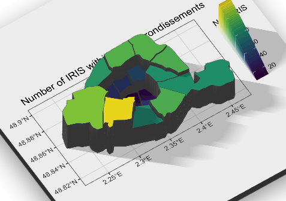

layout: true

<div class="my-footer"></div> 

---


```{r setup, include=FALSE,warning=FALSE,message=FALSE}
options(htmltools.dir.version = FALSE)
knitr::opts_chunk$set(
  message = FALSE,
  warning = FALSE,
  dev = "svg",
  cache = TRUE,
  cache.path = ".cache/",
  fig.align = "center"
  #fig.width = 11,
  #fig.height = 5
)
library(dplyr)
library(magrittr)
library(tidyverse)
library(pander)
```


# Welcome to ScPoEconometrics!

- In this course you will learn about the basics of *Econometrics*.
 
--

- You will also learn to use the `R` software.

--

## What is *Econometrics*, actually?

- A set of techniques and methods to answer questions with data.

- Econometrics shares many things with Applied Statistics and Machine Learning. 

- Some Examples!

---

# Answering Questions with Econometrics


[<ru-blockquote>
Does inauguration of World Bank-financed projects in Sub-Saharan Africa *cause* an electoral benefit for the incumbent?
</ru-blockquote>](https://drive.google.com/file/d/1aSDEhq-ZGlUcX5QxWbb-0bAcAdSUXlKc/view?usp=sharing)

--

[<ru-blockquote>
Does a certain concentration of `airbnb` listings in some urban area *cause* an increase in long-term rents?
</ru-blockquote>](https://floswald.github.io/project/airbnb/)

--

[<ru-blockquote>
Will increasing the minimum wage *cause* greater unemployment?
</ru-blockquote>](http://davidcard.berkeley.edu/papers/njmin-aer.pdf)

---

# Causality

* Notice the keyword **cause** in all of the above.

* Notice also that *many other factors could have caused* each of those outcomes.

* Econometrics is often about spelling out conditions under which we can claim to measure causal relationships.

* We will encounter the most basic of those conditions, and talk about some potential pitfalls.

---

# This Course

- Teach you the basics of *Linear Regression*

--

- Introduce you to the `R` software environment.

--

- This is *not* a course about `R`.

--

## Grades

1. There will be quizzes on Moodle roughly every two weeks.

2. There will be two or three take home exams / case studies.

3. There will be _no_ final exam. Your grade will be 40% of 1 and 60% of 2.

---
layout: false
class: title-slide-section-red, middle

# `R`


---
layout: true

<div class="my-footer"></div> 

---


## What is `R`?<sup>1</sup>

To quote the [`R` project website](https://www.r-project.org):

> R is a free software environment for statistical computing and graphics. It compiles and runs on a wide variety of UNIX platforms, Windows and MacOS.

--

What does that mean?

- `R` was created for statistical and graphical work.

- `R` has a vibrant, thriving online community. ([stack overflow](https://stackoverflow.com/questions/tagged/r))

- Plus it's __free__ and __open source__.

.footnote[
[1]: The next 3 slides have been shamelessly copied from [Ed Rubin's course](https://github.com/edrubin/EC421S19)
]

---

## Why are we using `R`?

1\. `R` is __free__ and __open source__—saving both you and the university 💰💵💰.

2\. _Related:_ Outside of a small group of economists, private- and public-sector __employers favor `R`__ over .mono[Stata] and most competing softwares.

3\. `R` is very __flexible and powerful__—adaptable to nearly any task, _e.g._, 'metrics, spatial data analysis, machine learning, web scraping, data cleaning, website building, teaching. 

---

## Why are we using `R`?

4\. _Related:_ `R` imposes __no limitations__ on your amount of observations, variables, memory, or processing power. (I'm looking at __you__, .mono[Stata].)

5\. If you put in the work<sup>2</sup>, you will come away with a __valuable and marketable__ tool.

6\. I 💖 __R__

.footnote[
[2]: Learning `R` definitely requires time and effort.
]

---

```{R, statistical languages, echo = F, fig.height = 6, fig.width = 9,message = FALSE}
pink <- "#d90502"
pop_df <- data.frame(
  lang = c("SQL", "Python", "R", "SAS", "Matlab", "SPSS", "Stata"),
  n_jobs = c(107130, 66976, 48772, 25644, 11464, 3717, 1624),
  free = c(T, T, T, F, F, F, F)
)
pop_df %<>% mutate(lang = lang %>% factor(ordered = T))
# Plot it
ggplot(data = pop_df, aes(x = lang, y = n_jobs, fill = free)) +
geom_col() +
geom_hline(yintercept = 0) +
aes(x = reorder(lang, -n_jobs), fill = reorder(free, -free)) +
xlab("Statistical language") +
scale_y_continuous(label = scales::comma) +
ylab("Number of jobs") +
ggtitle(
  "Comparing statistical languages",
  subtitle = "Number of job postings on Indeed.com, 2019/01/06"
) +
scale_fill_manual(
  "Free?",
  labels = c("True", "False"),
  values = c(pink, "darkslategray")
) + theme(legend.position = "bottom")
```


---
layout: false
class: title-slide-section-red, middle

# `R` SHOWCASE

---
layout: true

<div class="my-footer"></div> 

---

# Data Wrangling

.pull-left[
* The `flights` dataset contains on-time data for all flights that departed NYC (i.e. JFK, LGA or EWR) in 2013.

* Suppose we want to know the relationship between distance and average delay, as [in this example](https://r4ds.had.co.nz/transform.html#combining-multiple-operations-with-the-pipe). 

* We need to group the data by destination, summarise to get distance, delay and number of flights
]

.pull-right[
```{r}
library(nycflights13)
 # select 3 cols of interest
fl = flights[ ,c("dest","distance","arr_delay")] 
# show first 4 lines of this dataframe
head(fl,n = 4)   
```
]

---

# Data Wrangling

* There are always several ways to achieve a goal. (In life `r emo::ji("smile")`)
* Here are the two leading data packages:

.pull-left[

## `dplyr`

```{r}
delays_dplyr <- fl %>% 
  group_by(dest) %>% 
  summarise(
    count = n(),
    dist = mean(distance, na.rm = TRUE),
    delay = mean(arr_delay, na.rm = TRUE)
  ) %>% 
  filter(count > 20, dest != "HNL")
```
]

.pull-right[

## `data.table`

```{r}
library(data.table)
dl_dt = data.table(fl)
delays_dt <- 
  dl_dt[, list(count = .N, 
              dist = mean(distance,na.rm=T),
              delay = mean(arr_delay, na.rm=T)),
          by = dest][count > 20 & dest != "HNL"]
```
]


---

# Plotting

* Now we could *look* at `delays_dt`, or compute some statistics from it. 
* Nothing beats a picture, though:

```{r,fig.width=10,fig.height=3.5}
ggplot(data = delays_dt, 
       mapping = aes(x = dist, y = delay)) +
  geom_point(aes(size = count), alpha = 1/3) +
  geom_smooth(se = FALSE)
```

---

# Plotting in Base `R` vs `ggplot`

* `R` has very good graphical capabilities outside of contributed packages like `ggplot2`.

* We will encounter both approaches in this course.

* You will quickly see that some things are easier in base rather than ggplot and vice versa. 

---

# Spatial Data

```{r,echo = FALSE}
paris_sh <- readRDS("paris.RDS")
```

.pull-left[

* `R` is very strong with spatial data. In particular via the [`sf`](https://cran.r-project.org/web/packages/sf/index.html) package.

* We can represent _any_ shape or geometry.

* Maps are the most obvious example:
```{r, eval = FALSE}
library(sf)
plot(paris_sh[,"n"],
     main = "Number or IRIS by Arrondissement",key.pos = 3, axes = FALSE, key.width = lcm(1.3), key.length = 1.0)
```
]

--

.pull-right[

```{r, eval = require("sf"),fig.width=5,echo = FALSE,fig.height = 5}
plot(paris_sh[,"n"],
     main = "Number or IRIS by Arrondissement",key.pos = 3, axes = FALSE, key.width = lcm(1.3), key.length = 1.0)
```

]


---

# Spatial Plotting with ggplot


.pull-left[

* ggplot can also directly plot spatial data

* here is an example:
  ```r
  ggplot(paris_sh) +         # base layer: data
  geom_sf(aes(fill = n)) +   # the `sf` geom
  scale_fill_viridis_c() +   # greenish fill
  theme_bw()                 # simple theme
  ```
]

.pull-right[
```{r ggparis,fig.width = 6, fig.height = 5,echo = FALSE}
gp = ggplot(paris_sh) + 
  geom_sf(aes(fill = n)) + 
  scale_fill_viridis_c("Num IRIS") + 
  theme_bw() + 
  ggtitle("Number of IRIS within Paris Arrondissements")
gp
```
]


---

# 3D ggplots

.pull-left[
* A recent _very_ cool `r emo::ji("cool")` package is [`rayshader`](https://cran.r-project.org/web/packages/rayshader/index.html)

* Sometimes graphs are better to see in 3D.
]

.pull-right[
```{r,echo = FALSE}
# library(rayshader)
# plot_gg(gp, width = 5,height = 5, multicore = TRUE, scale = 250,
# zoom = 0.9, theta=320, phi=40, windowsize = c(800,800))
# render_snapshot(filename = "ray.png",clear = FALSE)
# render_movie(filename = "ray",theta=320, phi=40)

```
]

--

Like, *real* 3D...

---
layout: false
background-image: url("../img/gifs/ray-paris.mp4")
background-size: 100%


---
layout: false
class: title-slide-section-red, middle

# `R` 101: Here Is Where You Start.


---
layout: true

<div class="my-footer"></div> 

---


# Start your `Rstudio`!

## First Glossary of Terms

* `R`: a statistical programming language

* `RStudio`: an integrated development environment (IDE) to work with `R`

* *command*: user input (text or numbers) that `R` *understands*.

* *script*: a list of commands collected in a text file, each separated by a new line, to be run one after the other.

---

# R as a Calculator

.pull-left[

* You can use the R console like a calculator

* Just type an arithmetic operation after `>` and hit `Enter`!

]

--

.pull-right[
* Some basic arithmetic first:
    ```{r}
    4 + 1
    8 / 2
    ```


* Great! What about this?
    ```{r}
    log(exp(1))
    # by the way: this is a comment! (R disregards it)
    ```
]
---

# Calculator 2

* We can also do exponents with `^`:
    ```{r}
    x = 2
    x^3
    ```

* Square roots
    ```{r}
    sqrt(2)
    ```

* and many logarithmic and trigonometric functions.
* many ... What??

---
background-size: 100%
background-image: url(https://media.giphy.com/media/oGzFZek2lszlK/giphy.gif)

---

# Where to get Help?

* `R` built-in `help`:
    ```{r, eval = FALSE}
    ?log
    ?sin
    ?paste
    ?lm
    help(lm)   # help() is equivalent
    ??plot  # get all help on keyword "plot"
    help(ggplot,package="ggplot2")  # show help from a certain package
    ```

* Help from Humans!
  * [stackoverflow.com](https://stackoverflow.com) [SO]
  * Your classroom channel on Slack
  * [rstudio forum](https://community.rstudio.com)
  
  
---

# HOW to get Help?

1. Describe what you want to do.

1. Describe what you *expect* your code to do.

1. Describe what you your code *does instead*.
  * Provide the entire error message.
  
1. Provide enough code to *reproduce* your error.
  * You can post post code snippets on slack and SO

---

# R Packages

* `R` users contribute add-on data and functions as *packages*

* Installing packages is easy!
    ```{r, eval = FALSE}
    install.packages("ggplot2")
    ```

* To *use* the contents of a packge, we must load it from our library:
    ```{r, message = FALSE, warning = FALSE,eval=FALSE}
    library(ggplot2)
    ```

---

# `ScPoEconometrics` package

* We wrote an `R` package for you.

* It's hosted on github.com

* You can install (and frequently update!) from there:
    ```{r,eval=FALSE}
    if (!require("devtools")) install.packages("devtools")
    library(devtools)
    install_github(repo = "ScPoEcon/ScPoEconometrics")
    ```

--

* Did it work?
    ```{r,warning=FALSE,message=FALSE}
    library(ScPoEconometrics)
    packageVersion("ScPoEconometrics")
    ```

---

# Data Types and Data Structures


- Numeric: `1.0, 2.1`

- Integer: `1L`, `2L`, `42L`

- Logical: `TRUE` and `FALSE`

- Character: `"a"`, `"Statistics"`, `"1 plus 2."`

- Categorical or `factor`

* [You should read more right here!](https://scpoecon.github.io/ScPoEconometrics/R-intro.html#data-types)

---

# Vectors


* What *is* a **vector**?
* The `c` function creates vectors.
    ```{r}
    c(1, 3, 5, 7, 8, 9)
    ```

* Coercion to unique types:
    ```{r}
    c(42, "Statistics", TRUE)
    ```

* Creating a *Range*
    ```{r}
    (y = 1:6)
    ```


---

# Vectors from Sequences and Repetitions


* `seq` creates a sequence `from` `to` in steps of `by`:
    ```{r}
    seq(from = 1.5, to = 2.1, by = 0.1)
    ```
* `rep` repeats items:
    ```{r}
    rep("A", times = 10)
    ```
* They also work in combination:
    ```{r}
    c(x, rep(seq(1, 9, 2), 3), c(1, 2, 3), 42, 2:4)
    ```

---
class: inverse, bottom
background-image: url(../img/gifs/alert.png)
background-size: 100%

# YOUR TURN

---
class: inverse

# Task 1

* Create a vector of five ones, i.e.
```{r,echo=FALSE}
rep(1,5)
```
* Notice that the colon operator `a:b` is just short for *construct a sequence from `a` to `b`*. Create a vector the counts down from 10 to 0, i.e. it looks like
```{r,echo=FALSE}
10:0
```
* Use `rep` to create a vector that looks like this:
```{r,echo=FALSE}
rep(rep(1:3,each=3),2)
```
* Find out (using `help()`, google or whatever) how to get the *length* of a vector in `R`!

---

# Indexing or Subsetting a Vector


* `R` uses `1`-based indexing.
* We use `[]` to get the value at an index
    ```{r}
    x = c(1, 3, 5, 7, 8, 9)
    x[2]
    ```
* Works with vectors of indices:
    ```{r}
    x[c(2,5)]
    ```
* And can get *all but* indices:
    ```{r}
    x[-4]
    ```

---

# Logical Subsetting


* One can use a vector of `TRUE` and `FALSE` to index:
    ```{r}
    x = c(1, 3, 5, 7, 8, 9)
    x[c(TRUE,TRUE,TRUE,FALSE,TRUE,FALSE)]
    ```
* Let's create a *logical vector* for condition `x > 3`
    ```{r}
    x > 3
    ```
* We can get all values of `x` where `x>3` is `TRUE`:
    ```{r}
    x[ x > 3 ]
    ```

---
class:inverse, middle

#Task 2!


* From the `runif` function get 10 numbers drawn from the uniform distribution and store in `x`.
    ```{r,echo=FALSE}
    set.seed(10)
    x = runif(10)
    ```
* get all the elements of `x` larger than 0.3, and store them in `y`.
    ```{r,echo=FALSE}
    y = x[x>0.3]
    ```
* using the function `which`, store the *indices* of all of those elements in `iy`.
    ```{r,echo=FALSE}
    iy = which(x>0.3)
    iy
    ```
* Check that `y` and `x[iy]` are identical.
    ```{r,echo=FALSE}
    y == x[iy]
    ```

---

# Matrix


* A `Matrix` is a two-dimensional Array
    ```{r}
    X = matrix(1:9, nrow = 3, ncol = 3)
    X
    ```

* Subsetting needs two indices now:
    ```{r}
    X[1,2]
    X[3, ]
    ```

---

# Matrix Operations


* Let's create two matrices.
    ```{r}
    X = matrix(1:4, 2, 2)
    Y = matrix(4:1, 2, 2)
    ```
* Arithmetic!
    ```{r}
    X * Y # equally for +, - and /
    ```
* But `X * Y` is **not** matrix multiplication. All of above are *element by element* operations.
* Matrix multiplication uses `%*%`. What is `X %*% Y` for you?

---
class: inverse, middle

# Task 3


* Create a vector containing `1,2,3,4,5` called v.
```{r, echo=FALSE}
v = 1:5
```
* Create the (2,5) matrix `m`:
```{r, echo=FALSE}
(m = matrix(data = 1:10,nrow=2,ncol=5,byrow=T))
```
* Perform matrix multiplication of `m` with `v`. Use the command `%*%`. What dimension does the output have?
```{r, echo=FALSE}
dim(m%*%v)
```
* Why does the command `v %*% m` not work?

---

#Lists


* Up to now, all containers were *homogeneous*
* `lists` are more flexible:
```{r}
# works with and without fieldnames
ex_list = list(
  a = c(1, 2, 3, 4),
  b = TRUE,
  c = "Hello!",
  d = diag(2)
)
ex_list
```

---

# Indexing Lists


* `[]` gets a *sublist*
* `[[]]` gets a list element
* Can index by numerical index or name
```{r}
ex_list[1]
ex_list[[1]]
ex_list$d
```


---
class: inverse, middle

#Task 4


1. Copy and paste the above code for `ex_list` into your R session. Remember that `list` can hold any kind of `R` object. Like...another list! So, create a new list `new_list` that has two fields: a first field called "this" with string content `"is awesome"`, and a second field called "ex_list" that contains `ex_list`.

1. Accessing members is like in a plain list, just with several layers now. Get the element `c` from `ex_list` in `new_list`!

1. Compose a new string out of the first element in `new_list`, the element under label `this`. Use the function `paste` to print the string `R is awesome` to your screen.

---

# `data.frame`'s

`data.frame`'s are like spreadsheets.

```{r}
example_data = data.frame(x = c(1, 3, 5, 7),
                          y = c(rep("Hello", 3), "Goodbye"),
                          z = sample(c(TRUE,FALSE),size=4,replace=TRUE))
example_data
```

---

# `data.frame`s


* Useful methods for a dataframe:
```{r}
nrow(example_data)
ncol(example_data)
names(example_data)
```

---

# Data on Cars


* The `mtcars` dataset is built-in to `R`.
    ```{r}
    head(mtcars,n=3)  # show first 3 rows
    ```
    
* To access one of the variables **as a vector**, we use the `$` operator as in `mtcars$mpg`

* Or we use the column name or index: `mtcars[,"mpg"]` or `mtcars[,1]`

---

# Subsetting `data.frames`


* Subsetting is like with matrices, `[,]`
    ```{r}
    # mpg[row condition, col index]
    mtcars[mtcars$mpg > 32, c("cyl", "disp", "wt")]
    ```
    
* But there is a special function which looks nicer.
    ```{r,eval=FALSE}
    subset(mtcars, subset = mpg > 32, select = c("cyl", "disp", "wt")]
    ```

---
class: inverse

# Task 4


1. How many observations are there in `mtcars`?

1. How many variables?

1. What is the average value of `mpg`?

1. What is the average value of `mpg` for cars with more than 4 cylinders, i.e. with `cyl>4`?

---
class: middle

# Basic Programming


* It's useful for us to review some basics for programming.

* We won't be going very deep here, but it's good for you to know some of this.

---

# Variables


* A variable refers to an *object*.

* Another way to say it is that a variable is a name or a *label* for something:
    ```{r}
    x = 1
    y = "roses"
    z = function(x){sqrt(x)}
    ```

* *local* variables are only defined (and hence visible) within a certain area of your code, called a *scope*

* *global* variables are defined everywhere.

* Try to **avoid global variables**.

---

# Control Flow

.pull-left[
* We can influence which *branch* our code executes based on
* Whether we follow one branch or another depends on a `condition`.
```{r, eval = FALSE}
if (condition == TRUE) {
  some R code
} else {
  some other R code
}
```
]

.pull-right[
```{r}
x = 1
y = 3
if (x > y) {  # test if x > y
  # if TRUE
  z = x * y  # assign value to z
  print("x is larger than y")
} else {
  # if FALSE
  z = x + 5 * y  # assign other value to z
  print("x is less than or equal to y")
}
z
```
]

---
class: middle

# Loops

.pull-left[
* This is an example for a loop:
    ```{r}
    for (i in 1:3){  # does not have to be 1:3!
      print(i) # loop body: gets executed each time
      # the value of i changes with each iteration
    }
    ```
]

--

.pull-right[
* We can iterate over things other than numbers:
    ```{r}
    for (i in c("mangos","bananas","apples")){
      print(paste("I love",i))  # the paste function pastes together     strings
    }
    ```
]

---

# Nested Loops

We often also see *nested* loops, which are just what its name suggests:

```{r}
for (i in 2:3){
  # first nest: for each i
  for (j in c("mangos","bananas","apples")){
    # second nest: for each j
    print(paste("Can I get",i,j,"please?"))
  }
}
```

---

# Functions


* Function `say_hello` tells `R` what to do when it you tell it `say_hello()`.
```{r}
say_hello <- function(your_name = "Lord Vader"){
  paste("You R most welcome,",your_name)
}
# we call the function by typing it's name with round brackets
say_hello()
```

* We specified a default argument, but we don't have to.

* Call the function with your name!

---
background-image: url("https://media.giphy.com/media/j3Pm7ejYTm79SpoEha/giphy.gif")
background-size: 100%

---
class: inverse

# Task 5


1. Write a for loop that counts down from 10 to 1, printing the value of the iterator to the screen.

1. Modify that loop to write "i iterations to go" where `i` is the iterator

1. Modify that loop so that each iteration takes roughly one second. You can achieve that by adding the command `Sys.sleep(1)` below the line that prints "i iterations to go".

1. Finally, let's create a function called `ticking_bomb`. it takes no arguments, it's body is the loop you wrote in the preceding question. The only think you should add to the body is a line after the loop finishes, printing "BOOOOM!" with `print("BOOOOM!")`. You can repeatedly redefine the function in the console, and try it out with `ticking_bomb()`.

---
class: title-slide-final, middle
background-image: url(../img/logo/ScPo-econ.png)
background-size: 250px
background-position: 9% 19%

# END


|                                                                                                            |                                   |
| :--------------------------------------------------------------------------------------------------------- | :-------------------------------- |
| <a href="mailto:florian.oswald@sciencespo.fr">.ScPored[<i class="fa fa-paper-plane fa-fw"></i>]               | florian.oswald@sciencespo.fr       |
| <a href="https://github.com/ScPoEcon/ScPoEconometrics-Slides">.ScPored[<i class="fa fa-link fa-fw"></i>] | Slides |
| <a href="https://scpoecon.github.io/ScPoEconometrics">.ScPored[<i class="fa fa-link fa-fw"></i>] | Book |

| <a href="http://twitter.com/ScPoEcon">.ScPored[<i class="fa fa-twitter fa-fw"></i>]                          | @ScPoEcon                         |
| <a href="http://github.com/ScPoEcon">.ScPored[<i class="fa fa-github fa-fw"></i>]                          | @ScPoEcon                       |

