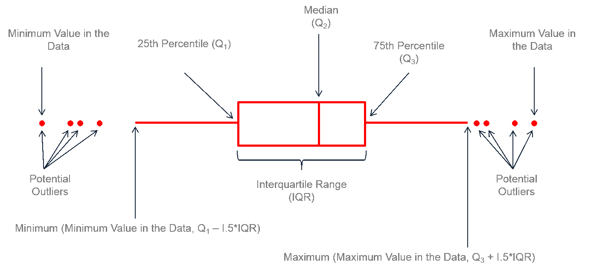

layout: true

<div class="my-footer"></div> 

---

```{r setup, include=FALSE,warning=FALSE,message=FALSE}
options(htmltools.dir.version = FALSE)
knitr::opts_chunk$set(
  message = FALSE,
  warning = FALSE,
  dev = "svg",
  cache = TRUE,
  fig.align = "center"
  #fig.width = 11,
  #fig.height = 5
)

library(learnr) # this line needs to be run manually I have no idea why but otherwise I get this error message which I can't seem to solve...
# Quitting from lines 27-40 (chapter2.Rmd) 
# Error: package or namespace load failed for 'learnr':
#  .onAttach failed in attachNamespace() for 'learnr', details:
#   call: NULL
#   error: The shiny_prerendered_chunk function can only be called from within runtime: shiny_prerendered
```

# Recap from last week

* ***Causality*** plays a central role in modern econometrics!

--

* Using R is ***very*** valuable

--

* Basic data wrangling:
  - `str`, `names`, `nrow`, `ncol`
  - *subsetting:* `murders[row condition, "column name"]`
  - *variable creation:* `murders$total_percap = (murders$total / murders$population) * 10000`

--

## Today

* Deeper dive into data wrangling with `R`:
  - __summarizing__ data,
  - __visualisation__ data,
  - __tidying__ data

---
  
# Working With Data

* Econometrics is about `data`.

```{r, echo = F, out.width = "400px"}
knitr::include_graphics("chapter2_files/figure-html/data_science_pipeline.png")
```

--

* According a to [2014 NYTimes article](https://www.nytimes.com/2014/08/18/technology/for-big-data-scientists-hurdle-to-insights-is-janitor-work.html), "data scientists [...] spend from ***50 percent to 80 percent of their time*** mired in this more mundane labor of collecting and preparing unruly digital data, before it can be explored for useful nuggets."

* In the next two lectures you will learn to the basics of summarizing, visualising and tidying data

---

# The `gapminder` dataset: Overview

* Let's first load a dataset with these commands:
    ```{r, echo = TRUE, eval = FALSE}
    library(dslabs)
    gapminder <- gapminder
    ```
    
    ```{r, echo = FALSE, eval = TRUE}
    gapminder <- dslabs::gapminder
    ```

* Here are the first 3 rows
    ```{r}
    head(gapminder, n = 3)
    ```

---
# The `gapminder` dataset: Overview

* What variables does this dataset contain?
    ```{r}
    names(gapminder)
    ```

* `tail` gives you the last (6) rows.
    ```{r,eval = FALSE}
    tail(gapminder)
    ```

---

# The `gapminder` dataset: Datatypes

* It's important to know how the data is stored.

* We can use `str` for that:

```{r}
str(gapminder)
```

---

class: inverse

# Task 1 (7 minutes)

* Create a new variable called `gdppercap` corresponding to `gdp` divided by `population`

* Which countries had a 2011 GDP per capita greater than 30.000? 

* Filter the dataset to only keep the year 2015: `gapminder_2015`

* How many countries have an infant mortality in 2015 greater than 90 (per 1000)?

* What is the average life expectancy in Africa in 2015?

```{r, echo = FALSE, eval = FALSE}
# ANSWERS

* gapminder$gdppercap <- gapminder$gdp / gapminder$population

* subset(gapminder, year == 2011 & gdppercap > 30000)

* gapminder_2015 <- subset(gapminder, year == 2015)

* nrow(subset(gapminder_2011, infant_mortality > 90))

* mean(gapminder_2015[gapminder_2015$continent == "Africa", "life_expectancy"])
  # also possible to use subset() but need to create new object
```

---

layout: false
class: title-slide-section-red, middle

# Summarizing

---

layout: true

<div class="my-footer"></div> 

---

# Summarizing Data


* One can learn only a limited amount from **looking** at a `data.frame`. `r emo::ji("mag")`

--

* Even if you *could* see all rows of the dataset, you would not know very much **about it**.

--

* We need to **summarize** the data for us to learn from it.

--

* In general, we can compute summary statistics, or visualize the data with plots.

--

* Let's start with some statistics first!

--

* Let's look at two features: *central tendency* and *spread*.

---

# Central Tendency


.pull-left[
1. `mean(x)`: the average of all values in `x`.
$$\bar{x} = \frac{1}{N}\sum_{i=1}^N x_i$$

```{r}
x <- c(1,2,2,2,2,100)
mean(x)
mean(x) == sum(x) / length(x)
```

***Your turn:*** What's the mean of `infant_mortality` in 1960? Read the help for `mean` to remove `NA`s.
]

--

.pull-right[
1. `median`: the value $x_j$ below and above which 50% of the values in `x` lie. $m$ is the median if
    $$\Pr(X \leq m) \geq 0.5 \text{ and } \Pr(X \geq m) \geq 0.5$$
    
1. The median is robust against *outliers*. `r emo::ji("thinking")`? (later).

```{r}
median(x)
```

***Your turn:*** What's the median of `infant_mortality` in 1960?
]

---

# Missing Values: `NA`

.pull-left[
* Whenever a value is *missing*, we code it as `NA`.
    ```{r, echo = TRUE}
    x <- NA
    ```
* `R` propagates `NA` through operations:
    ```{r, echo = TRUE}
    NA > 5
    NA + 10
    ```
* the function `is.na(x)` returns `TRUE` if `x` is an `NA`.
    ```{r, echo = TRUE}
    is.na(x)
    ```
]

--

.pull-right[
* What is confusing is that 
    ```{r, echo = TRUE}
    NA == NA
    ```

* It's easy to illustrate like that:
    ```{r, echo = TRUE}
    # Let x be Mary's age. We don't know how old she is.
    x <- NA
    
    # Let y be John's age. We don't know how old he is.
    y <- NA
    
    # Are John and Mary the same age?
    x == y
    #> [1] NA
    # We don't know!
    ```
]

---

# Spread

.pull-left[
* Another interesting feature is how much a variable is *spread out* about it's center (the mean in this case).

* The *variance* is such a measure.
    $$Var(X) = \frac{1}{N} \sum_{i=1}^N(x_i-\bar{x})^2$$
    
* Consider two `normal distributions` with equal mean at `0`:
]

--

.pull-right[
```{r,echo = FALSE,fig.height=4,message = FALSE,warning = FALSE}
library(ggplot2)
ggplot(data = data.frame(x = c(-5, 5)), aes(x)) +
  stat_function(fun = dnorm, n = 101, args = list(mean = 0, sd = 1), aes(color = "1"), size = 2) + ylab("") + scale_y_continuous(breaks = NULL) + theme_bw() +
  stat_function(fun = dnorm, n = 101, args = list(mean = 0, sd = 2), aes(color = "4"), size = 2) + scale_color_manual("Variance:", values = c("red","blue")) + theme(text = element_text(size=20))
```

* Compute with:

```{r,eval = FALSE}
    var(x)
    range(x)   # range
    ```
]
---

# The `table` function

* `table(x)` is a useful function that counts the occurence of each unique value in `x`:
    ```{r}
    table(gapminder$continent)
    table(gapminder$region)
    ```

---

# Crosstables


* Given two vectors, `table` produces a contingency table:
    ```{r}
    gapminder_2015 <- subset(gapminder, year == 2015)
    gapminder_2015$fertility_above_2 = (gapminder_2015$fertility > 2.1) # dummy variable for fertility rate above replacement level fertility
    table(gapminder_2015$fertility_above_2,gapminder_2015$continent)
    ```

--

* With `prop.table`, we can get proportions:
    ```{r,eval=FALSE}
    # proportions by row
    prop.table(table(gapminder_2015$fertility_above_2,gapminder_2015$continent), margin = 1)
    # proportions by column
    prop.table(table(gapminder_2015$fertility_above_2,gapminder_2015$continent), margin = 2) 
    ```

* `r emo::ji("warning")` To obtain `table`s or `crosstable`s with `NA`s, use the `useNA = "always"` or `useNA = "ifany"`
---

layout: false
class: title-slide-section-red, middle

# Plotting

---
layout: true

<div class="my-footer"></div> 

---

# Plotting

.pull-left[
* `R` base plotting is fairly good.

* There is an extremely powerful alternative in package `ggplot2`. We'll see both.

* First example: *histograms*. A histogram counts how many obserations fall within a certain bin.
]

--

.pull-right[
```{r,fig.align='center',fig.height=4.5}
gapminder_2015 <- gapminder[gapminder$year == 2015,]
hist(gapminder_2015$life_expectancy)
```

```{r, echo = FALSE, eval = FALSE, fig.align='center', fig.height=4.5}
gapminder_2015 <- gapminder[gapminder$year == 2015,]
ggplot(gapminder_2015,
       aes(x = life_expectancy)) +
  geom_histogram()
```
]

---

# A Nicer Histogram


.pull-left[
* We can give additional arguments to `hist`.

* Look at `?hist` for more.

```{r,fig.height=4.5,eval=FALSE}
hist(gapminder_2015$life_expectancy, 
     xlab   = "Life Expectancy", 
     main   = "Histogram of life expectancy in 2015", 
     breaks = seq(from = 40, to = 90, by = 5),
     las = 1, # horizontal y-axis values
     col  = "#d90502",
     border = "white")
```

]

.pull-right[
```{r,fig.height=4.5,eval=TRUE,echo=FALSE}
hist(gapminder_2015$life_expectancy, 
     xlab   = "Life Expectancy", 
     main   = "Histogram of life expectancy in 2015", 
     breaks = seq(from = 40, to = 90, by = 5),
     las = 1, # horizontal y-axis values
     col  = "#d90502",
     border = "white")
```
]

---

# Looking for Outliers: Boxplots

* An *outlier* is a datapoint far removed from the center of a distribution.

* Boxplots are an effective way to visualise the distribution of a variable.

* The *box* typically denotes the __interquartile range__ (observations between 25th pctile and 75th pctile).

* The *thick line* corresponds to the __median__.

* The *dots* are __outliers__ (`r emo::ji("warning")` no universally accepted definition).

---

# Looking for Outliers: Boxplots

```{r, echo = F, out.width = "850px"}

```

---

# Looking for Outliers: Boxplots

.pull-left[
```{r, echo = TRUE, eval = FALSE}
boxplot(life_expectancy ~ continent,
    data = gapminder_2015,
    xlab   = "Continent",
    ylab   = "Life expectancy in 2015",
    main   = "Life expectancy by continent in 2015",
    pch = 20, cex = 2, # colour and size of outliers
    col ="#d90502",border = "black", las = 1)
```

* see `?boxplot` for more options
]

.pull-right[
```{r,fig.align='center',echo=FALSE,fig.height = 7}
boxplot(life_expectancy ~ continent,
    data = gapminder_2015,
    xlab   = "Continent",
    ylab   = "Life expectancy in 2015",
    main   = "Life expectancy by continent in 2015",
    pch = 20, cex = 2, # colour and size of outliers
    col ="#d90502",border = "black", las = 1)
```
]

---

# Scatter Plots

* Two variables $x$ and $y$

--

* Natural to ask: How often do certain pairs of $(x_i,y_i)$ occur?
    ```{r}
    head(gapminder_2015[,c("fertility","infant_mortality")])
    ```
* That's what a scatter plots shows.

---

# Scatter Plots

.pull-left[
```{r, echo = TRUE, fig.height=5}
plot(fertility ~ infant_mortality,
    data = gapminder_2015,
    xlab   = "Infant mortality",
    ylab   = "Fertility rate",
    main   = "Relationship between fertility and infant mortality in 2015",
    col = "#d90502",
    las = 1)
```
]

.pull-right[
<br>
* Each dot is one pair $(x_i,y_i)$.

* We often call it one *observation*.

* Corresponding to one *row* of the `data.frame`.

* Why do some dots appear *darker* than others here?
]

---

background-image: url("../img/logo/ggplot2.svg")
background-position: 90% 5%
background-size: 180px

# Quick `ggplot2` Intro

.pull-left[
* Excellent cheatsheet on [project website](https://ggplot2.tidyverse.org).

* Great intro to `ggplot2` [here](https://pkg.garrickadenbuie.com/gentle-ggplot2).

* Based on *The __G__rammar of __G__raphics* (hence __gg__plot).

* More powerful than base `R` plotting

* Let's reproduce the previous graphs in ggplot
]

.pull-right[
<br>
<br>
```{r, echo = F, out.width = "500px"}
knitr::include_graphics("chapter2_files/figure-html/ggplot_grammar_graphics.png")
```

###### source: [BloggoType](http://bloggotype.blogspot.com/2016/08/holiday-notes2-grammar-of-graphics.html)
]

---

# `ggplot2`: Basic Histogram

.pull-left[
```{r, echo = TRUE, eval = FALSE}
library(ggplot2)

ggplot(gapminder_2015,
       aes(x = life_expectancy)) +
  geom_histogram()
```
]

.pull-right[
```{r, echo = FALSE, eval = TRUE, fig.height = 5}
ggplot(gapminder_2015,
       aes(x = life_expectancy)) +
  geom_histogram()
```
]

---

# `ggplot2`: Fancy Histogram

.pull-left[
```{r, echo = TRUE, eval = FALSE}
library(ggplot2)

ggplot(gapminder_2015,
       aes(x = life_expectancy)) +
  geom_histogram(binwidth = 5,
                 boundary = 45,
                 colour = "white",
                 fill = "#d90502") +
  labs(x = "Life Expectancy",
       y = "Frequency",
       title = "Histogram of life expectancy in 2015") +
  theme_bw(base_size = 16)
```
]

.pull-right[
```{r, echo = FALSE, eval = TRUE, fig.height = 5}
ggplot(gapminder_2015,
       aes(x = life_expectancy)) +
  geom_histogram(binwidth = 5, boundary = 45, colour = "white", fill = "#d90502") +
  labs(x = "Life Expectancy", y = "Frequency", title = "Histogram of life expectancy in 2015") +
  theme_bw(base_size = 16)
```
]

---

# `ggplot2`: Fancy Histogram with `facet_grid()`

.pull-left[
```{r, echo = TRUE, eval = FALSE}
library(ggplot2)

ggplot(gapminder_2015,
       aes(x = life_expectancy)) +
  geom_histogram(binwidth = 5,
                 boundary = 45,
                 colour = "white",
                 fill = "#d90502") +
  labs(x = "Life Expectancy",
       y = "Frequency",
       title = "Histogram of life expectancy in 2015") +
  theme_bw(base_size = 16) +
  facet_grid(rows = vars(continent))
```
]

.pull-right[
```{r, echo = FALSE, eval = TRUE, fig.height = 7}
ggplot(gapminder_2015,
       aes(x = life_expectancy)) +
  geom_histogram(binwidth = 5,
                 boundary = 45,
                 colour = "white",
                 fill = "#d90502") +
  labs(x = "Life Expectancy",
       y = "Frequency",
       title = "Histogram of life expectancy in 2015") +
  theme_bw(base_size = 16) +
  facet_grid(rows = vars(continent))
```
]

---

# `ggplot2`: Boxplots

.pull-left[
```{r, echo = TRUE, eval = FALSE}
ggplot(gapminder_2015,
       aes(x = continent, y = life_expectancy)) +
  geom_boxplot(colour = "black",
               fill = "#d90502") +
  labs(x = "Continent",
       y = "Life expectancy in 2015", 
       title = "Life expectancy by continent in 2015") +
  theme_bw(base_size = 20)
```
]

.pull-right[
```{r, echo = FALSE, eval = TRUE, fig.height = 5}
ggplot(gapminder_2015,
       aes(x = continent, y = life_expectancy)) +
  geom_boxplot(colour = "black", fill = "#d90502") +
  labs(x = "Continent", y = "Life expectancy in 2015", title = "Life expectancy by continent in 2015") +
  theme_bw(base_size = 20)
```
]

---

# `ggplot2`: Scatter Plots


.pull-left[
```{r, echo = TRUE, eval = FALSE}
ggplot(gapminder_2015,
       aes(x = infant_mortality,
           y = fertility)) +
  geom_point(size = 3,
             alpha = 0.5,
             colour = "#d90502") +
  expand_limits(x = 0, y = 0) +
  labs(x = "Infant mortality",
       y = "Fertility rate",
       title = "Relationship between fertility and infant mortality in 2015") +
  theme_bw(base_size = 16)
```
]

.pull-right[
```{r, echo = FALSE, eval = TRUE, fig.height = 5}
ggplot(gapminder_2015,
       aes(x = infant_mortality,
           y = fertility)) +
  geom_point(size = 3,
             alpha = 0.5,
             colour = "#d90502") +
  expand_limits(x = 0, y = 0) +
  labs(x = "Infant mortality",
       y = "Fertility rate",
       title = "Relationship between fertility and infant mortality in 2015") +
  theme_bw(base_size = 16)
```
]


---

class: inverse, middle


# It's Tutorial Time!

---

# Tutorial 1 (10 minutes)

Time for our first tutorial!!

Type this into your `RStudio` console:

```{r, echo = TRUE, eval=FALSE}
library(ScPoEconometrics)
runTutorial('chapter2')
```

If you have trouble with the interactive doc, try this version (no interactive content):

```{r, echo = TRUE, eval=FALSE}
ScPoEconometrics::runTutorial('chapter2-script')
```

---

# How are x and y related? Covariance and Correlation

* [This](https://scpoecon.github.io/ScPoEconometrics/sum.html#summarize-two) is the relevant section in the book about Covariance.

.pull-left[
```{r x-y-corr,echo=FALSE,message=FALSE,warning=FALSE,fig.align='center',fig.height = 5,fig.width=6}
plot(fertility ~ infant_mortality,
    data = gapminder_2015,
    xlab   = "Infant mortality",
    ylab   = "Fertility rate",
    main   = "Relationship between fertility and infant mortality in 2015",
    col = "#d90502")
```
]

--

.pull-right[
* The covariance is a measure of __joint variability__ of two variables.
    $$Cov(x,y) = \frac{1}{N} \sum_{i=1}^N(x_i-\bar{x})(y_i-\bar{y})$$
```{r, echo=FALSE}
cov(gapminder_2015$fertility,gapminder_2015$infant_mortality, use = "complete.obs")
```

* The correlation is a measure of the strenght of the __linear association__ between two variables.
    $$Cor(x,y) = \frac{Cov(x,y)}{\sqrt(Var(x))\sqrt(Var(y))}$$
```{r, echo=FALSE}
cor(gapminder_2015$fertility,gapminder_2015$infant_mortality, use = "complete.obs")
```
]

---

class: inverse

# Correlation App

```{r, echo = TRUE, eval=FALSE}
library(ScPoEconometrics)
runTutorial('correlation')
```

---

layout: false
class: title-slide-section-red, middle

# Wrangling

---
layout: true

<div class="my-footer"></div> 

---

# Intro to `dplyr`

.pull-left[
<br>
<br>
<br>
* [`dplyr`](https://dplyr.tidyverse.org) is part of the [tidyverse](https://www.tidyverse.org) package family.

* [`data.table`](https://github.com/Rdatatable/data.table/wiki) is an alternative. Very fast but a bit more difficult.

* Both have pros and cons. We'll start you off with `dplyr`. 
]

.pull-right[


]

---

# `dplyr` Overview

.pull-left[
<br>
<br>
* You *must* read through [Hadley Wickham's chapter](https://r4ds.had.co.nz/transform.html). It's concise.

* The package is organized around a set of **verbs**, i.e. *actions* to be taken.

* We operate on `data.frames` or `tibbles` (*nicer looking* data.frames.)

* All *verbs*: First argument is a data.frame, subsequent arguments describe what to do, returns another data.frame.

]

--

.pull-right[

## Verbs

1. `filter()`: Choose observations based on a certain value (i.e. subset)

1. `arrange()`: Reorder rows 

1. `select()`: Select variables by name

1. `mutate()`: Create new variables out of existing ones

1. `summarise()`: Summarise variables
]

---

# Data on 2016 US election polls from the `dslabs` package

* This dataset contains __real__ data on polls made during the 2016 US Presidential elections and compiled by [fivethirtyeight](fivethirtyeight.com)

```{r dslabs, echo = TRUE}
library(dslabs)
library(dplyr)
data(polls_us_election_2016) # this data is from fivethirtyeight.com
polls_us_election_2016 <- as_tibble(polls_us_election_2016)
head(polls_us_election_2016[,1:6]) # show first 6 lines of first 6 variables
```

`r emo::ji("rotating_light")` This is a `tibble` (more informative than `data.frame`)

What variables does this dataset contain?

---

# `filter()`: subset a data.frame

* `filter` has the same purpose as `subset`

* Example: Which A graded poll with at least 2,000 people had Trump win at least 45% of the vote?
    ```{r, echo = TRUE, eval = FALSE}
    filter(polls_us_election_2016,
           grade == "A" & samplesize > 2000 & rawpoll_trump > 45)
    ```
--
    ```{r, echo = FALSE}
    filter(polls_us_election_2016,
           grade == "A" & samplesize > 2000 & rawpoll_trump > 45)
    ```
   
---

# Create a Filter: Comparisons and Logical Operators

.pull-left[
* We have a standard suite of comparison operators:
  - `>`: greater than,
  - `<`: smaller than,
  - `>=`: greater than or equal to,
  - `<=`: smaller than or equal to,
  - `!=`: not equal to,
  - `==`: equal to.

* Construct more complex filters with logical operators
    1. `x & y`: `x` **and** `y`
    1. `x | y`: `x` **or** `y`
    1. `!y`: **not** `y`
]

.pull-right[
* `R` has the convenient `x %in% y` operator (conversely `!(x %in% y)`), `TRUE` if `x` is *a member of* `y`.
    ```{r, echo = TRUE}
    3 %in% 1:3
    c(2,5) %in% 2:10  # also vectorized
    c("S","Po") %in% c("Sciences","Po")  # also strings
    ```
]

---

# `mutate()`: create new variables

* *Example*: What was
    1. the combined vote share of Trump and Clinton for each poll?
    2. the difference between Trump's raw poll vote share and 538's adjusted vote share?

```{r, echo = TRUE, eval = FALSE}
mutate(polls_us_election_2016,
       trump_clinton_tot = rawpoll_trump + rawpoll_clinton,
       trump_raw_adj_diff = rawpoll_trump - adjpoll_trump)
```

# `select()`: only keep some variables

* *Example*: Only keep the variables `state,startdate,enddate,pollster,rawpoll_clinton,rawpoll_trump`
```{r, echo = TRUE, eval = FALSE}
select(polls_us_election_2016,
       state,startdate,enddate,pollster,rawpoll_clinton,rawpoll_trump)
```

---

class: inverse

# Task 2 (10 minutes)

1. Which polls had more vote intentions for Trump than for Clinton.

1. How many polls have a missing `grade`?

1. Which polls were (i) polled by American Strategies, GfK Group or Merrill Poll, _and_ (ii) had a sample size greater than 1,000, _and_ (iii) started on October 20th, 2016?

*For the following questions you should use `filter` and `mutate`.*

1. Which polls (i) did not have missing poll data for Johnson, (ii) had a combined raw poll vote share for Trump and Clinton greater than 95% _and_ (iii) had a sample size greater than 1,000.?

1. Which polls (i) did not poll for vote intentions for Johnson, (ii) had a difference in raw poll vote shares between Trump and Clinton greater than 5, and (iii) were done in the state of Iowa?

---

# Split-Apply-Combine

.pull-left[
* Often we do *some* operation **by** some group in our dataset:
    * Mean vote share for Clinton by pollster grade.
    * Maximum vote share for Trump by poll month, etc

* For this, we need to 
    1. Split the data **by** group
    2. Apply to each group the operation
    3. Recombine all groups into one table
    
* In `dplyr`, this is achieved with `group_by()` and `summarise`.
]

--

.pull-right[
1. `group_by(polls_us_election_2016, grade)` groups/splits `polls_us_election_2016` by pollster `grade`:
    ```{r dplyr1}
    polls_grade = group_by(polls_us_election_2016, grade)
    ```

1. `summarise` each chunk and re-combine
    ```{r}
    summarise(polls_grade, mean_vote_clinton = mean(rawpoll_clinton))
    ```
]

---

background-image: url("../img/logo/magrittr.svg")
background-position: 90% 5%
background-size: 180px

# Chaining `r emo::ji("link")` Commands Together: The Pipe

* The `magrittr` package gives us the *pipe* `%>%`.

* `x %>% f(y)` becomes `f(x,y)`.

* With the *pipe* you construct data *pipelines*.

--

.pull-left[
Our above example would become:
```{r pipe, echo = TRUE, eval = FALSE}
polls_us_election_2016 %>%
  group_by(grade) %>% 
  summarise(
    mean_vote_clinton = mean(rawpoll_clinton)
    )
```
which is equivalent to, but nicer than:
```{r,eval = FALSE}
summarise(
  group_by(polls_us_election_2016, grade),
  mean_vote_clinton = mean(rawpoll_clinton))
```
]

--

.pull-right[
Works for all `dplyr` verbs:
```{r, echo = TRUE, eval = TRUE}
polls_us_election_2016 %>%
  mutate(trump_clinton_diff = rawpoll_trump-rawpoll_clinton) %>%
  filter(trump_clinton_diff>5 &
        state == "Iowa" &
        is.na(rawpoll_johnson)) %>%
  select(pollster)
```
]

---
class: title-slide-final, middle
background-image: url(../img/logo/ScPo-econ.png)
background-size: 250px
background-position: 9% 19%

# SEE YOU IN TWO WEEKS!


|                                                                                                            |                                   |
| :--------------------------------------------------------------------------------------------------------- | :-------------------------------- |
| <a href="mailto:florian.oswald@sciencespo.fr">.ScPored[<i class="fa fa-paper-plane fa-fw"></i>]               | florian.oswald@sciencespo.fr       |
| <a href="https://github.com/ScPoEcon/ScPoEconometrics-Slides">.ScPored[<i class="fa fa-link fa-fw"></i>] | Slides |
| <a href="https://scpoecon.github.io/ScPoEconometrics">.ScPored[<i class="fa fa-link fa-fw"></i>] | Book |
| <a href="http://twitter.com/ScPoEcon">.ScPored[<i class="fa fa-twitter fa-fw"></i>]                          | @ScPoEcon                         |
| <a href="http://github.com/ScPoEcon">.ScPored[<i class="fa fa-github fa-fw"></i>]                          | @ScPoEcon                       |

