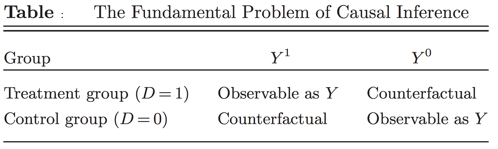

layout: true

<div class="my-footer"></div> 

---

```{r setup, include=FALSE,warning=FALSE,message=FALSE}
options(htmltools.dir.version = FALSE)
knitr::opts_chunk$set(
  message = FALSE,
  warning = FALSE,
  dev = "svg",
  cache = TRUE,
  fig.align = "center"
  #fig.width = 11,
  #fig.height = 5
)

# define vars
om = par("mar")
lowtop = c(om[1],om[2],0.1,om[4])

overwrite = FALSE

library(tidyverse)
library(ggplot2)
library(emo)
library(dplyr)
library(png)
library(grid)
library(pander)
library(countdown)

# countdown style
countdown(
  color_border              = "#d90502",
  color_text                = "black",
  color_running_background  = "#d90502",
  color_running_text        = "white",
  color_finished_background = "white",
  color_finished_text       = "#d90502",
  color_finished_border     = "#d90502"
)
```

layout: true

<div class="my-footer"></div> 

---

# Quick "Quiz" on Last Week's Material

1\. From your ***computer*** `r emo::ji("backhand_index_pointing_right")` connect to [***www.wooclap.com/SCPOSLR***](https://app.wooclap.com/SCPOSLR)

&nbsp; &nbsp; &nbsp; ***OR***

2\. From your ***phone*** `r emo::ji("backhand_index_pointing_right")` flash QR code below

```{r, echo = F, out.width = "300px"}

```

---

# Today - Introduction to Causal Inference

* ***Causality*** versus ***correlation***

* The ***Potential Outcome Framework*** a.k.a. Rubin's Causal Model

* ***Randomized controlled trials*** (RCTs)

* Follow up on the empirical application of *class size* and *student performance*

---

# Why do we care about causality?

Many of the *interesting questions* we might want to answer with data are causal

--

- ***Understanding*** the world

  - *Social sciences*: Why do people behave in the way they do?
  - *Health sciences*: Why do people get sick? Which medicine can cure them?

--

- Causal understanding is also of first interest to **policymakers**

  - How to lower unemployment?
  - How to improve student learning?
  - Whether governments should care about the level of public debt?

--

- Note that some questions we might want to answer are not causal 
  - Most *Artificial Intelligence* tasks only care about **prediction**
  - *Example*: predicting whether a photo is of a dog or a cat is vital to how Google Images works, but it doesn't care what *caused* the photo to be of a dog or a cat.

---

# Causality and Economics

- Making causal inference from data can be seen as economists' *comparative advantage* among the social sciences!

- Plenty of fields do statistics. But very few make it standard training for their students to understand causality.

- Economists' endeavour to establish causal relationships is also what makes them useful both in the private (e.g. tech companies) and public sector (e.g. policy advisors). 

--

- Ok, that's enough preaching `r emo::ji("sweat_smile")`


---

# The Concept of Causality

__Causality__: what are we talking about? 

- We say that `X` *causes* `Y`

--

  - if we were to intervene and *change* the value of `X` ***without changing anything else***...
    
--

  - then `Y` would also change ***as a result***.
  
--

- The key point here is the ***without changing anything else***, often referred as the **ceteris paribus (*all else equal*) assumption**.   
(*latin* makes things seem more complicated `r emo::ji("nerd_face")`)

--

- `r emo::ji("warning")` It does **NOT** mean that `X` is the only factor that causes `Y`.

---

# Correlation vs Causation

***Correlation does not equal causation*** has become a ubiquitous mantra, but can you tell why it is true?

--

Some correlations obviously don't imply causation ([e.g. spurious correlation website](https://www.tylervigen.com/spurious-correlations)).

--

```{r, echo = FALSE, out.width = "800px"}
knitr::include_graphics("../img/photos/spurious.png")
```

---

# Correlation vs Causation: Smoking and Lung Cancer

But not all correlations are so easy to rule out

--

***Does smoking cause lung cancer?***

--

.pull-left[
- Today, we know the answer is *YES*! 

- But let's go back in the 1950's

  - We are at the start of a big increase in deaths from lung cancer...
  
  - ... which is happening after a fast growth in cigarette consumption
]

--

.pull-right[
```{r, echo = FALSE, out.width = "400px"}
knitr::include_graphics("../img/photos/Smoking_lung_cancer.png")
```
]

--

- It's very tempting to claim that smoking causes lung cancer based on this graph.

---

# Correlation vs Causation: Smoking and Lung Cancer

At the time many people were still skeptical, including some famous statisticians:

--

.pull-left[
***Macro confouding factors***:  

Other macro factors which can cause cancers also changed between 1900 and 1950:

  - Tarring of roads,
  
  - Inhalation of motor exhausts (leaded gasoline fumes),
  
  - General greater air pollution.
]

--

.pull-right[
***Self selection***: 

Smokers and non-smokers may be different in the first place: 
  
  - __Selection on observable characteristics__: age, education, income, etc.
  
  - __Selection on unobservable characteristics__: genes (the hypothetical confounding genome theory of [Fisher](https://fr.wikipedia.org/wiki/Ronald_Aylmer_Fisher)). 
]

---

# Correlation vs Causation: Smoking and Lung Cancer

- Let's focus on one of these potential confounding characteristics: **age**.

--

- Based on [Cochran (1968)](https://www.jstor.org/stable/2528036?origin=crossref&seq=11#metadata_info_tab_contents), we will use death rates in Canada, the U.K. and the U.S.

- For each country 3 groups of men were studied for 20 months (U.S.) to 5 five years (U.K.).

--

- The following table gives the death rates per 1,000 persons-years among these people.

| Smoking group &nbsp; &nbsp; | &nbsp; &nbsp; Canada &nbsp; &nbsp; | &nbsp; &nbsp; U.K. &nbsp; &nbsp; | &nbsp; &nbsp; U.S. &nbsp; &nbsp;
| -| :-: | :-: | :-:
| Non-smokers | 20.2 | 11.3 | 13.5
| Cigarettes | 20.5 | 14.1 | 13.5
| Cigars/pipes | 35.5 | 20.7 | 17.4

- Cigar/pipe smokers are 30% (U.S.) to 75% (Canada) more likely to die from lung cancer than non-smokers.

---

# Correlation vs Causation: Smoking and Lung Cancer

* But the age *distribution* is also very different depending on smoking status.

* The following table gives the mean age by smoking status

| Smoking group &nbsp; &nbsp; | &nbsp; &nbsp; Canada &nbsp; &nbsp; | &nbsp; &nbsp; U.K. &nbsp; &nbsp; | &nbsp; &nbsp; U.S. &nbsp; &nbsp;
| -| :-: | :-: | :-:
| Non-smokers | 54.9 | 49.1 | 57.0
| Cigarettes | 50.5 | 49.8 | 53.2
| Cigars/pipes | 65.9 | 55.7 | 59.7

* Because health is likely to deteriorate with age the previous table could be far from giving causal estimates. 

---

class:inverse

# Task 1

`r countdown(minutes = 5, top = 0)`

Let's adjust our Canadian statistics **taking the age distribution into account **.


|           | Death rates of <br> Pipe-smokers| Nb. of <br> pipe smokers | Nb. of <br> non-smokers |
|-----------|:----:|:----:|:----:|
| Age 20-50 | 15 | 11 | 29 |
| Age 50-70 | 35 | 13 | 9  |
| Age +70   | 50 | 16 | 2  |
| Total     |    | 40 | 40 |

1. Compute the average death rate for pipe smokers in Canada.

1. What would the average mortality rate be for pipe smokers if they had the same age distribution as non-smokers?

---


# Correlation vs Causation: Smoking and Lung Cancer


Here is the age-adjusted death rates table found by [Cochran (1968)](https://www.jstor.org/stable/2528036?origin=crossref&seq=11#metadata_info_tab_contents).

| Smoking group &nbsp; &nbsp; | &nbsp; &nbsp; Canada &nbsp; &nbsp; | &nbsp; &nbsp; U.K. &nbsp; &nbsp; | &nbsp; &nbsp; U.S. &nbsp; &nbsp;
| -| :-: | :-: | :-:
| Non-smokers | 20.2 | 11.3 | 13.5
| Cigarettes | 28.3 | 12.8 | 17.7
| Cigars/pipes | 21.2 | 12.0 | 14.2

- Cigars/pipes seem much less dangerous than in the previous table...

--

- ... but this table still does not allow us to tell about the causal effect of smoking.

--

- There are still a lot of ***confounding factors*** that are not accounted for. 

---

# How Can We Tell?

- Sometimes correlations are just pure *artefacts*: there is no causal relationship between the variables of interest.

- In some other cases, there are both correlation and causality but not of the same **magnitude**, or even the same **direction**.

--

- So how can we make causal inference then? 

- The ***Potential Outcomes Framework*** will be our guide.


---
layout: false
class: title-slide-section-red, middle

# Causal Inference

---
layout: true

<div class="my-footer"></div> 

---

# The Potential Outcomes Framework

Often called the **Rubin Causal Model** in memory of the statistician **Donald Rubin** who generalised and formalized this model in the 1970's.

--

***Key idea***: Each individual can be exposed to **multiple alternative treatment states**.
  - smoking cigarrettes, smoking cigars or not smoking,
  - growing up in a poor vs a middle class neighborhood vs a rich neighborhood,
  - being in a small or a big class.
  
--

.pull-left[
For practicality, let this treatment variable $D_i$ be a binary variable:

$$
D_i = \begin{cases} 
                    1 \textrm{ if individual $i$ is treated} \\\\ 
                    0 \textrm{ if individual $i$ is not treated} 
      \end{cases}
$$
]

--

.pull-right[

***Treatment group***  
all the individuals such that $D_i = 1$.

***Control group***  
all the individuals such that $D_i = 0$.
]

---


# The Potential Outcomes Framework

* In this framework, each individual has two ***potential outcomes***:
  
  - $Y_i^1$: *potential outcome in the treatment state* $(D_i = 1)$ for individual $i$,
  
  - $Y_i^0$: *potential outcome in the control state* $(D_i = 0)$ for individual $i$.

--

* From these we can define the ***individual treatment effect***:

$$ \delta_i = Y_i^1 - Y_i^0$$

* $\delta_i$ measures the **causal effect of $D_i$ (treatment)** for individual $i$ on outcome $Y$.

--

* In real life we only observe $Y_i$ which can be written as:

$$Y_i = D_i * Y_i^1 + (1- D_i)*Y_i^0$$

--

* ***Fundamental Problem of Causal Inference***: for any individual $i$, we only observe one of either potential outcomes, and thus we cannot compute $\delta_i$ [(Holland, 1986)](http://people.umass.edu/~stanek/pdffiles/causal-holland.pdf).

---

# The Potential Outcomes Framework

```{r, echo = FALSE, out.width = "700px"}

```

.footnote[
This table is from Morgan and Winship (2015, p.46).
]

* The potential outcome that is not observed exists in principle, it is called the ***counterfactual outcome***.

  * What your test score would have been if you had been in a big class, knowing that you were in a small one.

--

* Since the treatment effect *cannot* be observed at the individual level, we estimate population averages.

---

# Average Treatment Effect (ATE)

Broadest possible average effect: **A**verage **T**reatment **E**ffect (***ATE***)

\begin{align}
ATE &= \mathop{\mathbb{E}}(\delta_i) \\
    &= \mathop{\mathbb{E}}(Y_i^1 - Y_i^0) \\ 
    &= \mathop{\mathbb{E}}(Y_i^1) - \mathop{\mathbb{E}}(Y_i^0)
\end{align}
  
* The ATE simply measures the ***average of individual treatment effects over the whole population***. 
  
  * The $\mathop{\mathbb{E}}(.)$ operator stands for **expectation** or *population mean*.
  
  * The $\mathop{\mathbb{E}}(.)$ operator is linear, in other words, $\mathop{\mathbb{E}}(X+Y) = \mathop{\mathbb{E}}(X) + \mathop{\mathbb{E}}(Y)$ with $X$ and $Y$ being two random variables.

---

# Average Treatment on the Treated (ATT)

Other ***conditional*** average treatment effects may be of interest:

* The **A**verage **T**reatment Effect on the **T**reated (***ATT***)

\begin{align}
 ATT &= \mathop{\mathbb{E}}(\delta_i | D_i = 1) \\
     &= \mathop{\mathbb{E}}(Y_i^1 - Y_i^0 | D_i = 1) \\
     &= \mathop{\mathbb{E}}(Y_i^1 | D_i = 1) - \mathop{\mathbb{E}}(Y_i^0 | D_i = 1)
\end{align}

* The ATT measures the ***average treatment effect conditional on being in the treatment group***.

    * The $\mathop{\mathbb{E}}(.|D = x)$ operator stands for **conditional expectation**. It refers to the expectation over a subcategory of the entire population, namely people who satisfy the condition $D = x$.
  * The $\mathop{\mathbb{E}}(.|D = x)$ operator is also linear.

---

# Average Treatment on the Untreated (ATU)

Other ***conditional*** average treatment effects may be of interest:

* The **A**verage **T**reatment Effect on the **U**ntreated (***ATU***)

\begin{align}
 ATU &= \mathop{\mathbb{E}}(\delta_i | D_i = 0) \\
     &= \mathop{\mathbb{E}}(Y_i^1 - Y_i^0 | D_i = 0) \\
     &= \mathop{\mathbb{E}}(Y_i^1 | D_i = 0) - \mathop{\mathbb{E}}(Y_i^0 | D_i = 0)
\end{align}

* The ATU measures the ***average treatment effect conditional on being in the control group***.

--

* In the majority of cases, ATE $\neq$ ATT $\neq$ ATU!

---

# The Problem of Causal Inference

* We have the same **missing data problem** for computing the ATE, ATT or ATU as we did for $\delta_i$. Either $Y_i^1$ or $Y_i^0$ is missing for each $i$.

--

* From the data, we can compute the **S**imple **D**ifference in mean **O**utcomes (***SDO***) for both groups:

$$ SDO = \mathop{\mathbb{E}}(Y_i^1|D_i=1) - \mathop{\mathbb{E}}(Y_i^0|D_i=0) $$ 

--

* For example, it would consist in taking the difference between:
  * Death rates for smokers and non-smokers,
  * GDP growth rates for democratic and non democratic countries,
  * Unemployment rates for countries with and without a minimum wage.

--

* Most of the time, such a difference **will fail to capture the causal effect** of the treatment.

--

* Notice that this kind raw comparison is often done by journalists, politicians, badly trained scientists (but not you now! `r emo::ji("wink")`).

---

# The Problem of Causal Inference

Let's rewrite the SDO to make the individual treatment effect $(\delta_i)$ appear in the equation. 

\begin{align}
  \mathop{\mathbb{E}}(Y_i^1|D_i=1) - \mathop{\mathbb{E}}(Y_i^0|D_i=0) &= \mathop{\mathbb{E}}(Y_i^0 + \delta_i | D_i = 1) - \mathop{\mathbb{E}}(Y_i^0 | D_i = 0)
\end{align}

For now, suppose **treatment effect is constant** across people: $\forall i, \delta_i = \delta$.

Then,

\begin{align}
  \mathop{\mathbb{E}}(Y_i^1|D_i=1) - \mathop{\mathbb{E}}(Y_i^0|D_i=0) &= \delta + \mathop{\mathbb{E}}(Y_i^0 | D_i = 1) - \mathop{\mathbb{E}}(Y_i^0 | D_i = 0)
\end{align}

And because $ATE = \mathop{\mathbb{E}}(\delta_i) = \mathop{\mathbb{E}}(\delta) = \delta$ (by assumption), we get: 


\begin{align}
  SDO &= \mathop{\mathbb{E}}(Y_i^1|D_i=1) - \mathop{\mathbb{E}}(Y_i^0|D_i=0) \\
  &= ATE + \underbrace{\mathop{\mathbb{E}}(Y_i^0 | D_i = 1) - \mathop{\mathbb{E}}(Y_i^0 | D_i = 0)}_\text{Selection bias}
\end{align}

---

# The Problem of Causal Inference

Let's now relax the assumption that the treatment effect is constant among all individuals.

After tedious calculations that we skip, we get that the SDO is now decomposed as: 

\begin{align}
  SDO &= ATE + \underbrace{\mathop{\mathbb{E}}(Y_i^0 | D_i = 1) - \mathop{\mathbb{E}}(Y_i^0 | D_i = 0)}_\text{Selection bias} \\
  & \quad \quad  \quad \quad + \underbrace{(1-\pi)(ATT - ATU)}_\text{Heterogenous treatment effect bias}
\end{align}

where $1 - \pi$ denotes the share of people in the control group.

--

So there is a novel source of bias that comes from the potential ***heterogeneity in the individual treatment effect*** $\delta_i$.

--

* ***Selection bias***: those who attend university are likely to have higher baseline cognitive skills (regardless of whether they actually attend college).
* ***Heterogeneous treatment effect bias***: those who attend university may improve their cognitive skills more at university because they are more motivated.

---

class:inverse

# Task 2

`r countdown(minutes = 10, top = 0)`

Let's compute these various quantities and biases with some toy data (i.e. data we generated ourselves).

```{r, echo = FALSE, eval = FALSE}
set.seed(1)
D_i = sample(c(0,1), replace = T, size = 10000)
Y0_i = sample(c(1:10), replace = T, size = 10000) + D_i
delta_i = sample(c(1:3), replace = T, size = 10000) + 0.2*D_i
cor(Y0_i, D_i)
cor(delta_i, D_i)
Y1_i = Y0_i + delta_i
set.seed(3)
D_i_random = sample(c(0,1), replace = T, size = 10000)
cor(Y0_i, D_i_random)
cor(delta_i, D_i_random)
toy_data = data.frame(D_i, Y0_i, Y1_i, D_i_random)
# fwrite(toy_data, "../../../../../Dropbox/ScPoEconometrics/pierre_gustave/toy_data.csv")
# toy_data = read.csv("https://www.dropbox.com/s/a4u67nmu9gnl94y/toy_data.csv?dl=1")
```

1. Load the data [here](https://www.dropbox.com/s/a4u67nmu9gnl94y/toy_data.csv?dl=1). Notice that `Di_random` is a treatment status we would have under random assignment.

1. Create the following variables: $Y_i$ and $\delta_i$. Recall that $Y_i = D_i * Y_i^1 + (1 - D_i) Y_i^0$ and $\delta_i = Y_i^1 - Y_i^0$. 

1. Compute the ***ATE*** and the ***SDO***. (Use base `R`.)  Is there is any *bias*? Is it large in magnitude?

1. Using `D_i_random`, compute the ***SDO under randomization***. Remember that you need to recompute $Y_i$ because the assignment is not the same anymore.   
If you got it right, the bias should be very close to 0. Why is it not exactly 0? 

1. *To do at home*:  Compute the value of the ***selection bias*** and the ***heterogenous treatment effect bias*** and check that we have $$SDO = ATE + \textrm{selection bias} + \textrm{heterogenous treatment effect bias}$$


---

# Randomization solves the problem of causal inference!

* ***Randomized experiments***: you ***randomly*** assign people to a treatment and a control group.

* In this case, the treatment status **independent** of the potential outcomes.

--

* In particular, there is no reason for $\mathop{\mathbb{E}}(Y_i^0 | D_i = 1)$ to be different from $\mathop{\mathbb{E}}(Y_i^0 | D_i = 0)$

  * Therefore the ***selection bias is equal to 0***.
  
--
  
* In the same way, there is no reason for $\mathop{\mathbb{E}}[\delta_i]$ to be different in the treatment and control group. 

  * There $ATT = ATU$, implying the ***heterogenous treatment effect bias will also be 0***.

---

# Randomization solves the problem of causal inference!

With random assignment we have: 

$$ \mathop{\mathbb{E}}(Y_i^1|D_i=1) - \mathop{\mathbb{E}}(Y_i^0|D_i=0) = ATE$$ 

`r emo::ji("point_right")` We can directly estimate the ATE from the data!

---

layout: false
class: title-slide-section-red, middle

# Randomized Experiments

---
layout: true

<div class="my-footer"></div> 

---

# Randomized experiments

- Often called **R**andomized **C**ontrolled **T**rials (RCT).

- The first RCTs were conducted a long time ago (18th and 19th century), mainly in **Medecine**. 

- In the beginning of the 20th century they were popularized by famous statisticians like **J. Neyman** or **R.A. Fisher**. 

- Since then they have had a growing influence and have progressively become a reliable [tool for public policy evaluation](https://www.povertyactionlab.org/fr). 

- As for economics, the **2019 Nobel Price in Economics** was awarded to three exponents of RCTs, [Abhijit Banerjee, Esther Duflo and Michael Kremer](https://www.economist.com/finance-and-economics/2019/10/17/a-nobel-economics-prize-goes-to-pioneers-in-understanding-poverty), "for their experimental approach to alleviating global poverty".

---

# Back to class size and students' achievement

Last week we regressed average student math and reading scores on class size.

$$\textrm{math score}_i = b_0 + b_1 \textrm{class size}_i + e_i$$
We briefly discuss why $b_1^{OLS}$ could only establish an ***association*** and not a ***causal relationship***.

--

* **Student sorting**: There is selection into schools with different sized classes. Suppose parents have a prior that smaller classes are better, they will try to get their kids into those schools.

--

* **Teacher sorting**: Teachers may sort in schools with smaller classes because it’s easier to teach a small rather than a large class, and if there is competition for those places then higher quality teachers will have an advantage.

--

* **Location effect**: Large classes may be more common in wealthier and bigger cities, while small classes may be more likely in poorer rural areas.

--

An RCT would take care of all these biases!

---

# The Project STAR Experiment

Tennessee **S**tudent/**T**eacher **A**chievement **R**atio Experiment (see [Krueger (1999)](http://piketty.pse.ens.fr/files/Krueger1999.pdf))

* Funded by Tennesse legislature for a total cost of approx. $12 million.

* The experiment started in the 1985-1986 school year and lasted four years.

--

* 11,600 students and their teachers where **randomly assigned** to one of the following 3 groups from kindergarten through third grade:

  1. ***Small class***: 13-17 students per teacher,
  
  2. ***Regular class***: 22-25 students,
  
  3. ***Regular/aide class***: 22-25 students with a full-time teacher's *aide*.

--

* Randomization occurred within schools.

* Students' math and reading skills were tested around March each year.

--

* There was a problem of ***non-random attrition*** but we will ignore it.

---

class:inverse

# Task 3

`r countdown(minutes = 10, top = 0)`

1. Load the *STAR* data from [here](https://www.dropbox.com/s/bf1fog8yasw3wjj/star_data.csv?dl=1) and assign it to an object called `star_df`.

1. Read the help for `AER::STAR` to understand what the variables correspond to. (Note: the data has been *reshaped* so don't mind the "k", "1", etc. in the variable names in the help.)

1. What's the unit of observation? Which variable contains: (i) the (random) class assignment, (ii) the student's class grade, (iii) the outcomes of interest?

1. How many observations are there? Why so many?

1. Why are there so many `NA`s? What do they correspond to?

1. Keep only cases with no `NA`s with the following code:  
`star_df <- star_df[complete.cases(star_df),]`

1. Let's check how well the randomization was done by doing ***balancing checks***.  
Compute the average percentage of girls, african americans, and free lunch qualifiers by grade *and* treatment class.  
*Hint*: The following computes the percentage of girls (without the relevant `dplyr` verbs)
`share_female = mean(gender == "female") * 100`.


```{r, echo = FALSE}
# data("STAR", package = "AER")
# star <- STAR %>%
#     pivot_longer(
#         cols = -c(gender, ethnicity, birth),
#         names_to = c(".value", "grade"),
#         names_pattern = "(.+)(k|1|2|3)$")
# write.csv2(star, file = "star_data.csv", row.names = F)
star_df = readr::read_csv(file = "https://www.dropbox.com/s/bf1fog8yasw3wjj/star_data.csv?dl=1")
star_df <- star_df[complete.cases(star_df),]
```

---

# The Project STAR Experiment

We just saw that in an RCT the ATE is obtained by computing the differences in outcomes between the treatment and control groups.

Let's only focus on:

- One treatment group: **small classes**,

- One control group: **regular classes**,

- One grade: **kindergarten** (k).

--

```{r, echo = FALSE}
diff_table = data.frame(
    grade = rep(c("1","2","3","k"), each = 2),
    test = rep(c("math","read"), times = 4),
    star_df  %>%
        pivot_longer(cols = c("math","read"), names_to = "test", values_to = "score") %>%
        filter(star == "regular") %>%
        group_by(grade, test) %>%
        summarise(mean_regular = round(mean(score), 3)) %>%
        ungroup() %>%
        select(mean_regular),
    star_df %>%
        pivot_longer(cols = c("math","read"), names_to = "test", values_to = "score") %>%
        filter(star == "small") %>% group_by(grade, test) %>%
        summarise(mean_small = round(mean(score), 3)) %>%
        ungroup() %>%
        select(mean_small),
    star_df %>%
        pivot_longer(cols = c("math","read"), names_to = "test", values_to = "score") %>%
        filter(star == "regular+aide") %>%
        group_by(grade, test) %>%
        summarise(mean_regular_aide = round(mean(score), 3)) %>%
        ungroup() %>%
        select(mean_regular_aide)) %>%
    mutate(
        diff_small_regular = round(mean_small - mean_regular, 3),
        diff_regular_aide_regular = round(mean_regular_aide - mean_regular, 3)
    ) %>%
    arrange(factor(grade, levels = c("k","1","2","3")))
```

grade | test | mean regular | mean small | ATE
--------|---------|---------|---------|---------
k | math | `r round(diff_table[1,3], 2)` | `r round(diff_table[1,4], 2)` | `r round(diff_table[1,4] - diff_table[1,3], 2)`
k | read | `r round(diff_table[2,3], 2)` | `r round(diff_table[2,4], 2)` | `r round(diff_table[2,4] - diff_table[2,3], 2)`

What's the interpretation for these ATEs?

--

That's nice but can't we put this in regression form?

---

# RCT in Regression Form

$$ Y_i = D_i Y_i^1 + (1 - D_i) Y_i^0 $$

--

Rewriting this equation, we get:

$$\begin{align} Y_i &=Y_i^0 +D_i (Y_i^1 - Y_i^0) \\ &= Y_i^0 +D_i \delta_i \end{align}$$

--

Assuming $\delta_i = \delta, \forall i$,

$$Y_i = Y_i^0 + D_i \delta$$

--

Adding $\mathbb{E}[Y_i^0] - \mathbb{E}[Y_i^0] = 0$ to the right-hand side:

$$\begin{align} Y_i &= \mathbb{E}[Y_i^0] + D_i \delta + Y_i^0 - \mathbb{E}[Y_i^0] \\ &= b_0 + \delta D_i + e_i \end{align}$$
where $b_0 = \mathbb{E}[Y_i^0]$ and $e_i = Y_i^0 - \mathbb{E}[Y_i^0]$

---

# The Project STAR Experiment: Regression

The last equation looks exactly like the simple regression model we saw last week!

Let's therefore estimate the ATE of small class size on math scores using a regression.

--

.pull-left[
We want to estimate the following model: $mathscore_i = b_0 + \delta D_i + e_i$, with

$$
D_i = \begin{cases} 
                    1 \textrm{  if small class = 1}  \\\\ 
                    0 \textrm{  if small class = 0} 
      \end{cases}
$$

```{r, echo = TRUE}
star_df_k_small <- star_df %>%
  filter(
    star %in% c("regular", "small") &
      grade == "k") %>% 
  mutate(small = (star == "small"))
```
]

--

.pull-right[
```{r, echo = TRUE, eval = TRUE}
lm(math ~ small, star_df_k_small)
```

```{r, echo = TRUE, eval = TRUE}
mean(star_df_k_small$math[
    star_df_k_small$small == TRUE]) - 
  mean(star_df_k_small$math[
    star_df_k_small$small == FALSE])

mean(star_df_k_small$math[
    star_df_k_small$small == FALSE])
```
]

---

# The Project STAR Experiment: Regression

From the estimation output we get the following:

$\begin{align} \mathbb{E}[\textrm{math score} | D_i = 0]&= \mathbb{E}[b_0 + \delta D_i + e_i | D_i = 0] \\ &= b_0 + \delta \mathbb{E}[D_i| D_i = 0] + \mathbb{E}[e_i|D_i = 0] \\ &= b_0 \end{align}$

--

$\begin{align} \mathbb{E}[\textrm{math score} | D_i = 1]&= \mathbb{E}[b_0 + \delta D_i + e_i | D_i = 1] \\ &= b_0 + \delta \mathbb{E}[D_i| D_i = 1] + \mathbb{E}[e_i|D_i = 1] \\ &= b_0 + \delta \end{align}$

--

$\begin{align} ATE &= \mathbb{E}[\textrm{math score} | D_i = 1] - \mathbb{E}[\textrm{math score} | D_i = 0] \\ &= b_0 + \delta - b_0 \\ &= \delta \end{align}$

--

We knew this already but we now understand why this is true `r emo::ji("v")`

---

class:inverse

# Task 4

`r countdown(minutes = 10, top = 0)`

1. Filter the dataset to only keep first graders and the small class and regular class groups.

1. Compute the average math score for both groups, and the difference between the two. (Use base `R`.)

1. Create a dummy variable `treatment` equal to `TRUE` if student is in treatment group (i.e. small class size) and `FALSE` if in control group (i.e. regular class size). See slide 33 for how to create a dummy variable.

1. Regress math score on the treatment dummy variable. Are the results in line with the previous question?

1. How do you interpret these coefficients?

---

# Shortcomings of RCTs 

RCTs have very strong ***internal validity***, that is they can convincingly establish causal links.

However, they have some shortcomings:

* RCT are often **infeasible**:

  * RCTs are **costly**,
  * RCTs may face some **ethical issues**: some *treatments* simply cannot be given to people,
  * RCTs take time and we may be **time constrained**.

--

* **Interpretation** of the results:

  * ***External validity***: To what extent can the results from a given RCT be generalized to other contexts (countries, populations,...)?
  
  * Uncovering the mechanisms that are at stake may be difficult,
  
  * Imperfect randomization, attrition, ...

---


# What comes next? 

* So if we cannot rely on RCTs to make our life easy, it means we have to find a way to make causal inference from ***observational data*** (as opposed to ***experimental data***).

--

* It brings us back to models 

  - In causal inference, the *model* is our idea of what the process that *generated the data* is.

  - We have to make some assumptions about what this is!

--

2 broad cases:

* ***selection occurs on observable characteristics***: *multiple regression* (next week!)

* ***selection occurs on unobservable characteristics***: *regression discontinuity design* (lecture 10) or  *difference-in-differences* (not covered but set of slides online!)

---

<br>
<br>

.center[
```{r, echo = FALSE, out.width = "1000px"}
knitr::include_graphics("../img/photos/correlation_funny.png")
```
]

---

class: title-slide-final, middle
background-image: url(../img/logo/ScPo-econ.png)
background-size: 250px
background-position: 9% 19%

# SEE YOU NEXT WEEK!


|                                                                                                            |                                   |
| :--------------------------------------------------------------------------------------------------------- | :-------------------------------- |
| <a href="mailto:florian.oswald@sciencespo.fr">.ScPored[<i class="fa fa-paper-plane fa-fw"></i>]               | florian.oswald@sciencespo.fr       |
| <a href="https://github.com/ScPoEcon/ScPoEconometrics-Slides">.ScPored[<i class="fa fa-link fa-fw"></i>] | Slides |
| <a href="https://scpoecon.github.io/ScPoEconometrics">.ScPored[<i class="fa fa-link fa-fw"></i>] | Book |
| <a href="http://twitter.com/ScPoEcon">.ScPored[<i class="fa fa-twitter fa-fw"></i>]                          | @ScPoEcon                         |
| <a href="http://github.com/ScPoEcon">.ScPored[<i class="fa fa-github fa-fw"></i>]                          | @ScPoEcon                       |

