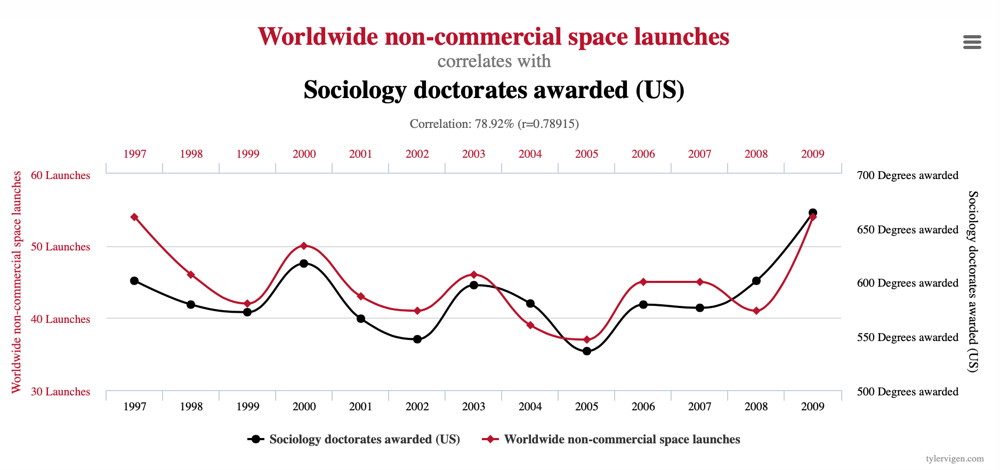
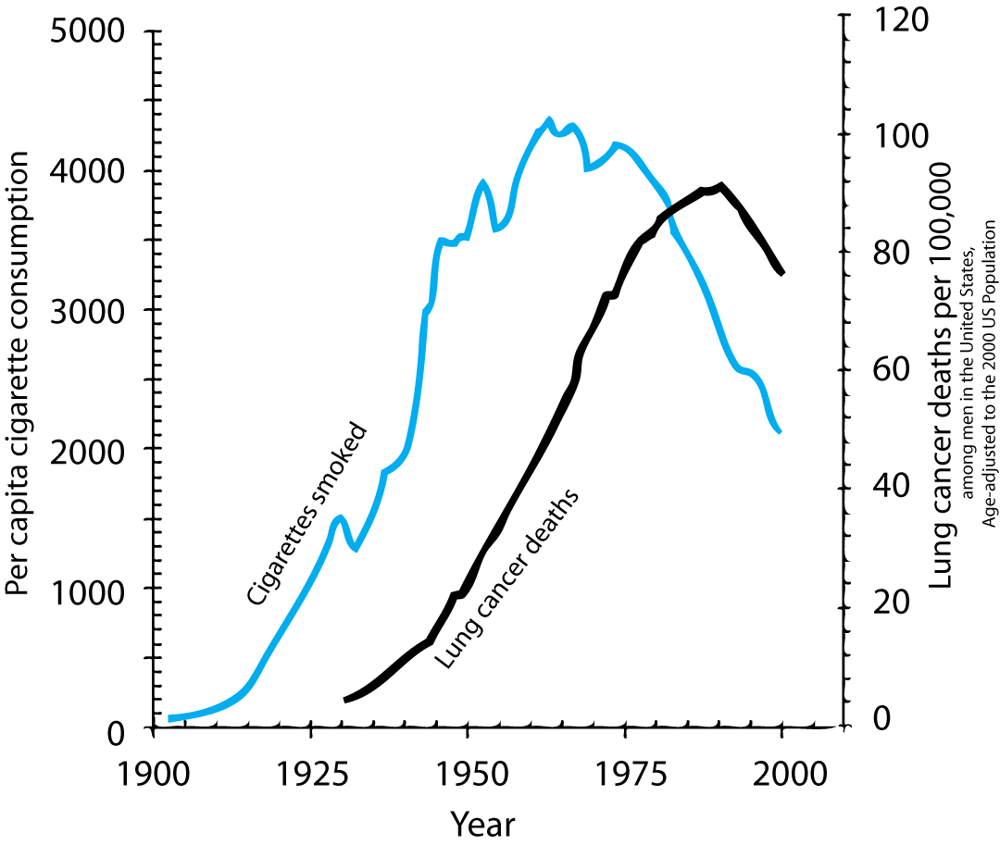
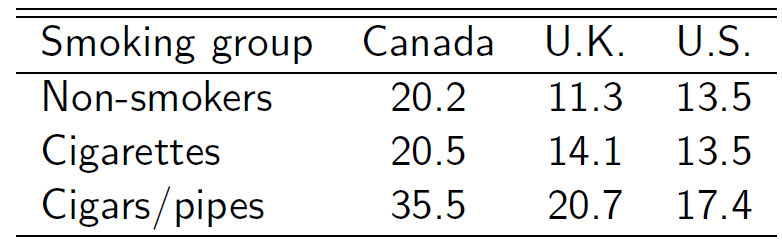
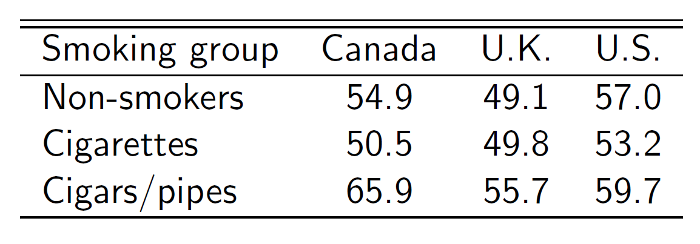
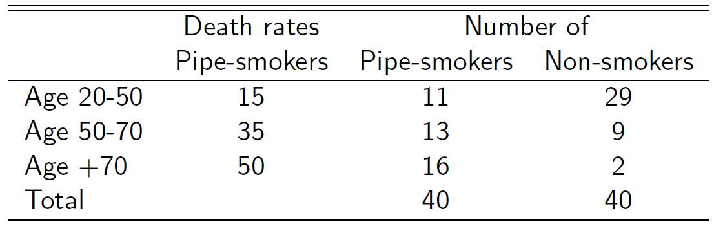
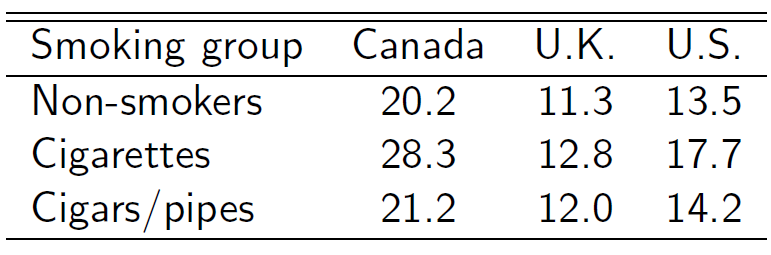

layout: true

<div class="my-footer"></div> 

---

```{r setup, include=FALSE,warning=FALSE,message=FALSE}
options(htmltools.dir.version = FALSE)
knitr::opts_chunk$set(
  message = FALSE,
  warning = FALSE,
  dev = "svg",
  cache = TRUE,
  fig.align = "center"
  #fig.width = 11,
  #fig.height = 5
)

# define vars
om = par("mar")
lowtop = c(om[1],om[2],0.1,om[4])

overwrite = FALSE

library(tidyverse)
library(ggplot2)
library(emo)
library(dplyr)
library(png)
library(grid)
library(pander)
```

layout: true

<div class="my-footer"></div> 

---

# Recap from last week

* *Simple Linear Regression Model*: $\widehat y_i = b_0 + b_1 x_i$

* *Ordinary Least Squares* (OLS) estimation: minimize the sum of squared errors

* R command to estimate a linear model: `lm(dependent variable ~ independent variable, data)`


## Today - Introduction to causal inference

* Causality versus correlation

* The Potential Outcome Framework a.k.a. Rubin's Causal Model

* Randomized controlled trials (RCTs)

* Follow up on the empirical application of *class size* and *student performance*

---

# Why do we care about causality?

Many of the *interesting questions* we might want to answer with data are causal

--

- ***Understanding*** the world

  - *Social sciences*: Why do people behave in the way they do?
  - *Health sciences*: Why do people get sick? Which medicine can cure them?

--

- Causal understanding is also of first interest for **policymakers**

  - How to lower unemployment?
  - How to improve student learning?
  - Whether governments should care about the level of public debt?

--

- Note that some questions we might want to answer are not causal 
  - Most *Artificial Intelligence* tasks only care about **prediction**
  - *Example*: "predicting whether a photo is of a dog or a cat" is vital to how Google Images works, but it doesn't care what *caused* the photo to be of a dog or a cat.

---

# Causality and Economics

- Making causal inference from data can be seen as economists' comparative advantage among the social sciences!

- Plenty of fields do statistics. But very few make it standard training for their students to understand causality.

- Economists' endeavour to establish causal relationships is also what makes them useful both in the private (e.g. tech companies) and public sector (e.g. policy advisors) 

--

- Ok, that's enough lobbying `r emo::ji("sweat_smile")`


---

# The Concept of Causality

__Causality__: what are we talking about? 

- We say that `X` *causes* `Y`

--

  - if we were to intervene and *change* the value of `X` ***without changing anything else***...
    
--

  - then `Y` would also change ***as a result***.
  
--

- The key point here is the ***without changing anything else***, often refered as the **ceteris paribus assumption**   
(*latin* makes things seem more complicated `r emo::ji("nerd_face")`)

--

- `r emo::ji("warning")` It does **NOT** mean that `X` is the only factor that causes `Y`.

---

# Correlation vs Causation

*Correlation does not equal causation* has become a ubiquitous mantra, but can you tell why it is true?

--

Some correlations obviously don't imply causation ([Spurious correlation website](https://www.tylervigen.com/spurious-correlations))

--

```{r, echo = FALSE, out.width = "800px"}

```

---

# Correlation vs Causation: Smoking and Lung Cancer

But not all correlations are so easy to rule out

***Does smoking cause lung cancer?***

.pull-left[
- Today, we know the answer is *YES*! 

- But let's go back in the 1950's

  - We are at the start of a big increase in deaths from lung cancer...
  
  - ... which is happening after a fast growth of cigarette consumption
]

--

.pull-right[
```{r, echo = FALSE, out.width = "400px"}

```
]

--

- It's very tempting to claim that smoking causes lung cancer based on this graph.

---

# Correlation vs Causation: Smoking and Lung Cancer

At the time many people were still skeptical, including some famous statisticians:

--

.pull-left[
***Macro confouding factors***:  

Other macro factors which can cause cancers also changed between 1900 and 1950:

  - Tarring of roads,
  
  - Inhalation of motor exhausts (leaded gasoline fumes),
  
  - General greater air pollution.
]

--

.pull-right[
***Self selection***: 

Smokers and non-smokers may be different in the first place: 
  
  - __Selection on observable characteristics__: age, education, income, etc.
  
  - __Selection on unobservable characteristics__: genes (the hypothetical confounding genome theory of Fisher [ADD LINK]). 
]

---

# Correlation vs Causation: Smoking and Lung Cancer

- Let's focus on one of these potential confounding characteristics : **age**.


- Based on [Cochran (1968)](https://www.jstor.org/stable/2528036?origin=crossref&seq=11#metadata_info_tab_contents), we will use death rates from lung cancer in Canada, U.K. and U.S.

- Add simple details about sample size and years!

Death rates per 1,000 person-years




- We are 30% (U.S.) to 75% (Canada) more likely to find death from lung cancer among cigar/pipe smokers than non-smokers.

---

# Correlation vs. causality : smoking and lung cancer #2

* But the age distribution is also very different according to smoking status

Mean age by smoking status



* Because health is likely to deteriorate with age the previous table could be far from causal estimates. 

---

class:inverse

# Correlation vs. causality : smoking and lung cancer #3

Let's consider adjust our statistics taking into account the age distribution of pipe-smokers.




This table replicates the 3 age group distribution of pipe-smokers and non-smokers, as well as the death rate of pipe-smokers for each age group in Canada.

**Questions** 

- Compute the average death rate for pipe smokers in Canada from age grouped death rates?

- What would be the average mortality rate be for pipe smokers if they had the same age distribution as the non-smokers?

---


# Correlation vs. causality : smoking and lung cancer #4

Here is the adjusted death rates table found by [(Cochran 1968)](https://www.jstor.org/stable/2528036?origin=crossref&seq=11#metadata_info_tab_contents) using 3 age groups



- Cigars/pipes seem much less dangerous than in the previous table...

- ... but this table still does not allow us to tell about the causal effect of smoking. 

- There are still a lot of **confounding factors** that we are not controling for. 

---

# How Can We Tell?

- Sometimes correlations are just pure artefacts : there is no causal relationship between the variables of interest

- In some other cases, there are both correlation and causality but not of the same **magnitude**, or even the same **direction**.

--

- So how can we make causal inference then ? 

- The **Potential Outcomes framework** will be helpful to find out.


---
layout: false
class: title-slide-section-red, middle

# Causal Inference

---
layout: true

<div class="my-footer"></div> 

---

# The Potential Outcomes Model of causal inference

Often called the **Rubin Causal Model** in memory of the statistician **Donald Rubin** who generalised and formalized this model in the 1970's.<sup>1<sup/>

--

* **Key idea/assumption** : Each individual can be exposed to **multiple alternative treatment states**.
For example :
  - smoking or non-smoking 
  - growing up in a poor vs a rich neighborhood
  - being in a small or a big class 
  
--

.pull-left[
* Let this treatment be a binary variable

$$
D_i = \begin{cases} 
                    1 \textrm{ if i is treated} \\\\ 
                    0 \textrm{ if i is not} 
      \end{cases}
$$
]

--

.pull-right[

**Treatment group** $\equiv$ all the individuals such that $D_i = 1$   

**Control group** $\equiv$ all the individuals such that $D_i = 0$   
]

.footnote[
[1]: The potential outcomes framework was first proposed by Jerzy Neyman in his 1923 Master's thesis.
]

---


# The Potential Outcomes Model of causal inference

* In this framework, each individual has two potential outcomes 

$$
\textrm{Potential outcome} = \begin{cases} 
                    Y_i^1 \textrm{  if } D_i = 1 \\\\ 
                    Y_i^0 \textrm{  if } D_i = 0 
      \end{cases}
$$
* It allows us to define the **individual treatment effect**

$$ \delta_i = Y_i^1 - Y_i^0$$
* N.b. : $\delta_i$ measures the **causal effect of $D$** for the individual $i$ on the outcome $Y$


* In real life we observe $Y_i$ such that 

$$Y_i = D_i * Y_i^1 + (1- D_i)*Y_i^0$$

* That is the **fundamental problem of causal inference**. We only observe one of both potential outcomes, so we cannot compute $\delta_i$ for any $i$. 


---

# The Potential Outcomes Model of causal inference

* The potential outcome that is not observed exists in principle, it is called the **counterfactual outcome**.

  * What your test score would have been if you have been in a big class, knowing that you were in a small one.
  
---

# The Potential Outcomes Model

We may also (mostly) be interested in average effect in the population, in particular :


* The **A**verage **T**reatment **E**ffect

\begin{align}
ATE &= \mathop{\mathbb{E}}(\delta_i) \\
    &= \mathop{\mathbb{E}}(Y_i^1 - Y_i^0) \\ 
    &= \mathop{\mathbb{E}}(Y_i^1) - \mathop{\mathbb{E}}(Y_i^0)
\end{align}
  
* The ATE simply measures the **average of individual treatment effects over the whole population**. 
  
  * The $\mathop{\mathbb{E}}(.)$ operator stands for *expectation* or *population mean*. 
  * N.B. : the $\mathop{\mathbb{E}}(.)$ operator is linear $\equiv$ $\mathop{\mathbb{E}}(A+B) = \mathop{\mathbb{E}}(A) + \mathop{\mathbb{E}}(B)$. $A$ and $B$ being two random variables

---

# The Potential Outcomes Model

We may also (mostly) be interested in average effect in the population, in particular :

* The **A**verage **T**reatment Effect on the **T**reated

\begin{align}
 ATT &= \mathop{\mathbb{E}}(\delta_i | D_i = 1) \\
     &= \mathop{\mathbb{E}}(Y_i^1 - Y_i^0 | D_i = 1) \\
     &= \mathop{\mathbb{E}}(Y_i^1 | D_i = 1) - \mathop{\mathbb{E}}(Y_i^0 | D_i = 1)
\end{align}

* The ATT measures the **average treatment effect conditional on being in the treatment group**.

    * The $\mathop{\mathbb{E}}(.|C)$ operator stands for *conditional expectation*. It refers to the expectation over a subcategory of the entire population, namely people who satisfy the condition $C$.
  * The $\mathop{\mathbb{E}}(.|C)$ is also linear.

---

# The Potential Outcomes Model

We may also (mostly) be interested in average effect in the population, in particular :

* The **A**verage **T**reatment Effect on the **U**treated

\begin{align}
 ATT &= \mathop{\mathbb{E}}(\delta_i | D_i = 0) \\
     &= \mathop{\mathbb{E}}(Y_i^1 - Y_i^0 | D_i = 0) \\
     &= \mathop{\mathbb{E}}(Y_i^1 | D_i = 0) - \mathop{\mathbb{E}}(Y_i^0 | D_i = 0)
\end{align}

* The ATU measures the **average treatment effect conditional on being in the control group**.

---

# Facing the problem of causal inference #1

* We have the same **missing data problem** for computing ATE, ATT or ATU than for $\delta_i$. Either $Y_i^1$ or $Y_i^0$ is missing for each $i$. 

--

* There is a simple estimator that can be computed from the data we have :

$$ \mathop{\mathbb{E}}(Y_i^1|D_i=1) - \mathop{\mathbb{E}}(Y_i^0|D_i=0) $$ 

* We simply **difference the mean outcomes in both treatment groups**. For example, it would consist in taking the difference between :
  * Death rates for smokers and non-smokers 
  * GDP growth for democratic and non democratic countries
  * Unemployment rates for countries with and without a minimum wage

* Most of the time, such an estimate **will fail to the capture causal effect** of the treatment

* Notice that this kind raw comparison is often done by journalists / politicians / ... 

---

# Facing the problem of causal inference #2

Let's decompose the Simple Difference in mean Ouctomes (SDO). 

\begin{align}
  \mathop{\mathbb{E}}(Y_i^1|D_i=1) - \mathop{\mathbb{E}}(Y_i^0|D_i=0) &= \mathop{\mathbb{E}}(Y_i^0 + \delta_i | D_i = 1) - \mathop{\mathbb{E}}(Y_i^0 | D_i = 0)
\end{align}

For simplicity, suppose **treatment effect is constant** across people : $\forall i : \delta_i = \delta$

Then,

\begin{align}
  \mathop{\mathbb{E}}(Y_i^1|D_i=1) - \mathop{\mathbb{E}}(Y_i^0|D_i=0) &= \delta + \mathop{\mathbb{E}}(Y_i^0 | D_i = 1) - \mathop{\mathbb{E}}(Y_i^0 | D_i = 0)
\end{align}

And because $ATE = \mathop{\mathbb{E}}(\delta_i) \underbrace{=}_\text{constant treatment effect} \mathop{\mathbb{E}}(\delta) = \delta$ we have : 


\begin{align}
  \mathop{\mathbb{E}}(Y_i^1|D_i=1) - \mathop{\mathbb{E}}(Y_i^0|D_i=0) &= ATE + \underbrace{\mathop{\mathbb{E}}(Y_i^0 | D_i = 1) - \mathop{\mathbb{E}}(Y_i^0 | D_i = 0)}_\text{Selection bias}
\end{align}

---

class:inverse

# Facing the problem of causal inference #3

###**Task**

Let's compute the selection bias with some toy data 

```{r, echo = FALSE, eval = FALSE}

set.seed(1)
D_i = sample(c(0,1), replace = T, size = 1000)
Y0_i = sample(c(1:10), replace = T, size = 1000) + D_i
delta_i = sample(c(1:3), replace = T, size = 1000) + 0.2*D_i
cor(Y0_i, D_i)
cor(delta_i, D_i)
Y1_i = Y0_i + delta_i

set.seed(3)
D_i_random = sample(c(0,1), replace = T, size = 1000)
cor(Y0_i, D_i_random)
cor(delta_i, D_i_random)

toy_data = data.frame(D_i, Y0_i, Y1_i, D_i_random)
fwrite(toy_data, "../../../../../Dropbox/ScPoEconometrics/pierre_gustave/toy_data.csv")
# toy_data = read.csv("https://www.dropbox.com/s/a4u67nmu9gnl94y/toy_data.csv?dl=1")
```

1) Load the data [here](https://www.dropbox.com/s/a4u67nmu9gnl94y/toy_data.csv?dl=1). 

2) Add the variables $Y_i$ and $\delta_i$. 

3) 


---

# Randomization solves the pb of causal inference ! 

* Let's imagine you can **randomly** assign people to each treatment group. That is what **randomized experiments** are. 

* Then the treatment status would be **independant** of the potential outcomes.

* In particular, there is no reason for $\mathop{\mathbb{E}}(Y_i^0 | D_i = 1)$ to be different from $\mathop{\mathbb{E}}(Y_i^0 | D_i = 0)$

  * So the **selection bias is equal to O** 
  
* In the same way, so there is no reason for $\delta_i$ to be different among treated than among controls. 

  * So ATT will equal ATU, implying the **Heterogenous treatment effect bias to be 0** 

---

# Randomization solves the pb of causal inference ! 

Thanks to randomization we then have : 

$$ \mathop{\mathbb{E}}(Y_i^1|D_i=1) - \mathop{\mathbb{E}}(Y_i^0|D_i=0) = ATE$$ 

It means we can directly estimate the ATE from the data! 

---

layout: false
class: title-slide-section-red, middle

# Randomized Experiments

---
layout: true

<div class="my-footer"></div> 

---

# Randomized experiments

- Often called **R**andom **C**ontrolled **T**rial (RCT).

- If you can *randomly assign* `D`, then you know that the people with `D=0` are, on average, exactly the same as the people with `D=1`.

- So simple comparisons will allow you to make causal inference!


---

# Back to class size and students' achievements

Last week we regressed class size on average student math and reading scores.

$$\textrm{math_score}_i = b_0 + b_1 \textrm{class_size}_i + e_i$$
We briefly discuss why $b_1^{OLS}$ could only establish an ***association*** and not a ***causal relationship***.

--

* **Student sorting**: There is selection into schools with different sized classes. Suppose parents have a prior that smaller classes are better, they will try to get their kids into those schools.

--

* **Teacher sorting**: Teachers may sort in schools with smaller classes because it’s easier to teach a small rather than a large class, and if there is competition for those places then higher quality teachers will have an advantage.

--

* **Location effect**: Large classes may be more common in wealthier and bigger cities, while small classes may be more likely in poorer rural areas.

--

An RCT would take care of all these biases!

---

# The Project STAR Experiment

Tennessee **S**tudent/**T**eacher **A**chievement **R**atio Experiment (see [Krueger (1999)](http://piketty.pse.ens.fr/files/Krueger1999.pdf))

* Funded by Tennesse legislature for a total cost of approx. $12 million.

* The experiment started in the 1985-1986 school year and lasted four years.

--

* 11,600 students and their teachers where **randomly assigned** to one of the following 3 groups from kindergarten through third grade:

  1. ***Small class***: 13-17 students per teacher,
  
  2. ***Regular class***: 22-25 students,
  
  3. ***Regular/aide class***: 22-25 students with a full-time teacher's *aide*.

--

* Randomization occurred within schools.

* Students' math and reading skills were tested around March each year.

--

* There was a problem of ***non-random attrition*** but we will ignore it.

---

class:inverse

# Task 2 (10 minutes)

1. Load the *STAR* data from [here]() and assign it to an object called `star_df`.

1. Read the help for `AER::STAR` to understand what the variables correspond to. (Note: the data has been *reshaped* so don't mind the "k", "1", etc. in the variable names in the help.)

1. What's the unit of observation? Which variable contains: (i) the (random) class assignment, (ii) the student's class grade, (iii) the outcomes of interest?

1. How many observations are there? Why so many?

1. Why are there so many `NA`s? What do they correspond to?

1. Keep only cases with no `NA`s with the following code:  
`star_df <- star_df[complete.cases(star_long),]`

1. Let's check how well the randomization was done by doing ***balancing checks***.  
Compute the average percentage of girls, african americans, and free lunch qualifiers by grade *and* treatment class.  
*Hint*: The following computes the percentage of girls (without the relevant `dplyr` verbs)
`share_female = mean(gender == "female") * 100`.


```{r, echo = FALSE}
# data("STAR", package = "AER")
# star <- STAR %>%
#     pivot_longer(
#         cols = -c(gender, ethnicity, birth),
#         names_to = c(".value", "grade"),
#         names_pattern = "(.+)(k|1|2|3)$")
# write.csv2(star, file = "star_data.csv", row.names = F)
star_df = read.csv2(file = "https://www.dropbox.com/s/u2ozlbs1d2qy0bz/star_data.csv?dl=1")
```

---

# The Project STAR Experiment

We just saw that in an RCT the ATE is obtained by computing the differences in outcomes between the control and treatment groups.

Let's only focus on only one treatment grou: small classes.

```{r, echo = FALSE}
diff_table = data.frame(
    grade = rep(c("1","2","3","k"), each = 2),
    test = rep(c("math","read"), times = 4),
    star_long  %>%
        pivot_longer(cols = c("math","read"), names_to = "test", values_to = "score") %>%
        filter(star == "regular") %>%
        group_by(grade, test) %>%
        summarise(mean_regular = round(mean(score), 3)) %>%
        ungroup() %>%
        select(mean_regular),
    star_long %>%
        pivot_longer(cols = c("math","read"), names_to = "test", values_to = "score") %>%
        filter(star == "small") %>% group_by(grade, test) %>%
        summarise(mean_small = round(mean(score), 3)) %>%
        ungroup() %>%
        select(mean_small),
    star_long %>%
        pivot_longer(cols = c("math","read"), names_to = "test", values_to = "score") %>%
        filter(star == "regular+aide") %>%
        group_by(grade, test) %>%
        summarise(mean_regular_aide = round(mean(score), 3)) %>%
        ungroup() %>%
        select(mean_regular_aide)) %>%
    mutate(
        diff_small_regular = round(mean_small - mean_regular, 3),
        diff_regular_aide_regular = round(mean_regular_aide - mean_regular, 3)
    ) %>%
    arrange(factor(grade, levels = c("k","1","2","3")))
diff_table
```

grade | test | mean regular | mean small | ATE
--------|---------|---------|---------|---------
k | math | `r round(diff_table[1,3], 2)` | `r round(diff_table[1,4], 2)` | `r round(diff_table[1,4] - diff_table[1,3], 2)`
k | read | `r round(diff_table[2,3], 2)` | `r round(diff_table[2,4], 2)` | `r round(diff_table[2,4] - diff_table[2,3], 2)`

---
# RCT in regression

## Dummy variable trap

---

class:inverse

# The STAR Experiment #2

**Task 2** 

Let's first focus on small size vs regular class (without aide)

We take the fact of being in small class has being treated, i.e. $D_i = 1$ if $i$ in a small class.

3) How would you get an estimate of the ATE for kindergarden grade (`k`)? Compute it for both math and reading score. 

```{r,echo=FALSE, eval = FALSE}
mean_outcomes_k = star_df %>%
  na.omit() %>%
  filter(star != "regular+aide" & grade == "k") %>%
  select(star, math, read) %>%
  group_by(star) %>%
  summarise_all(mean)

ATE = mean_outcomes_k[mean_outcomes_k$star=="small",c("read","math")] - mean_outcomes_k[mean_outcomes_k$star=="regular",c("read","math")] 

```

4) Compute the ATE for every grades. 

```{r,echo=FALSE, eval = FALSE}
star_df <- star_df[complete.cases(star_df),]
# nice difference table
diff_table = data.frame(
    grade = rep(c("1","2","3","k"), each = 2),
    test = rep(c("math","read"), times = 4),
    star_df  %>%
        pivot_longer(cols = c("math","read"), names_to = "test", values_to = "score") %>%
        filter(star == "regular") %>%
        group_by(grade, test) %>%
        summarise(mean_regular = round(mean(score), 3)) %>%
        ungroup() %>%
        select(mean_regular),
    star_df %>%
        pivot_longer(cols = c("math","read"), names_to = "test", values_to = "score") %>%
        filter(star == "small") %>% group_by(grade, test) %>%
        summarise(mean_small = round(mean(score), 3)) %>%
        ungroup() %>%
        select(mean_small)) %>%
    mutate(
        ATE = round(mean_small - mean_regular, 3)
        ) %>%
    arrange(factor(grade, levels = c("k","1","2","3")))
diff_table
```

5) Produce a bar plot to vizualize the difference in the ATE betwwen grades and test. 

```{r, echo = FALSE}

```

---

# Implementing STAR #3 

Comparing the achievments between each group using **regression**

The model we estimate is : $Y_{i} = b_0 + b_1\textrm{SMALL}_{i} + b_2 \textrm{REG&A}_{i} + e_i$

.pull-left[

]

--

.pull-right[

* Based on these results, would you advise to reduce class size or provide additional teaching aide? 

* What is the value of $b_1$ for grade3? Interpret this value.

* What are the limits of such an experiment? 

]
---

# Pros and cons of RCT's 

RCTs are often seen as the **gold standard of causal inference**

* The Nobel price in economics has recently (2019) been awarded to three exponents of the RCT literature, [Duflo, Banerje and Kremer](https://www.economist.com/finance-and-economics/2019/10/17/a-nobel-economics-prize-goes-to-pioneers-in-understanding-poverty).

* The main strenght of RCTs is their **internal validity** : we are very confident that the estimates we get are capturing causal effects 

--

But it has also several shortcomings 

* **External validity issue**: How much can we generalize from given RCT's results? 
* RCTs are **costly** both in time and money
* RCTs may face some **ethical issues** : there is some treatment that cannot be assigned to people 

* ...

---


# Back to model 

* If we cannot run an RCT (most of the time) we have to find way to make causal inference from **observational data**

* It brings us back to models 

- In causal inference, the *model* is our idea of what we think the process is that *generated the data*.

- We have to make some assumptions about what this is!

- We put together what we know about the world with assumptions and end up with our model.

- The model can then tell us what kinds of things could give us wrong results so we can fix them and get the right counterfactual.

---

# Models

- Wouldn't it be nice to not have to make assumptions?

- Yeah, but it's impossible to skip!

- We're trying to predict something tat hasn't happened - a counterfactual.

- This is literally impossible to do if you don't have some model of how the data is generated.

- You can't even predict the sun will rise tomorrow without a model!

- If you think you can, you're just don't realize the model you're using - that's dangerous!

---

# Teaser of next sessions 

The approach taken to make causal inference will depend on the 

---


# An Example: Randomization

- Let's generate some data.
- Let's say that getting `X` causes `Y` to increase by 100.
- And let's run a randomized experiment of who actually gets X and estimate the size of the effect (should be close to `100`!)

.pull-left[
```{r, echo=TRUE, eval=TRUE}
true_effect <- 100
df <- tibble(Y.without.X = rnorm(1000),
             X=sample(c(0,1),1000,replace=T)) %>%
  mutate(Y.with.X = Y.without.X + true_effect) %>%
  #Now assign who actually gets X
  mutate(Observed.Y = ifelse(X==1,Y.with.X,Y.without.X))
head(df,4)
```
]

.pull-right[
* Now, estimate the group means and simply difference them:
```{r}
#And see what effect our experiment suggests X has on Y
df %>% group_by(X) %>% 
  summarize(Y = mean(Observed.Y)) %>%
  pull(Y) %>% diff
```
]

* That's pretty close to the true effect there!

---

# An Example: No Randomization

- Suppose now we can *not* randomize the `X`.

- Instead there is some kind of rule that decides about `X`.

.pull-left[
```{r, echo=TRUE, eval=TRUE}
df <- tibble(Z = runif(10000)) %>% 
  mutate(Y.without.X = rnorm(10000)+100*Z, 
         Y.with.X = Y.without.X + 100) %>%
  #Now assign who actually gets X
  mutate(X = Z > .9,
         Observed.Y = ifelse(X==1,Y.with.X,Y.without.X))
head(df)
```
]

--

.pull-right[

```{r}
df %>% group_by(X) %>% 
  summarize(Y = mean(Observed.Y)) %>%
  pull(Y) %>% diff
```

* That's not the correct effect size!

* But if we properly model the assignment process and compare apples to apples?

```{r}
df %>% filter(abs(Z-.9)<.01) %>% 
  group_by(X) %>% 
  summarize(Y = mean(Observed.Y)) %>%
  pull(Y) %>% diff
```
]

---

# Building the Counterfactual

* In that last example our first attempt failed because we had not taken selection into account.

* It turns out that `Z` influences `Y.without.X`, which at the same time will be part of our estimator for the true effect size.

* But `Z` also determines who gets treatment! All the ones with `Z > 0.9`!

* So, people with `Z > 0.9` get treated, but **also** have a relatively high `Y.without.X`. 

* You can see that there is a depenence between the assignment and the effect size.


---

class: title-slide-final, middle

# Materials used to make these set of slides 

* Applied Econometrics: Causal Inference and Research Design, S. Cunningham, 2017

* Counterfactuals and Causal Inference, Methods and Principles for Social Research, S. L. Morgan, C. Winship, 2015

Thanks to the authors for making it available! 
---

class: title-slide-final, middle
background-image: url(../img/logo/ScPo-econ.png)
background-size: 250px
background-position: 9% 19%

# END


|                                                                                                            |                                   |
| :--------------------------------------------------------------------------------------------------------- | :-------------------------------- |
| <a href="mailto:florian.oswald@sciencespo.fr">.ScPored[<i class="fa fa-paper-plane fa-fw"></i>]               | florian.oswald@sciencespo.fr       |
| <a href="https://github.com/ScPoEcon/ScPoEconometrics-Slides">.ScPored[<i class="fa fa-link fa-fw"></i>] | Slides |
| <a href="https://scpoecon.github.io/ScPoEconometrics">.ScPored[<i class="fa fa-link fa-fw"></i>] | Book |
| <a href="http://twitter.com/ScPoEcon">.ScPored[<i class="fa fa-twitter fa-fw"></i>]                          | @ScPoEcon                         |
| <a href="http://github.com/ScPoEcon">.ScPored[<i class="fa fa-github fa-fw"></i>]                          | @ScPoEcon                       |

