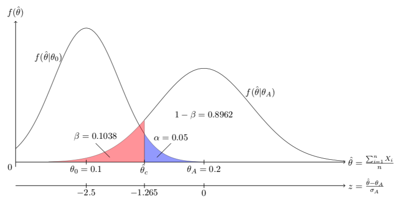

layout: true

<div class="my-footer"></div> 

---

```{r setup, include=FALSE,warning=FALSE,message=FALSE}
options(htmltools.dir.version = FALSE)
knitr::opts_chunk$set(
  message = FALSE,
  warning = FALSE,
  dev = "svg",
  cache = TRUE,
  fig.align = "center"
  #fig.width = 11,
  #fig.height = 5
)

# define vars
om = par("mar")
lowtop = c(om[1],om[2],0.1,om[4])

overwrite = FALSE

```

layout: true

<div class="my-footer"></div> 

---

# Packages used in this set of slides

```{r}
library(tidyverse)
library(infer)
library(moderndive)
```

---

# Is There Gender Discrimination In Promotions?

<!-- also: https://www.ncbi.nlm.nih.gov/pubmed/12083361 -->

.pull-left[
* Article published in the *Journal of Applied Psychology* in 1970 investigates whether female employees at Banks are discriminated against.

* 48 supervisors were given *identical* candidate CVs - identical up to the first name, which was male or female.

* Many similar experiments have been conducted with other groups. Arabic Names, Black names, Jewish names or other groups that can be identified from typical name choice.
]

--

.pull-right[

```{r}
library(moderndive)
promotions
```
]

---

# Looking At Promotions

.pull-left[
```{r,echo= FALSE}
ggplot(promotions, aes(x = gender, fill = decision)) +
  geom_bar() +
  labs(x = "Gender of name on resume")
```
]

.pull-right[
```{r}
promotions %>% 
  group_by(gender, decision) %>% 
  summarize(n = n()) %>%
  mutate(proportion = n / sum(n))
```

* 87.5% of "men" were promoted.
* 58.3% of "women" were promoted.
* That's a difference of 87.55 - 58.3% = 29.2%.
* Is the 29% advantage for men in this sample **conclusive evidence**?
* In a *hyopthetical world* **without gender discrimination**, could we have observed a 29% difference *by chance*?

]


---

# Imposing A Hypothetical World: No Gender Discriminiation

.pull-left[
* Suppose we lived in a world without gender discrimination.

* The label `gender` in our dataframe would be meaningless.

* Let's randomly reassign `gender` to each row and see how this affects the result.

* Suppose we have 48 playing cards: 24 red (female) and 24 (black)

* Shuffle the cards, and lay down the cards in a row, record `f` if **red**.
]

--

.pull-right[
```{r}
bind_cols(promotions, promotions_shuffled)
```

* Observe how in `promotions_shuffled` we randomly assigned `gender1`.

* The `decision` column is the same!

* What does this now look like?
]

---

# Reshuffled Promotions

.pull-left[
```{r,echo=FALSE,fig.height = 5,fig.width=6}
p1 = ggplot(promotions, aes(x = gender, fill = decision)) +
  geom_bar() +
  theme(legend.position = "none") +
  labs(x = "Gender of name on resume",title = "Original")
p2 = ggplot(promotions_shuffled, aes(x = gender, fill = decision)) +
  geom_bar() +
  labs(x = "Gender of resume name",title = "Reshuffled")
cowplot::plot_grid(p1,p2,rel_widths = c(1,1.4))
```

]

.pull-right[
```{r}
promotions %>% 
  group_by(gender, decision) %>% 
  summarize(n = n()) %>%
  mutate(proportion = n / sum(n))
```

```{r}
promotions_shuffled %>% 
  group_by(gender, decision) %>% 
  summarize(n = n()) %>%
  mutate(proportion = n / sum(n))
```
]


---

# Sampling Variation?

.pull-left[
* In the hypothetical world, the difference was only 4.2%.

* But what's the role of *sampling variation*? How representative of that hypothetical world is 4.2%?

* Let's construct the sampling distribution ourselves!
]

--

.pull-right[
1. You need to shuffle a deck of 48 cards, 24 red, 24 black, and lay out card after card in front of you.

2. You do **not** put the cards back into the deck!

3. You could use the function `sample` for example. Look at `?sample` to find out more.

3. fill in your results into [this shared spreadsheet](https://docs.google.com/spreadsheets/d/118NlPUQjd13XodX7IGri8J-oLgkObdCtDEFri65tWmo/edit?usp=sharing)!
]

---

# Sampling Variation in Reshuffling

.pull-left[
```{r,echo = FALSE}
url <- ""
if(overwrite){
  shuffled_data <- readr::read_csv("https://docs.google.com/spreadsheets/d/e/2PACX-1vSbSC3-reAp891PVjt8qsF7C7jVzMNqPEEWfuQ2k84ekFYmNJvscQPJ54aoJsl4G-bKLHRd4C_-gbHP/pub?gid=0&single=true&output=csv")
  shuffled_data = tibble(id = 1:48, decision = c(rep("not",13),rep("promoted",48-13)))
  set.seed(114)
  shuffled_data = bind_cols(shuffled_data, data.frame(replicate(33,
                                                      sample(c(rep("f",24),
                                                               rep("m",24)),
                                                             replace = FALSE, 
                                                             size = 48))))
  readr::write_rds(shuffled_data, "../rds/shuffled_data.rds")
} else {
  shuffled_data <- readr::read_rds("../rds/shuffled_data.rds")
}

n_replicates <- ncol(shuffled_data) - 2

shuffled_data_tidy <- shuffled_data %>% 
  gather(team, gender, -c(id,decision)) %>% 
  mutate(replicate = rep(1:n_replicates, each = 48))

shuffled_data_tidy <- shuffled_data_tidy %>% 
  group_by(replicate) %>% 
  count(gender, decision) %>% 
  filter(decision == "promoted") %>% 
  mutate(prop = n/24) %>% 
  select(replicate, gender, prop) %>% 
  spread(gender, prop) %>% 
  mutate(stat = m - f) 

obs_diff_prop <- promotions %>%
  specify(decision ~ gender, success = "promoted") %>%
  calculate(stat = "diff in props", order = c("male", "female"))

ggplot(shuffled_data_tidy,aes(x=stat)) + geom_histogram(binwidth=0.1,color = "white") + geom_vline(xintercept = obs_diff_prop[[1,1]], color = "red", size = 1.5) + labs(x = "differences in promotion rate")
```
]

.pull-right[
* This distribution was created in our **hypothetical** scenario: no discrimination.

* We see how sampling variation affects the difference in promotion rates.

* The red line denotes the *observed difference* in the **real world**.

* Now: How *likely* is it that the red line is part of this **hypothetical** distribution?
]

---

# Recap

.pull-left[
* We just did a **permutation test**. We randomly reshuffled and checked if it makes a difference.

* Again Resampling: Boostrapping is with replacment, permutation is without.

* Bootstrapping: we put the paper slips **back** after recording them.

* Permutation: We took card after card from our deck (*without* putting it back!)
]

--

.pull-right[

* We observed the estimate $\hat{p}_m - \hat{p}_f = 29\%$ in the real world.

* We *tested* whether in a hypothetical universe with no discrimination, 29% *likely* to occur.

* We concluded *rather not*. We tended to **reject** that hypothesis.

* The real question was: is 29% **really** different from zero? What is the role of sampling variation? 
]


---
layout: false
class: title-slide-section-red, middle

# Hypothesis Testing Setup


---
layout: true

<div class="my-footer"></div> 

---

# Hypothesis Test Notation and Definitions

.pull-left[
* In Hypothesis testing we compare two **competing hypothesis**. 
    * In our example:
        $$\begin{align}H_0:& p_m - p_f = 0\\H_A:& p_m - p_f > 0\end{align}$$
    * $H_0$ stands for the **null hypothesis**, where *no effect* is observed. That's our hypothetical world from above.

* $H_A$ or $H_1$ is the **alternative** hypothesis. Here, we have a *one-sided* alternative, saying that $p_m > p_f$, ie women are discriminated against. The *two-sided* formulation is just $H_A: p_m - p_f \neq 0$

]

--

.pull-right[

* A **test statistic** is a summary statistic which we use to summarise a certain aspect of our sample. Here: $\hat{p}_m - \hat{p}_f$

* The *observed test statistic* is the number we get from our real world sample: $\hat{p}_m - \hat{p}_f = 29\%$

* The **null distribution** is the sampling distribution of our test statistic, assuming the Null hypothesis is **true**. That's our hypothetical world without discrimination.

* We have seen such a null distribution just above:
]

---

# Null Distribution

.left-wide[
```{r,echo = FALSE,fig.height=5}
ggplot(shuffled_data_tidy,aes(x=stat)) + geom_histogram(binwidth=0.1,color = "white") + geom_vline(xintercept = obs_diff_prop[[1,1]], color = "red", size = 1.5) + labs(x = "differences in sample proportions")
```
]

.right-thin[
* This **is** the sampling distribution of $\hat{p}_m - \hat{p}_f$, assuming $H_0$ is true.

* The red line is the *observed* test statistic.
]

---

# P-Value and Significance Level $\alpha$

.pull-left[
* The **p-value** is the probability of observing a test statistic *more extreme* than the one we obtained, assuming $H_0$ is true. `r emo::ji("thinking")`

* How *strong* a piece of evidence is it to observe $\hat{p}_m - \hat{p}_f=29\%$ in a world where $p_m - p_f=0$ is assumed true? Very strong? Not so strong?

* How many samples did we obtain that had a difference *greater* than 29%? Many, or not so many?

* The p-value quantifies this by measuring the probability to the right of the red line in the previous plot.
]

--

.pull-right[
* The **significance level** $\alpha$ is a *cutoff* on the p-value.

* We choose it *before* conducting our hypothesis test. It's common to assume $\alpha = 5\%$.

* If the p-value falls below the cutoff $\alpha$, we **reject** the null hypothesis on the grounds that *what we observe is too unlikely to happen* under the Null.

* Small p-value: The red line is *too far* from the center of the Null distribution. Observing the red line would have happened with very small probability only. 

]

---
layout: false
class: title-slide-section-red, middle

# Conducting Hypothesis Tests


---
layout: true

<div class="my-footer"></div> 

---
background-image: url(../img/photos/ht.png)
background-size: 800px
background-position: 60% 60%

# Testing with `infer`


---

# `infer` Testing Pipeline

.pull-left[

* Here we follow closely the [infer workflow](https://moderndive.com/9-hypothesis-testing.html#infer-workflow-ht) given in moderndive.

* We augment our previous pipeline with the `hypothesize` function, defining the type of null hypothesis.

* Also, we give a `formula` to `specify()` this time, instead of only a variable name as before.

* We create the Null Distribution by *reshuffling* (deck of cards), and *not* by *resampling* (pennies).
]

--

.pull-right[
```{r}
null_distribution <- promotions %>% 
  # takes formula, defines success
  specify(formula = decision ~ gender,
          success = "promoted") %>% 
  # decisions are independent of gender
  hypothesize(null = "independence") %>% 
  # generate 1000 reshufflings of data
  generate(reps = 1000, type = "permute") %>% 
  # compute p_m - p_f from each reshuffle
  calculate(stat = "diff in props",
            order = c("male", "female"))
null_distribution
```
]

---

# Back to Reality: What did we *Observe*?

.pull-left[
* We computed $\hat{p}_m - \hat{p}_f$ from our *real-world* sample before.


```{r}
obs_diff_prop <- promotions %>% 
  specify(decision ~ gender, success = "promoted") %>% 
  calculate(stat = "diff in props", order = c("male", "female"))
obs_diff_prop
```
]

.pull-right[
* How does that observed statistic compare the distribution of **this** test statistic, assuming that $H_0$ is true?

* We **created** that distribution on the previous slide: `null_distribution`.

* Let's confront `null_distribution` with `obs_diff_prop`, and let's compute the p-value!
]

---

# Visualize the Null

.left-wide[
```{r,fig.height=4.5}
visualize(null_distribution, bins = 10)
```
]

.right-thin[
* This is the distribution of $\hat{p}_m - \hat{p}_f$ under $H_0$.

* No Discrimination in that world.
]

---

# Visualize the P-value

.pull-left[
```{r,fig.height=5}
visualize(null_distribution, bins = 10) + 
  shade_p_value(obs_stat = obs_diff_prop,
                direction = "right")
```
]

.pull-right[
* `shade_p_value` adds the p-value based on `obs_diff_prop`, i.e 0.29.

* `direction = "right"` represents our one-sided alternative $H_A:p_m - p_f > 0$

* *more extreme* means *bigger difference* here, hence *more to the right*.

* If $H_A:p_m - p_f < 0$, we'd set `direction = "left"`

* The red area **is the p-value**!

* Is that a *big* or a *small* area?
]

---

# Obtaining the p-value and Deciding to Reject

.pull-left[
* Obtain the precise p-value with
    ```{r}
    p_value <- null_distribution %>% 
      get_p_value(obs_stat = obs_diff_prop, direction = "right")
    p_value
    ```
    
* So, the probability of observing a 29% difference in a world with no discrimination is only `r 100*p_value[[1,1]]`%. That probability is due to sampling variation.
]

--

.pull-right[
* Suppose we had set $\alpha = 0.001 = 0.1\%$

* Given that the p-value is *greater* than $\alpha$, 
    * i.e. `r 100*p_value[[1,1]]`% > 0.1%,
    * we would **fail to reject** the null $H_0:p_m - p_f = 0$. 

* The p-value was not sufficiently small to convince us in this case.

* What would have happened, had we set cutoff $\alpha = 0.05 = 5\%$ instead?

]

---

# Testing Errors

.pull-left[
* Working with probabilities implies that sometimes, we make an error.

* 29% may be *unlikely* under $H_0$, but that doesn't mean it's *impossible* to occur.

* So, it may happen that we sometimes reject $H_0$, when in fact it was true.

]

--

.pull-right[
* This is similar to a verdict reach in a court trial:


* In fact, in hypothesis testing:


]

---

# Type I and Type II Errors

.pull-left[
* So, there are even two types of errors to make! 😲

* Type I: We convict an innocent person. We Reject a *true* Null.

* Type II: We *fail* to convict a criminal. We *fail* to reject a *wrong* Null.

* We **choose** the frequency of a Type I error by setting $\alpha$, called the **significance level**.
]

--

.pull-right[
* The probability of committing a type II error is called $\beta$. The value $1-\beta$, i.e. the prob. of *not* making such an error, is called the **power** of a hypothesis test.

* Ideally, $\alpha = \beta = 0$. However, with random sampling this is impossible. Also, both errors are inversely related. (see next slide)

* So, typically we fix $\alpha$ and try to maximize the power of the test. 

* Given a certain frequency of convicting an innocent person, we try to make sure we convict as many true criminals as possible.
]

---

# Type I and II Errors are Inversely related

.left-wide[

]

.right-thin[
* $\hat{\theta}$ is *some* test statistic.

* $f(\hat{\theta}|\theta_0)$ and $f(\hat{\theta}|\theta_A)$ are Null and Alternative distributions.

* Changing $\alpha$ moves critical value $\hat{\theta}_c$.

* This example is fully worked out [here](https://scpoecon.github.io/ScPoEconometrics/images/hypothesis.pdf)
]


---

class: title-slide-final, middle

# THANKS

To the amazing [moderndive](https://moderndive.com/) team!

---

class: title-slide-final, middle
background-image: url(../img/logo/ScPo-econ.png)
background-size: 250px
background-position: 9% 19%

# END


|                                                                                                            |                                   |
| :--------------------------------------------------------------------------------------------------------- | :-------------------------------- |
| <a href="mailto:florian.oswald@sciencespo.fr">.ScPored[<i class="fa fa-paper-plane fa-fw"></i>]               | florian.oswald@sciencespo.fr       |
| <a href="https://github.com/ScPoEcon/ScPoEconometrics-Slides">.ScPored[<i class="fa fa-link fa-fw"></i>] | Slides |
| <a href="https://scpoecon.github.io/ScPoEconometrics">.ScPored[<i class="fa fa-link fa-fw"></i>] | Book |
| <a href="http://twitter.com/ScPoEcon">.ScPored[<i class="fa fa-twitter fa-fw"></i>]                          | @ScPoEcon                         |
| <a href="http://github.com/ScPoEcon">.ScPored[<i class="fa fa-github fa-fw"></i>]                          | @ScPoEcon                       |

