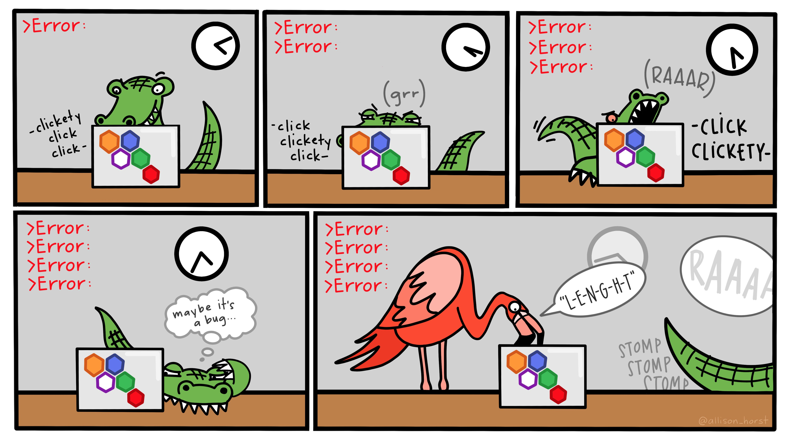

layout: true

<div class="my-footer"></div> 

---

```{r setup, include = FALSE, warning = FALSE, message = FALSE}
options(htmltools.dir.version = FALSE)
knitr::opts_chunk$set(
  message = FALSE,
  warning = FALSE,
  dev = "svg",
  cache = TRUE,
  fig.align = "center"
  #fig.width = 11,
  #fig.height = 5
)

# Load packages
library(dplyr)
library(magrittr)
library(tidyverse)
library(pander)
library(ggthemes)
library(maptools)
library(knitr)
library(xaringan)
library(emo)
library(countdown)

# countdown style
countdown(
  color_border              = "#d90502",
  color_text                = "black",
  color_running_background  = "#d90502",
  color_running_text        = "white",
  color_finished_background = "white",
  color_finished_text       = "#d90502",
  color_finished_border     = "#d90502"
)
```


# Welcome to ScPoEconometrics!

--

- In this course you will learn the core tools of ***econometrics***.
 
--

- You will also learn to use the `R` programming language!

--

## What is *econometrics*?

<blockquote>
<span style = "font-style: italic; font-weight: bold; color: #d90502">
The method of econometric research aims, essentially, at a conjunction of economic theory and actual measurements, using the theory and technique of statistical inference as a bridge pier.</span>
.right[<span style="font-style:italic; font-size: 18px">Haavelmo (1944). The Probability Approach to Econometrics.</span>]
</blockquote>

--

- A set of ***techniques and methods*** to answer (generally) economic questions with ***data***.

- Some examples!

---

# Answering Important Questions with Econometrics

[<ru-blockquote>
Does immigration *cause* lower wages and higher unemployment for locals?
</ru-blockquote>](http://davidcard.berkeley.edu/papers/mariel-impact.pdf)

--

[<ru-blockquote>
Does raising the minimum wage *cause* reduced employment for the low-skilled?
</ru-blockquote>](http://davidcard.berkeley.edu/papers/njmin-aer.pdf)

--

[<ru-blockquote>
Does more education *cause* higher wages and better jobs?
</ru-blockquote>](http://davidcard.berkeley.edu/papers/causal_educ_earnings.pdf)

--

[<ru-blockquote>
Does higher public debt levels *cause* lower economic growth?
</ru-blockquote>](https://www.imf.org/external/pubs/ft/wp/2014/wp1434.pdf)

--

[<ru-blockquote>
Does birth order *cause* differing education and employment oucomes?
</ru-blockquote>](https://academic.oup.com/qje/article/120/2/669/1933962)

---

# Causality

* Notice the keyword ***cause*** in all of the above.

* Notice also that ***many other factors could have caused*** each of those outcomes.

--

* Econometrics is often about spelling out ***conditions*** under which we can ***claim to measure causal relationships***.

* We will encounter the most basic of those conditions, and talk about some potential pitfalls.

---

layout: false
class: title-slide-section-red, middle

# R

---

layout: true

<div class="my-footer"></div> 

---

## What is `R`?

`R` is a __programming language__ with powerful statistical and graphic capabilities.

--

## Why are we using `R`?<sup>1</sup>

.footnote[
[1]: This list has been inspired by [Ed Rubin's](https://github.com/edrubin/EC421S19).  
<span style="visibility:hidden">[2]: Learning `R` definitely requires time and effort but it's worth it, trust me! `r emo::ji("muscle")`.</span>
]

--

1. `R` is __free__ and __open source__—saving both you and the university 💰💵💰.

--

1. `R` is very __flexible and powerful__—adaptable to nearly any task, _e.g._, data cleaning, data visualization, econometrics, spatial data analysis, machine learning, web scraping, ...

--

1. `R` has a vibrant, [thriving online community](https://stackoverflow.com/questions/tagged/r) that will (almost) always have a solution to your problem.

--

1. If you put in the work<sup>2</sup>, you will come away with a __very valuable and marketable__ tool.

.footnote[
<span style="visibility:hidden">[1]: This list has been inspired by [Ed Rubin's](https://github.com/edrubin/EC421S19).</span>  
[2]: Learning `R` definitely requires time and effort but it's worth it, trust me! `r emo::ji("muscle")`
]

---

# Why can't we just use Excel?

Many reasons but here are just a few:

--

- Not ***reproducible***.

--

- Not straightforward to ***merge*** datasets together.

--

- Very fastidious to ***clean*** data.

--

- Limited to ***small datasets***.

--

- Not designed for proper ***econometric analyses***, maps, complex visualisations, etc.

---

layout: false
class: title-slide-section-red, middle

# R SHOWCASE

---

layout: true

<div class="my-footer"></div> 

---

# Showcase #1: Spatial Data

.pull-left[

* `R` is very strong with spatial data. In particular via the [`sf`](https://cran.r-project.org/web/packages/sf/index.html) package.

* We can represent _any_ shape or geometry.

* Maps are the most obvious example:
```{r, eval = FALSE}
library(sf)
library(tmap)
iris_shfl <- read_sf("chapter_intro_files/figure-html/contours_iris_2015/CONTOURS-IRIS.shp") %>%
  mutate(dep = substr(INSEE_COM,1,2)) %>%
  select(CODE_IRIS, dep, geometry) %>%
  filter(dep == "75")
iris_income <- readRDS("../rds/iris_inc.rds") %>%
  mutate(CODE_IRIS = IRIS) %>%
  select(CODE_IRIS, DISP_MED15)
iris_map <- left_join(iris_shfl, iris_income, by = "CODE_IRIS")
tmap_mode("plot")
tm_shape(iris_map) +
  tm_borders() +
  tm_fill(col = "DISP_MED15", title = "Median household income (euros)")
```
]

--

.pull-right[

* Can be improved but you get this with only __13 lines of code!__

```{r, echo = FALSE}
library(sf)
library(tmap)
iris_shfl <- read_sf("../rds/iris_shapefile_2015.shp")
iris_income <- readRDS("../rds/iris_inc.rds") %>%
  mutate(CODE_IRIS = IRIS) %>%
  select(CODE_IRIS, DISP_MED15)
iris_map <- left_join(iris_shfl, iris_income, by = "CODE_IRIS")
tmap_mode("plot")
tm_shape(iris_map) +
  tm_borders() +
  tm_fill(col = "DISP_MED15",
          title = "Median household income (euros)")
```
]

---

# Showcase #2: Interactive Web Applications

--

[France Stratégie](https://strategie.gouv.fr/) has created a [simple web application](http://segregationresidentielle.strategie.gouv.fr/app_seg) to visualize the evolution of residential segregation in France between 1968 and 2015.

<iframe src="https://francestrategie.shinyapps.io/app_seg/" width="100%" height="60%" frameBorder="0"></iframe>

---

# In Practice: Data Wrangling

--

* You will spend a lot of time preparing data for further analysis.

--

* The `gapminder` dataset contains data on life expectancy, GDP per capita and population by country between 1952 and 2007.

* Suppose we want to know the average life expectancy and average GDP per capita for each continent in each year.

--

* We need to group the data by continent *and* year, then compute the average life expectancy and average GDP per capita

--

.left-column[
```{r, gapminder, echo = T, eval = F}
# load gapminder package
library(gapminder)
# load the dataset in object gapminder
gapminder = gapminder::gapminder
# display variables in the dataset
names(gapminder)
# show first 4 lines of this dataframe
head(gapminder,n = 4)
```
]

.right-column[
```{r, gapminder, echo = F, eval = T}
```
]

---

# In Practice: Data Wrangling

* There are always several ways to achieve a goal. (As in life `r emo::ji("smile")`)

* Here we will only focus on the `dplyr` way:

```{r}
  # compute the required statistics
gapminder_dplyr <- gapminder %>% 
  group_by(continent, year) %>% 
  summarise(count = n(),
            mean_lifeexp = mean(lifeExp, na.rm = TRUE),
            mean_gdppercap = mean(gdpPercap, na.rm = TRUE))
```

```{r}
  # show first 5 lines of this dataframe
head(gapminder_dplyr, n = 5)
```

---

# Visualisation

.pull-left[
* Now we could *look* at the result in `gapminder_dplyr`, or compute some statistics from it. 

* Nothing beats a picture, though:

```{r,eval = FALSE}
ggplot(data = gapminder_dplyr, 
       mapping = aes(x = mean_lifeexp,
                     y = mean_gdppercap,
                     color = continent,
                     size = count)) +
  geom_point(alpha = 1/3) +
  labs(x = "Average life expectancy",
       y = "Average GDP per capita",
       color = "Continent",
       size = "Nb of countries")
```
]

.pull-right[
```{r, echo = FALSE, fig.h}
ggplot(data = gapminder_dplyr, 
       mapping = aes(x = mean_lifeexp,
                     y = mean_gdppercap,
                     color = continent,
                     size = count)) +
  geom_point(alpha = 1/3) +
  labs(x = "Average life expectancy",
       y = "Average GDP per capita",
       color = "Continent",
       size = "Nb of countries")
```
]

---

# Animated Plotting `r emo::ji("ok_hand")` <sup>1</sup>

```{r, example: gganimate, include = F, cache = T}
# The package for animating ggplot2
library(gganimate)
# As before
# gg <- ggplot(
#   data = gapminder %>% filter(continent != "Oceania"),
#   aes(gdpPercap, lifeExp, size = pop, color = country)
# ) +
# geom_point(alpha = 0.7, show.legend = FALSE) +
# scale_colour_manual(values = country_colors) +
# scale_size(range = c(2, 12)) +
# scale_x_log10("GDP per capita", label = scales::comma) +
# facet_wrap(~continent) +
# theme_pander(base_size = 16) +
# theme(panel.border = element_rect(color = "grey90", fill = NA)) +
# # Here comes the gganimate-specific bits
# labs(title = "Year: {frame_time}") +
# ylab("Life Expectancy") +
# transition_time(year) +
# ease_aes("linear")
# # Save the animation
# anim_save(
#   animation = gg,
#   filename = "ex_gganimate.gif",
#   path = "chapter_in1les/figure-html",
#   width = 9,
#   height = 4,
#   units = "in",
#   res = 150,
#   nframes = 56
# )
```

.center[]

.footnote[
[1]: This animation is taken from [Ed Rubin](https://raw.githack.com/edrubin/EC421S19/master/LectureNotes/01Intro/01_intro.html#40).
]

---

layout: false
class: title-slide-section-red, middle

# R 101: Here Is Where You Start

---

layout: true

<div class="my-footer"></div> 

---

# Start your `RStudio`!

## First Glossary of Terms

* `R`: a programming language.

* `RStudio`: an integrated development environment (IDE) to work with `R`.

--

* *command*: user input (text or numbers) that `R` *understands*.

* *script*: a list of commands collected in a text file, each separated by a new line, to be run one after the other.

--

* To run a script, you need to highlight the relevant code lines and hit `Ctrl`+`Enter` (Windows) or `Cmd`+`Enter` (Mac).

---

# `RStudio` Layout

```{r, echo = F, out.width = "600px"}
knitr::include_graphics("chapter_intro_files/figure-html/rstudio.png")
```

---

# R as a Calculator

.pull-left[

* You can use the `R` console like a calculator

* Just type an arithmetic operation after `>` and hit `Enter`!

]

--

.pull-right[
* Some basic arithmetic first:
    ```{r}
    4 + 1
    8 / 2
    ```


* Great! What about this?
    ```{r}
    log(exp(1))
    # by the way: this is a comment! (R disregards it)
    ```
]
---

class: inverse

# Task 1

`r countdown(minutes = 5, top = 0)`

1. Create a new R script (File $\rightarrow$ New File $\rightarrow$ R Script). Save it somewhere as `lecture_intro.R`.

1. Write in your script and run the following code: (`Ctrl` or `Cmd` + `Enter`)
    ```{r, eval = F}
    4 * 8
    ```

1. Write in your script and run the following code. What happens if you only run the first line of the code?
    ```{r, eval = F}
    x = 5 # equivalently x <- 5
    x
    ```
Congratulations, you have created your first `R` "object"! Everything is an object in R! Objects are assigned using `=` or `<-`.

1. Lastly, find the cube of `x` and assign that value to `x_3`.

---

# Where to get Help?

.pull-left[
`R` built-in `help`:
```{r, eval = FALSE}
?log #? in front of function
help(lm)   # help() is equivalent
??plot  # get all help on keyword "plot"
```
]

--

.pull-right[
In practice:

]

---

# Collaborate!



---

# R Packages

* `R` users contribute add-on data and functions as *packages*

* Installing packages is easy! Just use the `install.packages` function:
    ```{r, eval = FALSE}
    install.packages("ggplot2") # do NOT run this code on your end
    ```

* To *use* the contents of a packge, we must load it from our library using `library`:
    ```{r, message = FALSE, warning = FALSE,eval=FALSE}
    library(ggplot2)
    ```

---

# Vectors

* What *is* a **vector**?

* The `c` function creates vectors.
    ```{r}
    c(1, 3, 5, 7, 8, 9)
    ```

* Coercion to unique types:
    ```{r}
    c(42, "Statistics", TRUE)
    ```

* Creating a *range*
    ```{r}
    1:10
    ```

---

# `data.frame`'s

`data.frame`s are like spreadsheets.

```{r}
example_data = data.frame(x = c(1, 3, 5, 7),
                          y = c(rep("Hello", 3), "Goodbye"),
                          z = sample(c(TRUE,FALSE),size=4,replace=TRUE))
example_data
```

In practice, you will be importing files that contain the data into `R` rather than creating `data.frame`s by hand.

---

class: inverse

# Task 2

`r countdown(minutes = 7, top = 0)`

```{r, echo=F}
library(dslabs)
data("murders")
murders <- murders
```

1. Find out (using `help()` or google) how to import a .csv file.

1. Import [gun_murders.csv](https://www.dropbox.com/s/zuk0qcfm3kyzs4e/gun_murders.csv?dl=1)<sup>1</sup> in a new object `murders`. This file contains data on gun murders by US state in 2010. (Hint: objects are created using `=`).

1. Ensure that `murders` is a data.frame by running:
    ```{r,eval=F}
    class(murder) # check class
    ```

1. Find out what variables are contained in `murders` by running:
    ```{r, eval = F}
    names(murders) # obtain variable names
    ```

1. View the contents of `murders` by clicking on `murders` in your workspace. What does the `total` variable correspond to?

.footnote[
[1]: This dataset is taken from the `dslabs` package.
]

---

# `data.frame`s

Useful functions to describe a dataframe:
```{r}
str(murders) # describes the data.frame
```

--

```{r}
names(murders) # column names
```

--

```{r}
nrow(murders) # number of rows
```

--

```{r}
ncol(murders) # number of columns
```

---

# Data on Gun Murders in the US
    
* To access one of the variables **as a vector**, we use the `$` operator as in `murders$state`. We can check the type of `murders$state` with
    ```{r}
    class(murders$state)  # type of the state variable in the murders data.frame
    ```

--

* Or we use the column name or index: `murders[,"state"]` or `murders[,1]`
    ```{r}
    class(murders[,"state"])  # type of the state variable in the murders data.frame
    ```

---

# Subsetting `data.frames`

* Subsetting a data.frame: `murders[row condition, column number]` or `murders[row condition, "column name"]`
    ```{r}
    # Only keep states with over 500 gun murders and keep only the "state" and "total" variables
    murders[murders$total > 500, c("state", "total")]
    
    # Only keep California and Texas and keep only the "state" and "total" variables
    murders[murders$state %in% c("California", "Texas"), c("state", "total")]
    ```

---

class: inverse

# Task 3

`r countdown(minutes = 10, top = 0)`

1. How many observations are there in `murders`?

1. How many variables? What are the data types of each variable?

1. Remember that the colon operator `a:b` is just short for *construct a sequence from `a` to `b`*. Create a new object `murders_2` containing the rows 10 to 25 of `murders`.

1. Create a new object `murders_3` which only contains the columns `state` and `total`. (Recall that `c` creates vectors.)

1. What is the average value of `total` for state's in the "South", i.e. with `region == "South"`?

1. Create a `total_percap` variable equal to the number of murders per 10,000 inhabitants:
    ```{r}
    murders$total_percap = (murders$total / murders$population) * 10000
    ```

Congratulations, you've created your first variable!

---

layout: false
class: title-slide-section-red, middle

# Class Details

---

layout: true

<div class="my-footer"></div> 

---

# This Course

- Teach you the basics of ***linear regression***, ***statistical inference*** and ***impact evaluation***.

--

- Equip you with a framework to think more deeply about ***causality***.

--

- Introduce you to the `R` software environment.

--

- `r emo::ji("warning")` This is *not* a course about `R`.

--

## Grading

1. There will be ***five quizzes*** on Moodle roughly every two weeks $\rightarrow$ 40%

--

1. There will be ***two take home exams / case studies*** $\rightarrow$ 60%

--

1. There will be _no_ final exam `r emo::ji("sweat_smile")`

---

# Syllabus `r emo::ji("crossed_fingers")`

.pull-left[
Lecture 1 (today): ***Introduction***

*Quiz 1 (after lecture 2)*

Lectures 2 and 3: ***Tidying, Visualising and Summarising Data***

*Quiz 2*

Lecture 4: ***Simple Linear Regression***

Lecture 5: ***Introduction to Causality***

*Midterm Project*

Lecture 6: ***Multiple Linear Regression***

Lecture 7: ***Linear Regression Extensions***
]

.pull-right[
*Quiz 3*

Lecture 8: ***Sampling***

Lecture 9: ***Confidence Intervals and Hypothesis Testing***

*Quiz 4*

Lecture 10: ***Statistical Inference***

Lecture 11: ***Regression Discontinuity***

*Quiz 5*

Lecture 12: ***Recap***

*Final Project*
]

---

# Course Materials and Useful Resources

&nbsp; &nbsp; &nbsp; &nbsp; [Book](https://scpoecon.github.io/ScPoEconometrics/) &nbsp; &nbsp; &nbsp; &nbsp; | &nbsp; &nbsp; &nbsp; &nbsp; [Slides](https://github.com/ScPoEcon/ScPoEconometrics-Slides) &nbsp; &nbsp; &nbsp; &nbsp; | &nbsp; &nbsp; &nbsp; &nbsp; [Reading Suggestions](https://github.com/ScPoEcon/ScPoEconometrics-Slides/blob/master/syllabus.md) &nbsp; &nbsp; &nbsp; &nbsp; | &nbsp; &nbsp; &nbsp; &nbsp;  [Interactive R Apps](https://github.com/ScPoEcon/ScPoApps) &nbsp; &nbsp; &nbsp; &nbsp;
-- | -- | --

--

.pull-left[
## Econometrics
- [*Mastering Metrics* by Angrist and Pischke](http://catalogue.sciencespo.fr/ark:/46513/sc0001290364)
- [*Modern Introduction to Econometrics* by Wooldridge](http://catalogue.sciencespo.fr/ark:/46513/sc0001336459)
- [*Introduction to Econometrics* by Stock and Watson](http://catalogue.sciencespo.fr/ark:/46513/sc0001334932)
- [*Causal Inference: The Mixtape* by Cunningham](https://scunning.com/causalinference_norap.pdf)
- [Ben Lambert's youtube channel](https://www.youtube.com/user/SpartacanUsuals)
]

.pull-right[
## Metrics and `R`
- [ModernDive](https://moderndive.com/)
- [Introduction to Econometrics with R](https://www.econometrics-with-r.org/)
- [R for Data Science](https://r4ds.had.co.nz/)
- [Awesome R Learning Resources](https://github.com/iamericfletcher/awesome-r-learning-resources)
]


---

# Course Policies

*Be nice. Be honest. Don't cheat.*<sup>1</sup>

.footnote[
[1] [Andrew Heiss](https://evalsp20.classes.andrewheiss.com/syllabus/)' put it more concisely than I could!
]

--

(BTW you should apply these principles outside of the classroom as well ***#lifeadvice*** `r emo::ji("wink")`)

--

.pull-left[
***Slack***

We will ***exclusively*** use Slack for our interactions.

Please ***DO NOT*** contact me by email (unless there's a legitimate reason to).

I will be checking Slack sparingly so please help one another!
]

--

.pull-right[
***Class conduct and expectations***

*Late work:* Won't be accepted unless you have a very good reason.

*Cheating:* I will have a chat with you. Just don't cheat, it's honestly not worth it.

*Work in groups:* You can/should work in groups of 2 (3 max) on the quizzes.
]

---

# Mental Health

> ***Pay attention to your mental health in the same way you would your physical health!***

--

Seeking help is a sign perceptive self-awareness, [not weakness](https://www.nytimes.com/2020/09/24/well/mind/cord-jefferson-emmy-black-mental-health.html).

Especially important during this difficult period.

--

Don't hesitate to ***reach out*** to your friends, family, a professor or me if you feel the need.

***Sciences Po*** offers free and confidential [psychological support services](https://www.sciencespo.fr/students/en/living/health/health-centre) with professionals.

--

To combat everyone's social isolation (mine included!), I propose we meet weekly on [gather.town](https://gather.town/app) `r emo::ji("hugs")` (details on Slack)

---

class: title-slide-final, middle
background-image: url(../img/logo/ScPo-econ.png)
background-size: 250px
background-position: 9% 19%

# SEE YOU NEXT WEEK!


|                                                                                                            |                                   |
| :--------------------------------------------------------------------------------------------------------- | :-------------------------------- |
| <a href="mailto:florian.oswald@sciencespo.fr">.ScPored[<i class="fa fa-paper-plane fa-fw"></i>]               | florian.oswald@sciencespo.fr       |
| <a href="https://github.com/ScPoEcon/ScPoEconometrics-Slides">.ScPored[<i class="fa fa-link fa-fw"></i>] | Slides |
| <a href="https://scpoecon.github.io/ScPoEconometrics">.ScPored[<i class="fa fa-link fa-fw"></i>] | Book |
| <a href="http://twitter.com/ScPoEcon">.ScPored[<i class="fa fa-twitter fa-fw"></i>]                          | @ScPoEcon                         |
| <a href="http://github.com/ScPoEcon">.ScPored[<i class="fa fa-github fa-fw"></i>]                          | @ScPoEcon                       |

```{r makepdf, echo=FALSE,eval=FALSE}
system("decktape chapter1.html chapter1.pdf --chrome-arg=--disable-web-security")
```
