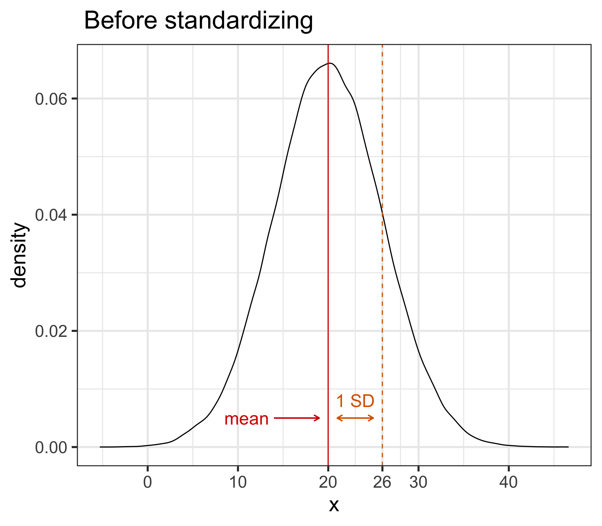
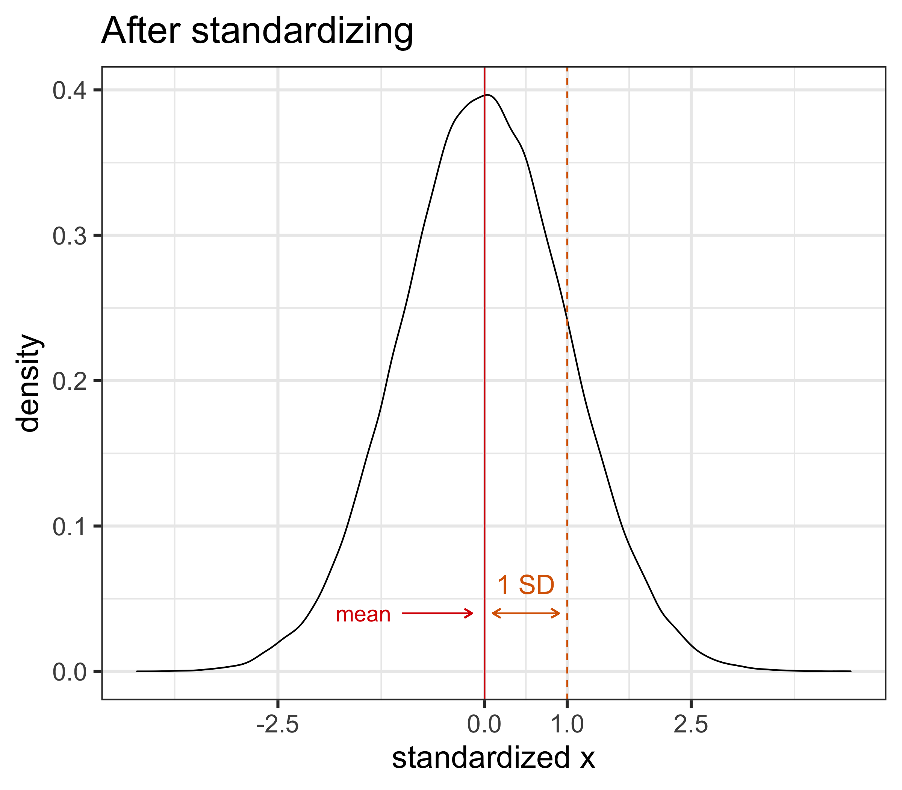
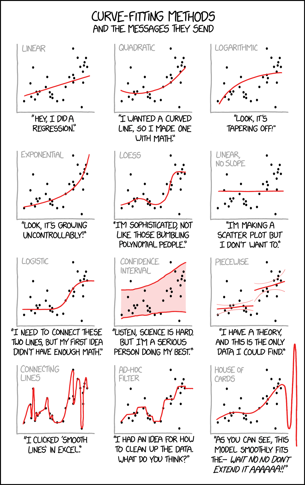
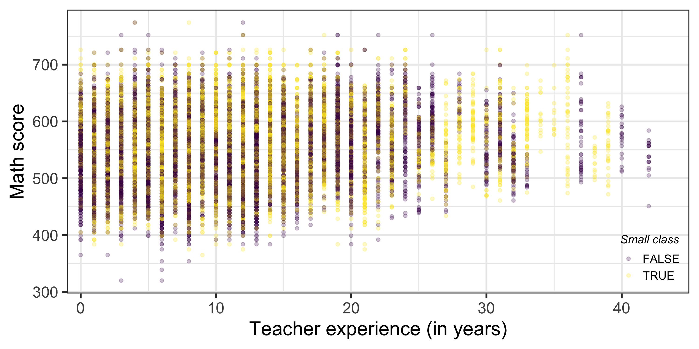
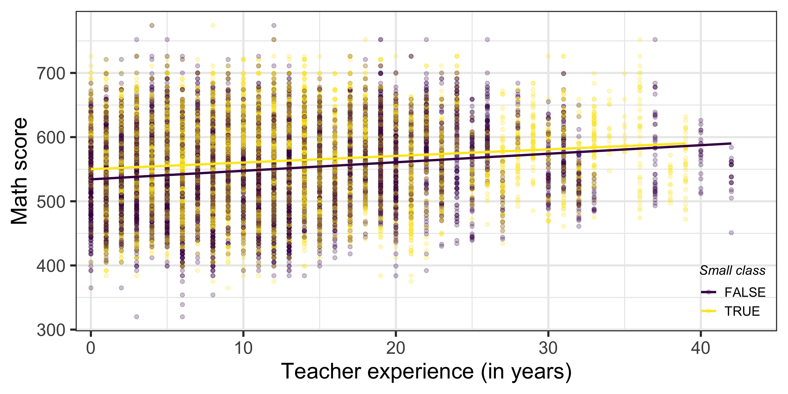
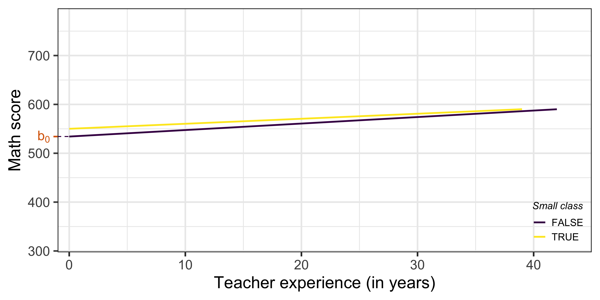
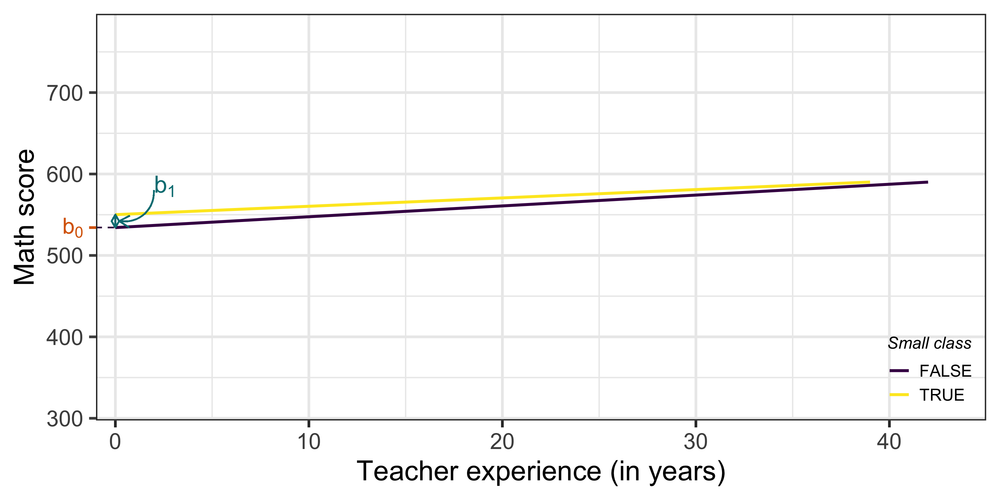
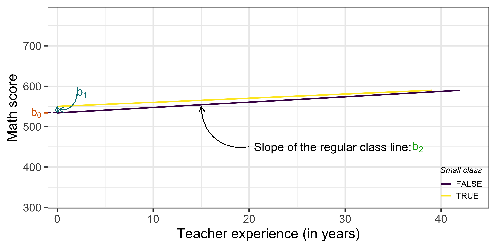
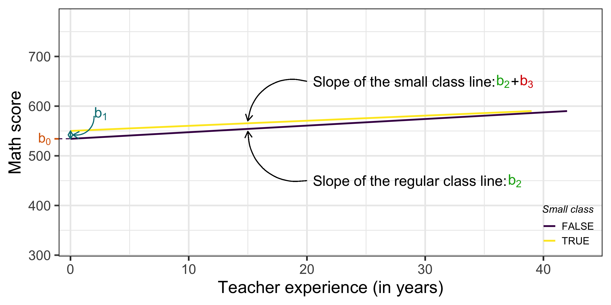

layout: true

<div class="my-footer"></div> 

---

```{r setup, include=FALSE,warning=FALSE,message=FALSE}
options(htmltools.dir.version = FALSE)
knitr::opts_chunk$set(
  message = FALSE,
  warning = FALSE,
  dev = "svg",
  cache = TRUE,
  fig.align = "center"
  #fig.width = 11,
  #fig.height = 5
)

# define vars
om = par("mar")
lowtop = c(om[1],om[2],0.1,om[4])
library(magrittr)
library(plotly)
library(reshape2)
library(haven)
library(tidyverse)
library(AER)
library(gtools)
library(countdown)

# countdown style
countdown(
  color_border              = "#d90502",
  color_text                = "black",
  color_running_background  = "#d90502",
  color_running_text        = "white",
  color_finished_background = "white",
  color_finished_text       = "#d90502",
  color_finished_border     = "#d90502"
)
```


# Quick "Quiz" on Last Week's Material

1\. From your ***computer*** `r emo::ji("backhand_index_pointing_right")` connect to [***www.wooclap.com/SCPOMLR***](https://app.wooclap.com/SCPOMLR)

&nbsp; &nbsp; &nbsp; ***OR***

2\. From your ***phone*** `r emo::ji("backhand_index_pointing_right")` flash QR code below

```{r, echo = F, out.width = "300px"}

```

---

# Today - Linear Regression Extensions

Depending on the data and the relationships between the variables of interest, you may need to move away from the baseline model.

--

We will focus on 3 important variations:

  1. ***Standardized*** regression
  
  1. ***Non-linear relationships***: log and polynomial models
  
  1. ***Interactions*** between variables

--

In each case, the way we estimate these coefficients does not change (i.e OLS).

--

Empirical applications:

  (i) *class size* and *student performance*,
  (ii) *college tuition* and *earnings potential*,
  (iii) *wage*, *education* and *gender* 

---

layout: false
class: title-slide-section-red, middle

# Standardized Regression

---

layout: true

<div class="my-footer"></div> 

---

# Standardized Regression

Let's define what *standardizing* a variable means.

> ***Standardizing*** a variable $z$  means to *demean* the variable and to divide the demeaned value by its own standard deviation:

$$ z_i^{stand} = \frac{z_i - \bar z}{\sigma(z)}$$ 
where $\bar z$ is the mean of $z$ and $\sigma(z)$ is the standard deviation of $z$, i.e. $\sigma(z) = \sqrt{\textrm{Var}(z)}$.

--

$z^{stand}$ now has mean 0 and standard deviation 1, i.e. $\overline{z^{stand}} = 0$ and $\sigma(z^{stand}) = 1$

--

Intuitively, standardizing ***puts variables on the same scale*** so we can compare them.
  
In our class size and student performance example, it will help to interpret: 

  * The **magnitude** of the effects,
  * The **relative importance of each variable**.

---

# Standardized Regression: Graphically

```{r, echo = FALSE}
# nrom = data.frame(x = rnorm(100000, mean = 20, sd = 6))
# nrom <- nrom %>%
#     mutate(x_stand = scale(x))
# 
# mean = mean(nrom$x)
# sd = sd(nrom$x)
# mean_stand = mean(nrom$x_stand)
# sd_stand = sd(nrom$x_stand)
# 
# nrom %>%
#     ggplot(aes(x = x)) +
#     geom_density() +
#     geom_vline(xintercept = mean, color = "#d90502") +
#     geom_vline(xintercept = mean + sd, linetype = 2, color = "#d96502") +
#     scale_x_continuous(breaks = c(0,10,20, round(mean+sd,0), 30, 40)) +
#     geom_segment(aes(x = 14, xend = 19, y = 0.005, yend = 0.005), size = .5, linetype = 1, colour = "#d90502", arrow = arrow(length = unit(0.2, "cm"))) +
#     annotate("text", x = 8.5, y = 0.005, hjust = 0, label = "mean", color = "#d90502", size = 6) +
#     geom_segment(aes(x = mean + 1, xend = mean + sd - 1, y = 0.005, yend = 0.005), size = .5, linetype = 1, colour = "#d96502", arrow = arrow(length = unit(0.2, "cm"), ends = "both")) +
#     annotate("text", x = mean + sd/2, y = 0.008, label = "1 SD", color = "#d96502", size = 6) +
#     labs(title = " Before standardizing") +
#     theme_bw(base_size = 20)
# ggsave("chapter_regext/chapter_regext_files/figure-html/graph_before.png", height = 7, width = 8)
# 
# nrom %>%
#     ggplot(aes(x = x_stand)) +
#     geom_density() +
#     geom_vline(xintercept = mean_stand, color = "#d90502") +
#     geom_vline(xintercept = mean_stand + sd_stand, linetype = 2, color = "#d96502") +
#     scale_x_continuous(breaks = c(-2.5,0, round(mean_stand+sd_stand,0), 2.5)) +
#     geom_segment(aes(x = -1, xend = -.15, y = 0.04, yend = 0.04), size = .5, linetype = 1, colour = "#d90502", arrow = arrow(length = unit(0.2, "cm"))) +
#     annotate("text", x = -1.8, y = 0.04, hjust = 0, label = "mean", color = "#d90502", size = 5) +
#     geom_segment(aes(x = mean_stand + .1, xend = mean_stand + sd_stand - .1, y = 0.04, yend = 0.04), size = .5, linetype = 1, colour = "#d96502", arrow = arrow(length = unit(0.2, "cm"), ends = "both")) +
#     annotate("text", x = mean_stand + sd_stand/2, y = 0.06, label = "1 SD", color = "#d96502", size = 6) +
#     labs(x = "standardized x", title = "After standardizing") +
#     theme_bw(base_size = 20)
# ggsave("chapter_regext/chapter_regext_files/figure-html/graph_after.png", height = 7, width = 8)
```

.pull-left[
```{r, echo = F}

```
]

--

.pull-right[
```{r, echo = F}

```
]

---

# Standardized Regression: Interpretation

If the ***dependent*** variable $y$ is standardized, i.e. the model is $\color{#d90502}{y^{stand}} = b_0 + \sum_{k=1}^Kb_kx_k +e$:

--

* By definition, $b_k$ measures the predicted change in ** $y^{stand}$ **  associated with a one unit increase in $x_k$.
  
* If $y^{stand}$ increases by one, it means that $y$ increases by one standard deviation. So $b_k$ measures the change in $y$ **as a share of $y$'s standard deviation**.
  
--

If the ***regressor*** $x_k$ is standardized, i.e. the model is $y = b_0 + \sum_{k=1}^Kb_k\color{#d90502}{x_k^{stand}} +e$:

--

* By definition, $b_k$ measures the predicted change in $y$ associated with a one unit increase in ** $x_k^{stand}$ **. 
  
* If $x_k^{stand}$ increases by one unit, it means that $x_k$ increases by one standard deviation. So $b_k$ measures the predicted change in $y$ **associated with an increase in $x_k$ by one standard deviation**. 
  
---

class:inverse

# Task 1: Standardized regression

`r countdown(minutes = 7, top = 0)`

Let's go back our [grades](https://www.dropbox.com/s/wwp2cs9f0dubmhr/grade5.dta?dl=1) dataset. Remember that to load the data you need to use the `read_dta()` function from the `haven` package. These are the estimates we got from regressing average math test scores on the full set of regressors.

```{r echo = FALSE}
grades = read_dta(file = "https://www.dropbox.com/s/wwp2cs9f0dubmhr/grade5.dta?dl=1")

reg_full <- lm(avgverb ~ classize + disadvantaged + school_enrollment + female + religious, grades)
reg_full$coefficients
```

1. Create a new variable `avgmath_stand` equal to the standardized math score. You can use the `scale()` function (combined with `mutate`) or do it by hand with base `R`.

1. Run the full regression using the standardized math test score as the dependent variable. Interpret the coefficients and their magnitude.

1. Create the standardized variables for each *continuous* regressor as `<regressor>_stand`.
  * Would it make sense to standardize the `religious` variable?

1. Regress `avgmath_stand` on the full set of standardized regressors and `religious`. Discuss the relative influence of the regressors.

---

layout: false
class: title-slide-section-red, middle

# Non-Linear Relationships

---

layout: true

<div class="my-footer"></div> 

---

# Accounting for Non-Linear Relationships

There are two main "methods":

--

1. ***Log*** models

--

1. ***Polynomial*** models

---


# Log Models

* The models we have seen so far can be called ***level-level*** specifications. Both the dependent and the independent variables have been measured in level.

--

  * This *level* can be: euros, years, number of students,... and even percentage.
  
--

* Taking the *natural* log of the dependent and/or the independent variable(s) leads us to define 3 other types of regressions:

  * ***Log - level***: $\quad log(y_i) = b_0 + b_1 x_{1,i} + ... + e_i$

  * ***Level - log***: $\quad \textrm{y}_i = b_0 + b_1 log(x_{1,i}) + ... + e_i$

  * ***Log - log***: $\quad log(y_i) = b_0 + b_1 log(x_{1,i}) + ... + e_i$
  
---

# The (natural) log Function: A Primer `r emo::ji("winking_face")`

```{r, echo = FALSE, fig.height = 5, fig.width = 10}
data <- data.frame(x = seq(0, 10000, .1))

data %>%
  ggplot(aes(x = x, y = log(x))) +
  geom_line() +
  theme_bw(base_size = 20)
```

---

# The (natural) log Function: A Primer `r emo::ji("winking_face")`

The [natural log function](https://en.wikipedia.org/wiki/Natural_logarithm) is the inverse function of the exponential function. , i.e. $log(e^x)=x$

--

$\rightarrow$ since for all $x$, $e^x>0 \implies$ natural log function is only defined for ***strictly positive values***! (It is not defined in 0!)

--

`r emo::ji("warning")` You can only log your variables if they don't take 0 or negative values! Always think about this when taking the log of your dependent or independent variable(s)

---

# The (natural) log Function: A Primer `r emo::ji("winking_face")`

If you have very ***skewed distributions*** taking the log will render it more ***normally distributed***

--

.pull-left[
```{r, echo = FALSE, fig.height = 6}
data <- data.frame(x = rlnorm(1000, meanlog = log(100), sdlog = log(5)))

data %>%
  ggplot(aes(x = x)) +
  geom_density() +
  scale_x_continuous(labels = scales::comma) +
  theme_bw(base_size = 20)
```
]

--

.pull-right[
```{r, echo = FALSE, fig.height = 6}
data %>%
  ggplot(aes(x = log(x))) +
  geom_density() +
  scale_x_continuous(labels = scales::comma) +
  theme_bw(base_size = 20)
```
]

---

# Log Models: Simplified Interpretations

|    Specification           | Model  |  Interpretation of $b_1$            |
|--------------------|:---------:|:-----------------------------------:|
| Level - Level | $y = b_0 + b_1 x + e$ | .small[A **one unit** increase in ] $x$ .small[ is associated, on average, with a ] $b_1$ .small[**unit change** in y]  |
| Log - Level | $log(y) = b_0 + b_1 x + e$ | .small[A **one unit** increase in ] $x$ .small[ is associated, on average, with a] $b_1 \times 100$ .small[ **percent change** in y]  |
| Level - Log | $y = b_0 + b_1 log(x)  + e$ | .small[A **one percent** increase in ] $x$ .small[ is associated, on average, with a ] $b_1 / 100$  .small[**unit change** in y] |
| Log - Log  |  $log(y) = b_0 + b_1 log(x) + e$ | .small[A **one percent** increase in ] $x$ .small[ is associated, on average, with a] $b_1$ .small[**percent change** in y]  |

--

* This may look like cooking recipes but of course it can be [derived with some relatively simple maths](https://stats.idre.ucla.edu/other/mult-pkg/faq/general/faqhow-do-i-interpret-a-regression-model-when-some-variables-are-log-transformed/).

--

* `r emo::ji("warning")` these interpretations are only true for ***small*** changes in $x$ and small/or $b_1$. What happens if we want to know the change in $y$ for big changes in $x$ or when $b_1$ is large?

---

# Log Models: General Interpretations

For ***any increase in $x$, $\Delta x,$ and any $b_1$*** $(\Delta x = 5\% = 0.05 \implies 1 + \Delta x = 1.05)$:

|    Specification           | Model  |  Interpretation of $b_1$            |
|--------------------|:---------:|:-----------------------------------:|
| Level - Level | $y = b_0 + b_1 x + e$ | .small[A **one unit** increase in ] $x$ .small[ is associated, on average, with a ] $b_1$ .small[**unit change** in y]  |
| Log - Level | $log(y) = b_0 + b_1 x + e$ | .small[A **one unit** increase in ] $x$ .small[ is associated, on average, with a] $(e^{b_1} - 1) \times 100$ .small[ **percent change** in y]  |
| Level - Log | $y = b_0 + b_1 log(x)  + e$ | .small[A  ] ** $\Delta x$** .small[**percent** increase in ] $x$ .small[ is associated, on average, with a ] $b_1 \times log(1 + \Delta x)$  .small[**unit change** in y] |
| Log - Log  |  $log(y) = b_0 + b_1 log(x) + e$ | .small[A  ] ** $\Delta x$** .small[**percent** increase in ] $x$ .small[ is associated, on average, with a] $((1 + \Delta x)^{b_1} - 1) \times 100$ .small[**percent change** in y]  |

---

# Log Models: Approximations

Why are the approximations shown previously true?

--

***Log-Level***

*General interpretation:* A **one unit** increase in $x$ is associated, on average, with a $(e^{b_1} - 1) \times 100$ **percent change** in y.

*Simplified interpretation:* A **one unit** increase in $x$ is associated, on average, with a $b_1 \times 100$ **percent change** in y.

--

This is because, for small $b_1$, $e^{b_1} \approx 1+ b_1 \iff b_1 \approx e^{b_1} - 1$

--

$\rightarrow$ for $b_1 = \color{#d90502}{0.04}$, $e^{b_1} - 1 = e^{0.04} - 1 = `r round(exp(0.04) - 1,4)`$ 

--

$\rightarrow$ for $b_1 = \color{#d90502}{0.5}$, $e^{b_1} - 1 = e^{0.5} - 1 = `r round(exp(0.5) - 1,4)`$

---

# Log Models: Approximations

Why are the approximations shown previously true?

***Level-Log***

*General interpretation:* A ** $\Delta x$** **percent** increase in $x$ is associated, on average, with a $b_1 \times log(1 + \Delta x)$ **unit change** in y.

*Simplified interpretation:* A **one percent** increase in $x$ is associated, on average, with a $b_1 / 100$ **unit change** in y.

--

This is because for small $\Delta x$, $log(1 + \Delta x) \approx \Delta x$

--

$\rightarrow$ for $\Delta x = \color{#d90502}{1\%}=0.01$, $log(1+\Delta x) = log(1.01) = `r round(log(1.01),2)`$ (hence the $/100$ in the simplified interpretation)

--

$\rightarrow$ for $\Delta x = \color{#d90502}{20\%}=0.20$, $log(1+\Delta x) = log(1.20) = `r round(log(1.20),2)`$

---

# Log Models: Approximations

Why are the approximations shown previously true?

***Log-Log***

*General interpretation:* A ** $\Delta x$** **percent** increase in $x$ is associated, on average, with a $((1 + \Delta x)^{b_1} - 1) \times 100$ **percent change** in y.

*Simplified interpretation:* A **one percent** increase in $x$ is associated, on average, with a $b_1$ **percent change** in y.

--

This is because for small $|b_1|\times \Delta x$, $(1 + \Delta x)^{b_1} \approx 1 + b_1 \times \Delta x \iff b_1 \times \Delta x \times 100 \approx ((1 + \Delta x)^{b_1} - 1) \times 100$

--

$\rightarrow$ for $\Delta x = \color{#d90502}{1\%}=0.01$ and $b_1 = \color{#d90502}{0.5}$, $((1+\Delta x)^{b_1} - 1) \times 100 = (1.01^{0.5} - 1) \times 100 = `r round(((1.01)^0.5 - 1) * 100,2)`$

--

$\rightarrow$ for $\Delta x = \color{#d90502}{10\%}=0.10$ and $b_1 = \color{#d90502}{10}$, $((1+\Delta x)^{b_1} - 1) \times 100= (1.1^{10} - 1) \times 100 = `r round(((1.10)^10 -1) * 100,2)`$

---

# When Should You Use log Models?

1. If the relationship betwen $x$ and $y$ looks like a log or exponential function. 

--

.pull-left[
```{r, echo = FALSE, fig.height = 6}
gapminder <- dslabs::gapminder

gapminder %>%
    filter(year == 2011) %>%
    ggplot(aes(x = gdp, y = life_expectancy)) +
    geom_point() +
    geom_smooth(method = "lm", se = FALSE) +
    scale_y_continuous(lim = c(40,100)) +
    labs(x = "GDP",
         y = "Life Expectancy",
         title = "Relationship between Life Expectancy and GDP in 2011",
         caption = "Data from gapminder data in dslabs package.") +
    theme_bw(base_size = 20) +
  theme(plot.title = element_text(size = 15))
```
]

--

.pull-right[
```{r, echo = FALSE, fig.height = 6}
gapminder %>%
    filter(year == 2011) %>%
    ggplot(aes(x = log(gdp), y = life_expectancy)) +
    geom_point() +
    geom_smooth(method = "lm", se = FALSE) +
    scale_y_continuous(lim = c(40,100)) +
    labs(x = "Log GDP",
         y = "Life Expectancy",
         title = "Relationship between Life Expectancy and log GDP in 2011",
         caption = "Data from gapminder data in dslabs package.") +
    theme_bw(base_size = 20) +
  theme(plot.title = element_text(size = 15))
```
]

---

# When Should You Use log Models?

1. If the relationship betwen $x$ and $y$ looks like a log or exponential function. 

.pull-left[
```{r, echo = FALSE, fig.height = 6}
gapminder <- dslabs::gapminder

gapminder %>%
    filter(year == 2011) %>%
    ggplot(aes(x = fertility, y = gdp)) +
    geom_point() +
    geom_smooth(method = "lm", se = FALSE) +
    scale_x_continuous(lim = c(0,8)) +
    labs(x = "Fertility Rate",
         y = "GDP",
         title = "Relationship between GDP and Fertility in 2011",
         caption = "Data from gapminder data in dslabs package.") +
    theme_bw(base_size = 20) +
  theme(plot.title = element_text(size = 15))
```
]

--

.pull-right[
```{r, echo = FALSE, fig.height = 6}
gapminder %>%
    filter(year == 2011) %>%
    ggplot(aes(x = fertility, y = log(gdp))) +
    geom_point() +
    geom_smooth(method = "lm", se = FALSE) +
    scale_x_continuous(lim = c(0,8)) +
    labs(x = "Fertility Rate",
         y = "GDP",
         title = "Relationship between log GDP and Fertility in 2011",
         caption = "Data from gapminder data in dslabs package.") +
    theme_bw(base_size = 20) +
  theme(plot.title = element_text(size = 15))
```
]

---

# When Should You Use log Models?

1. If the relationship betwen $x$ and $y$ looks like a log or exponential function. 

1. To easily interpret coefficients as <a href="https://en.wikipedia.org/wiki/Elasticity_(economics)">***elasticities***</a> which play a central role in economic theory.

***Elasticity of $y$ with respect to $x$:*** percent change in $y$ following a 1% increase in $x$.

---

# Accounting for Other Types Non-Linear Relationships

What if the relationship between $x$ and $y$ is not exponential/log?

--

$\rightarrow$ ***polynomial*** regressions: just take a polynomial function of the regressor!

---

# Polynomial Wut? `r emo::ji("worried_face")`

.pull-left[
```{r, echo = FALSE, fig.height=6}
x <- runif(10000, min = -20, max = 20)
y = 2 + 3*x + 5*x^2

data <- data.frame(x = x, y = y)

data %>%
    ggplot(aes(x,y)) +
    geom_line() +
    annotate("text", x = 0, y = 1850, label = "y == 2 + 3 * x + 5 * x^2", parse = TRUE, size = 8) +
    labs(title = "Second Order Polynomial") +
    theme_bw(base_size = 20)
```
]

--

.pull-right[
```{r, echo = FALSE, fig.height=6}
x <- runif(10000, min = -20, max = 20)
y = 2 + 3*x - 10*x^2 - 5*x^3

data <- data.frame(x = x, y = y)

data %>%
    ggplot(aes(x,y)) +
    geom_line() +
    scale_y_continuous(labels = scales::comma) +
    annotate("text", x = 0, y = 28000, label = "y == 2 + 3 * x  - 10 * x^2 - 5 * x^3", parse = TRUE, size = 8) +
  labs(title = "Third Order Polynomial") +
    theme_bw(base_size = 20)
```
]

---

# Polynomial Regressions

What does this mean in practice?

--

$\rightarrow$ add a higher order of the regressor to the regression, depending on the visual (or expected) relationship

--

Several ways of doing this in `R`:

.pull-left[
```{r, eval = F}
lm(y ~ x + I(x^2) + I(x^3), data)
```
]

--

.pull-right[
```{r, eval = F}
lm(y ~ poly(x, 3, raw = TRUE), data)
```
]


---

# Polynomial Regressions


.pull-left[

***2nd order:***

```{r, echo = FALSE, fig.height = 6}
gapminder <- dslabs::gapminder

gapminder %>%
    filter(year == 2011) %>%
    ggplot(aes(x = fertility, y = log(gdp))) +
    geom_point() +
    geom_smooth(method = "lm", se = FALSE, formula = y ~ poly(x, 2, raw = TRUE)) +
    scale_x_continuous(lim = c(0,8)) +
    labs(x = "Fertility Rate",
         y = "GDP",
         title = "Relationship between GDP and Fertility in 2011",
         caption = "Data from gapminder data in dslabs package.") +
    theme_bw(base_size = 20) +
  theme(plot.title = element_text(size = 15))
```
]

--

.pull-left[

***3rd order:***

```{r, echo = FALSE, fig.height = 6}
gapminder %>%
    filter(year == 2011) %>%
    mutate(log_gdp = log(gdp)) %>%
    ggplot(aes(x = log_gdp, y = life_expectancy)) +
    geom_point() +
    geom_smooth(method = "lm", se = FALSE, formula = y ~ poly(x, 3, raw = T)) +
    scale_y_continuous(lim = c(40,100)) +
    labs(x = "Log GDP",
         y = "Life Expectancy",
         title = "Relationship between Life Expectancy and log GDP in 2011",
         caption = "Data from gapminder data in dslabs package.") +
    theme_bw(base_size = 20) +
  theme(plot.title = element_text(size = 15))
```
]

---

```{r, echo = F, out.height = "600px", out.width = "378px"}
 
```

---

class:inverse

# Task 2: Non-linear relationships

`r countdown(minutes = 10, top = 0)`

1. Load the data [here](https://www.dropbox.com/s/2v5mb04nzw2u7bd/college_tuition_income.csv?dl=1). This dataset contains information about tuition and estimated incomes of graduates for universities in the US. More details can be found [here](https://github.com/rfordatascience/tidytuesday/blob/master/data/2020/2020-03-10/readme.md).

2. Create a scatter plot of estimated mid career pay (`mid_career_pay`) $(y-axis)$ as a function of out of state tuition (`out_of_state_tuition`) $(x-axis)$. Would you say the relationship is broadly linear or rather non-linear? Use `geom_smooth(method = "lm", se = F) + geom_smooth(method = "lm", se = F, formula = y ~ poly(x, 2, raw= T))` to fit both a linear and 2nd order regression line. This time which seems most appropriate?

3. Create a variable equal to out of state tuition divided by 1000. Regress mid career pay on out of state tuition divided by 1000. Interpret the coefficient.

4. Regress mid career pay on out of state tuition divided by 1000 and its square. *Hint:* you can use either `poly(x, 2, raw = T)` or `x + I(x^2)`, where x is your regressor. What does the positive sign on the squared term imply?

---

layout: false
class: title-slide-section-red, middle

# Interaction Terms

---

layout: true

<div class="my-footer"></div> 

---

# Interacting Regressors

* We interact two regressors when we believe ***the effect of one depends on the value of the other***. 

  * *Example:* The returns to education on wage vary by gender.
  
--
  
* In practice, if we interact $x_1$ and $x_2$, we would write our model like this : 

$$y_i =  b_0 + b_1 x_{1,i} + b_2 x_{2,i} + b_3x_{1,i}*x_{2,i} + ... + e_i$$

--

* The interpretation of $b_1$, $b_2$, and $b_3$ will depend on the type of $x_1$ and $x_2$.

--
  
* Let's focus on the cases where one regressor is a ***dummy/categorical*** variable and the other is ***continuous***.

* It will give you the intuition for the other cases:

  * Both regresors are dummies/categorical variables,

  * Both regresors are continuous variables.
  
---

# Interacting Regressors

Let's go back to the *STAR* experiment data.

--

How does the effect of being in a small vs regular class vary with the experience of the teacher?

--

Our regression model becomes:

$$ \textrm{score}_i = \color{#d96502}{b_0} + \color{#027D83}{b_1} \textrm{small}_i + \color{#02AB0D}{b_2} \textrm{experience}_i + \color{#d90502}{b_3} \textrm{small}_i * \textrm{experience}_i + e_i$$ 

--

Effect of small class with teacher with 10 years of experience?

--

$\mathbb{E}[\textrm{score}_i | \textrm{small}_i = 1 \textrm{ & experience}_i = 10] = \color{#d96502}{b_0} + \color{#027D83}{b_1} + \color{#02AB0D}{b_2}*10 + \color{#d90502}{b_3}*10$

--

$\mathbb{E}[\textrm{score}_i | \textrm{small}_i = 0 \textrm{ & experience}_i = 10] = \color{#d96502}{b_0} + \color{#02AB0D}{b_2}*10$

--

$\begin{split} \mathbb{E}[\textrm{score}_i &| \textrm{small}_i = 1 \textrm{ & experience}_i = 10] - \mathbb{E}[\textrm{score}_i | \textrm{small}_i = 0 \textrm{ & experience}_i = 10] \\ &= \color{#d96502}{b_0} + \color{#027D83}{b_1} + \color{#02AB0D}{b_2}*10 + \color{#d90502}{b_3}*10 - (\color{#d96502}{b_0} + \color{#02AB0D}{b_2}*10) \\ &= \color{#027D83}{b_1} + \color{#d90502}{b_3}*10 \end{split}$

---

# Interacting Regressors

Running the regression for the `math` score (for all grades), we obtain:

```{r, echo = FALSE}
star_df = read.csv("https://www.dropbox.com/s/bf1fog8yasw3wjj/star_data.csv?dl=1")
star_df = star_df %>%filter(star != "regular+aide")
star_df$small = star_df$star == "small"
star_df = star_df[complete.cases(star_df),]
```


```{r}
lm(math ~ small+ experience + small*experience, star_df)
```

***Interpretation:***

--

* The interaction term allows the impact of being in a small class to vary with the experience of the teacher. 
  
--
  
* In particular, we still observe a ***positive impact of being in a small class*** on math score,
  
* but this ***effect is decreasing in the experience of the teacher***.
  
---

# Interacting Regressors: Visually

$$ \textrm{score}_i = \color{#d96502}{b_0} + \color{#027D83}{b_1} \textrm{small}_i + \color{#02AB0D}{b_2} \textrm{experience}_i + \color{#d90502}{b_3} \textrm{small}_i * \textrm{experience}_i + e_i$$ 

```{r,echo=F, eval = F}
# graph_base <- star_df %>%
#     ggplot(aes(x = experience, y = math, group = small, color = small)) +
#     geom_point(alpha = 0.25) +
#     scale_color_viridis_d() +
#     scale_x_continuous(lim = c(-1,45), breaks = seq(0,40,10), expand = c(0,0)) +
#     theme_bw(base_size = 20) +
#     labs(x = "Teacher experience (in years)",
#          y = "Math score",
#          color = "Small class") +
#     theme(legend.position = c(1,0),
#           legend.justification = c(1,0),
#           legend.background = element_blank(),
#           legend.key = element_blank(),
#           legend.text = element_text(size = 12),
#           legend.title = element_text(size = 12, face = "italic"))
# graph_base
# ggsave("chapter_regext/chapter_regext_files/figure-html/graph_base.png", height = 5, width = 10)
```

```{r, echo = F, out.width = "90%"}
 
```

---

# Interacting Regressors: Visually

$$ \textrm{score}_i = \color{#d96502}{b_0} + \color{#027D83}{b_1} \textrm{small}_i + \color{#02AB0D}{b_2} \textrm{experience}_i + \color{#d90502}{b_3} \textrm{small}_i * \textrm{experience}_i + e_i$$ 

```{r,echo=F, eval = F}
# graph_reg <- graph_base +
#     geom_smooth(method = "lm", se = F)
# graph_reg
# ggsave("chapter_regext/chapter_regext_files/figure-html/graph_reg.png", height = 5, width = 10)
```

```{r, echo = F, out.width = "90%"}
 
```

---

# Interacting Regressors: Visually

$$ \textrm{score}_i = \color{#d96502}{b_0} + \color{#027D83}{b_1} \textrm{small}_i + \color{#02AB0D}{b_2} \textrm{experience}_i + \color{#d90502}{b_3} \textrm{small}_i * \textrm{experience}_i + e_i$$ 

```{r,echo=F, eval = F}
# library(latex2exp)
# library(viridis)
# reg_coefs <- lm(math ~ small+ experience + small*experience, star_df)$coefficient
# b0 = reg_coefs[1]
# b1 = reg_coefs[2]
# b2 = reg_coefs[3]
# b3 = reg_coefs[4]
# 
# 
# graph_reg_b0 <- star_df %>%
#     ggplot(aes(x = experience, y = math, group = small, color = small)) +
#     geom_point(col = "transparent") + 
#     geom_smooth(method = "lm", se = F) +
#     geom_segment(aes(x = -1, xend = 0, y = b0, yend = b0), size = .5, linetype = 2, colour = viridis_pal()(2)[1]) +
#     scale_y_continuous(breaks = c(300,400,500,b0,600,700), labels = c("300","400","500",parse(text = TeX("$b_0$")),"600","700"), minor_breaks = seq(350,750,50)) +
#     scale_color_viridis_d() +
#     scale_x_continuous(lim = c(-1,45), breaks = seq(0,40,10), expand = c(0,0)) +
#     theme_bw(base_size = 20) +
#     labs(x = "Teacher experience (in years)",
#          y = "Math score",
#          color = "Small class") +
#     theme(legend.position = c(1,0),
#           legend.justification = c(1,0),
#           legend.background = element_blank(),
#           legend.key = element_blank(),
#           legend.text = element_text(size = 12),
#           legend.title = element_text(size = 12, face = "italic"),
#           axis.text.y = element_text(color = c("grey30", "grey30", "grey30", "#d96502", "grey30", "grey30")),
#           axis.ticks.y = element_line(color = c("grey30", "grey30", "grey30", "#d96502", "grey30", "grey30")),
#           panel.grid.minor = element_line(color = c("grey92", "grey92", "grey92", "grey92", "grey92")),
#           panel.grid.major.y = element_line(color = c("grey92", "grey92", "grey92", NA, "grey92", "grey92")))
# graph_reg_b0
# ggsave("chapter_regext/chapter_regext_files/figure-html/graph_reg_b0.png", height = 5, width = 10)
```

```{r, echo = F, out.width = "90%"}
 
```

---

# Interacting Regressors: Visually

$$ \textrm{score}_i = \color{#d96502}{b_0} + \color{#027D83}{b_1} \textrm{small}_i + \color{#02AB0D}{b_2} \textrm{experience}_i + \color{#d90502}{b_3} \textrm{small}_i * \textrm{experience}_i + e_i$$ 

```{r,echo=F, eval = F}
# graph_reg_b0_b1 <- graph_reg_b0 +
#     geom_segment(aes(x = 0, xend = 0, y = b0, yend = b0 + b1), size = .5, linetype = 1, colour = "#027D83", arrow = arrow(length = unit(0.2, "cm"), ends = "both")) +
#     geom_curve(aes(x = 0.2, xend = 2, y = b0 + b1/2, yend = 580), size = .5, color = "#027D83", linetype = 1, arrow = arrow(length = unit(0.3, "cm"), end = "first")) +
#     annotate("text", x = 2, y = 585, hjust = 0, label = "b[1]", parse = TRUE, color = "#027D83", size = 6)
# graph_reg_b0_b1
# ggsave("chapter_regext/chapter_regext_files/figure-html/graph_reg_b0_b1.png", height = 5, width = 10)
```

```{r, echo = F, out.width = "90%"}
 
```

---

# Interacting Regressors: Visually

$$ \textrm{score}_i = \color{#d96502}{b_0} + \color{#027D83}{b_1} \textrm{small}_i + \color{#02AB0D}{b_2} \textrm{experience}_i + \color{#d90502}{b_3} \textrm{small}_i * \textrm{experience}_i + e_i$$ 

```{r,echo=F, eval = F}
# graph_reg_b0_b1_b2 <- graph_reg_b0_b1 +
#     geom_curve(aes(x = 15, xend = 20, y = b0 + b2*15 - 5, yend = 450), size = .5, color = "black", linetype = 1, arrow = arrow(length = unit(0.3, "cm"), end = "first")) +
#     annotate("text", x = 35.3, y = 450, label = "b[2]", color = "#02AB0D", hjust = 0,  parse = TRUE, size = 6) +
#     annotate("text", x = 20.5, y = 450, label = "Slope of the regular class line:", hjust = 0, size = 6)
# graph_reg_b0_b1_b2
# ggsave("chapter_regext/chapter_regext_files/figure-html/graph_reg_b0_b1_b2.png", height = 5, width = 10)
```

```{r, echo = F, out.width = "90%"}
 
```

---

# Interacting Regressors: Visually

$$ \textrm{score}_i = \color{#d96502}{b_0} + \color{#027D83}{b_1} \textrm{small}_i + \color{#02AB0D}{b_2} \textrm{experience}_i + \color{#d90502}{b_3} \textrm{small}_i * \textrm{experience}_i + e_i$$ 

```{r,echo=F, eval = F}
# graph_reg_b0_b1_b2 +
#     geom_curve(aes(x = 20, xend = 15, y = 650, yend = b0 + b1 + (b2+b3)*15 + 5), size = .5, color = "black", linetype = 1, arrow = arrow(length = unit(0.3, "cm"))) +
#     annotate("text", x = 34.5, y = 650, label = "b[2]", color = "#02AB0D", hjust = 0,  parse = TRUE, size = 6) +
#     annotate("text", x = 35.75, y = 650, label = "+", hjust = 0, size = 6) +
#     annotate("text", x = 36.5, y = 650, label = "b[3]", color = "#d90502", hjust = 0,  parse = TRUE, size = 6) +
#     annotate("text", x = 20.5, y = 650, label = "Slope of the small class line:", hjust = 0, size = 6)
# ggsave("chapter_regext/chapter_regext_files/figure-html/graph_reg_b0_b1_b2_b3.png", height = 5, width = 10)
```

```{r, echo = F, out.width = "90%"}
 
```

---

class:inverse

# Task 3: Wages, education and gender in 1985

`r countdown(minutes = 10, top = 0)`

1. Load the data `CPS1985` from the `AER` package.

1. Look at the `help` to get the definition of each variable: `?CPS1985`

1. We don't know if people are working part-time or full-time, does it matter here? 

1. Create the`log_wage` variable equal to the log of `wage`.

1. Regress `log_wage` on `gender` and `education`, and save it as `reg1`. Interpret each coefficient.

1. Regress the `log_wage` on `gender`, `education` and their interaction `gender*education`, save it as `reg2`. Interpret each coefficient. Does the gender wage gap decrease with education?

1. Create a plot showing this interaction. (*Hint:* use the `color = gender` argument in `aes` and `geom_smooth(method = "lm", se = F)` to obtain a regression line per gender.)


---

# Teaser for the Next 3 Lectures

* You may have noticed that since the beginning we always work with **samples** drawn from the overall population.

--

* Each time, imagine we could draw another sample from population:

  * Would we obtain the same results? 
  
  * In other words, how confident can we be that our estimates (sign, magnitude) are not just driven by randomness?
  
--

* We will answer those kind of questions:

  * We'll present the notion of **sampling**, and
  
  * Understand what **statistical inference** is and how to do it. 

---


class: title-slide-final, middle
background-image: url(../img/logo/ScPo-econ.png)
background-size: 250px
background-position: 9% 19%

# SEE YOU NEXT WEEK!


|                                                                                                            |                                   |
| :--------------------------------------------------------------------------------------------------------- | :-------------------------------- |
| <a href="mailto:florian.oswald@sciencespo.fr">.ScPored[<i class="fa fa-paper-plane fa-fw"></i>]               | florian.oswald@sciencespo.fr       |
| <a href="https://github.com/ScPoEcon/ScPoEconometrics-Slides">.ScPored[<i class="fa fa-link fa-fw"></i>] | Slides |
| <a href="https://scpoecon.github.io/ScPoEconometrics">.ScPored[<i class="fa fa-link fa-fw"></i>] | Book |
| <a href="http://twitter.com/ScPoEcon">.ScPored[<i class="fa fa-twitter fa-fw"></i>]                          | @ScPoEcon                         |
| <a href="http://github.com/ScPoEcon">.ScPored[<i class="fa fa-github fa-fw"></i>]                          | @ScPoEcon                       |

