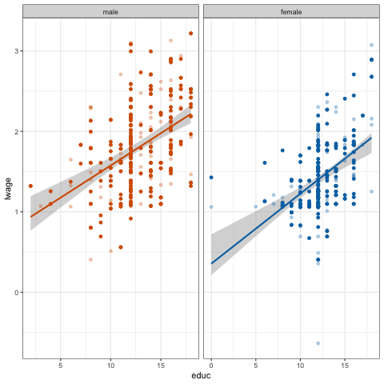

layout: true

<div class="my-footer"></div> 

---

```{r setup, include=FALSE,warning=FALSE,message=FALSE}
options(htmltools.dir.version = FALSE)

def.chunk.hook  <- knitr::knit_hooks$get("chunk")


knitr::opts_chunk$set(
  message = FALSE,
  warning = FALSE,
  dev = "svg",
  cache = TRUE,
  fig.align = "center"
  #fig.width = 11,
  #fig.height = 5
)

knitr::knit_hooks$set(chunk = function(x, options) {
  x <- def.chunk.hook(x, options)
  ifelse(options$size != "normalsize", paste0("\n \\", options$size,"\n\n", x, "\n\n \\normalsize"), x)
})

# define vars
om = par("mar")
lowtop = c(om[1],om[2],0.1,om[4])

overwrite = FALSE

```

layout: true

<div class="my-footer"></div> 

---

# Recap from last week

* **Confidence Interval**

* **Hypothesis testing**

--

## Today: 

* Understand regression tables 

---


# Back to class size and student achievments

* Take back the STAR experiment data and keep: 

  * *small* and *regular* classes
  * *Kindegarten* grade
  
* Let's consider the model:

$$ \textrm{math_score}_i = b_0 + b_1 \textrm{small}_i + e_i$$ 

* By running the regression we find:

```{r echo = FALSE}
star_df = read.csv("https://www.dropbox.com/s/bf1fog8yasw3wjj/star_data.csv?dl=1")
star_df = star_df %>%filter(star != "regular+aide" & grade == "k") 
star_df$small = star_df$star == "small"
star_df = star_df[complete.cases(star_df),]

reg_star = lm(math~small, star_df)
coeff_star = round(reg_star$coefficients,1)
```

$$ \hat{\textrm{math_score}_i} = `r coeff_star[1]` + `r coeff_star[2]` * \textrm{small}_i$$
* *Interpretation*: Being in a small class is associated to an average 8.9 increase in the math test score for *kindergarten* students.
  

* Is this coefficient really significantly different from 0? 

---


# Regression inference: $b$ vs $\beta$ 

* Let's clarify what we are looking for when running regression. 

* $b_0, b_1$ are the **point estimates** computed from our sample.
  * Like the sample proportion $\hat{p}$ was in our pasta example!

.pull-left[

* In fact, our model's prediction...
    $$\hat{y} = b_0 + b_1 x_1 + b_2x_2 + b_3x_3$$
]

--

.pull-right[

... is an **estimate** about an unknown, **true population line**
$$y = \beta_0 + \beta_1 x_1 + \beta_2x_2 + \beta_3x_3$$
]

where $\beta_0, \beta_1, \beta_2, \beta_3$ are the **population parameters** of interest.

--

* Let's bring what we know about Confidence Intervals, Hypothesis tests and Standard Errors to bear on those estimates!

---


# Regression Table

Here is the R `summary` of our regression:
```{r}
reg_wage = lm(log_wage~education + gender + education*gender, cps)
summary(reg_wage)
```

---

# Understanding Regression Tables

* Let's focus on:

```{r, echo=FALSE}
round(summary(reg_wage)$coefficients,3)
```

* There are 3 new columns: `std_error`, `statistic`, `p value`.

--

Entry | Meaning
----- | ----
`std_error` |  Standard Error of $b_k$
`statistic` |  Observed Test statistic associated to $H_0:\beta_k = 0,H_A:\beta_k \neq 0$
`p value` |  p-value associated to $H_0:\beta_k = 0,H_A:\beta_k \neq 0$

--

* So, nothing really new after all, but let's make sense of each in the case of a regression.

* We will take the example of b1

---

# Standard Error of $b_k$

> *Standard Error of $b_k$* $\equiv$ Standard deviation of the sampling distribution of $b_k$.

Let's imagine we could draw 1000 samples of workers from the US population. 

* We'd run 1000 regression and would get 1000 estimates for each $b_k$.

* The standard error of $b_k$ quantifies how much variation in the fitted slope $b_k$ one would expect between different samples

---

# Testing $H_0$: $\beta_k = 0$?

By default, the regression output provides the results associated to following hypothesis test: 

$$\begin{align}H_0:& \beta_k = 0\\H_A:& \beta_k \neq 0\end{align}$$

* It allows to statistically test if there is a true relationship between the outcome and our regressor. 
--

* If $H_0$ is true, there is **no** relationship between outcome and our regressor. 

  * In that case observing $b_1 \neq 0$ was just chance.

--

* If $H_0$ is false, then there is a true relationship. 

--

* How to decide? 
---

# Test statistic and p-value

* To conduct the test, we assume $H_0$ is true and derive the **null distribution** of $b_k$.

* The `statistic` column is *approximately* $\frac{b}{SE(b)}$.

  * We'll come back and explain this formula later.

* The `pvalue` column tells us *how extreme* the estimated slope $b_k$ is in a universe where the truth is $\beta_k = 0$

* We see a value of `0` here. So, for any significance level $\alpha$, we'd reject $H_0$.

* The pvalue measures the area outside of $\pm$ `statistic` under the Null distribution.

---

# Confidence Interval around $b_1$

.pull-left[
* The values `[lower_ci,upper_ci] =` $[0.068,0.098]$ delimite the 95% confidence interval around $b_1$.

* We said: If we took a large number of samples (1000), in 95% of cases would this interval contain the true value $\beta_1$.

* Shorthand: We are 95% confident that $\beta_1 \in [0.068,0.098]$

* Notice one thing in particular: $0 \notin [0.068,0.098]$!
]

--

.pull-right[
* That means that $\beta_1 = 0$ is *not* a highly plausible value, given our sample of data.

* We are inclined to believe that there **is** a true relationship between `educ` and `lwage`!

* It means that there is a statistically significant link between ...

* But statistical significance does not imply causality.

]

---

# How does `R` (and others) compute those values?

* The values reported by statistical packages like R are obtained from theory under suitable assumptions.

* The theory is based on *large sample approximations*, i.e. one can show that the sampling distributions converge to suitable distributions,

* We can then use to derive standard errors and conduct tests.

* The set of assumptions needed defines the *Classical Regression Model* (CRM)

---
layout: false
class: title-slide-section-red, middle

# The Classical Regression Model


---
layout: true

<div class="my-footer"></div> 

---

# Notation: $b_1 \Rightarrow \beta_1$

Let's talk about the small but important modifications we applied to our model:

* $\beta_0$ and $\beta_1$ and intercept and slope parameters

* $\varepsilon$ is the error term.

We made this change to indicate that $b_0,b_1,e$ are point estimates and sample errors, respectively, while $\beta_0,\beta_1,\varepsilon$ are the true population parameters.

---

# Defining The CRM

1. The data are **not linearly dependent**: Each variable provides new information for the outcome, and it cannot be replicated as a linear combination of other variables.

2. The mean of the residuals conditional on $x$ should be zero, $E[\varepsilon|x] = 0$. Notice that this also means that $Cov(\varepsilon,x) = 0$, i.e. that the errors and our explanatory variable(s) should be *uncorrelated*.

3. The data are drawn from a **random sample** of size $n$: observation $(x_i,y_i)$ comes from the exact same distribution, and is independent of observation $(x_j,y_j)$, for all $i\neq j$.

4. The variance of the error term $\varepsilon$ is the same for each value of $x$: $Var(\varepsilon|x) = \sigma^2$. This property is called **homoskedasticity**.

5. The error is normally distributed, i.e. $\varepsilon \sim \mathcal{N}(0,\sigma^2)$
  
  
Invoking assumption 5. in particular defines what is commonly called the *normal* linear regression model.

---

# Breaking the CRM Assumptions

.pull-left[
* No perfect collinearity. Remember `wtplus`?
    ```{r}
    library(dplyr)
    mtcars %>%
      mutate(wtplus = wt + 1) %>%
      lm(mpg ~ wt + wtplus, data = .)
    ```
]

.pull-right[
Conditional mean $E[\varepsilon|x] = 0$. Consider:
    $$\text{lwage}_i = \beta_0 + \beta_1 \text{educ}_i + \varepsilon_i$$
* Suppose there is *unobserved* ability $a_i$. High ability means higher wage.
* It *also* means school is easier, and so $i$ selects into more schooling.
* Given it's *unobserved*,  $a_i$ goes into the error $\varepsilon_i$
* We will attribute to `educ` part of the effect on wages that is actually *caused* by ability $a_i$!
* Our *ceteris paribus* assumption (all else equal) does not hold. 
* More examples in our book! Takeaway: if assumptions violated, theoretical inference invalid!
]

---
layout: false
class: title-slide-section-red, middle

# Simluation Based Inference


---
layout: true

<div class="my-footer"></div> 


---

# Simluation Based Inference

.pull-left[
* We proceed as before with `infer`

* We'll generate bootstrap samples from our dataset.

* We estimate many different coefficients and look at their sampling distribution.

]

.pull-right[
```{r}
bootstrap_distn_slope <- star_df %>% 
  specify(formula = math ~ small) %>%
  generate(reps = 1000, type = "bootstrap") %>% 
  calculate(stat = "slope")

bootstrap_distn_slope
```
]

---

# Bootstrap Sampling Distribution of $b_1$


```{r,fig.height=5}
visualize(bootstrap_distn_slope)
```

---

# Confidence Intervals

.pull-left[

* percentile method:
    ```{r}
    percentile_ci <- bootstrap_distn_slope %>% 
      get_confidence_interval(type = "percentile", level = 0.95)
    percentile_ci
    ```

* SE-method:
    ```{r}
    #observed_slope <- coef(hourly_wage)[2] # [1] is intercept
    #se_ci <- bootstrap_distn_slope %>% 
    #  get_ci(level = 0.95, type = "se", point_estimate = observed_slope)
    #se_ci
    ```
]


.pull-right[
* The *theoretical* bounds of the CI are are given to use in the above table.

* We had $[0.068,0.098]$. 

* Let's put all three together and compare!
]


---

# Simulated vs Theoretical CIs

```{r,eval = FALSE}
visualize(bootstrap_distn_slope) + 
  shade_confidence_interval(endpoints = percentile_ci, fill = NULL, 
                            linetype = "solid", color = "black") + 
  shade_confidence_interval(endpoints = se_ci, fill = NULL, 
                            linetype = "dashed", color = "black") +
  shade_confidence_interval(endpoints = c(0.068,0.098), fill = NULL, 
                            linetype = "dotted", color = "black")
```


---

# Simulated vs Theoretical CIs


```{r,echo = FALSE,fig.height=5}
visualize(bootstrap_distn_slope) + 
  shade_confidence_interval(endpoints = percentile_ci, fill = NULL, 
                            linetype = "solid", color = "black") + 
  shade_confidence_interval(endpoints = se_ci, fill = NULL, 
                            linetype = "dashed", color = "black") +
  shade_confidence_interval(endpoints = c(0.068,0.098), fill = NULL, 
                            linetype = "dotted", color = "black")

```

---

# Hypothesis Test on $\beta_1$

.pull-left[
* Let's do this hypothesis test:
    $$\begin{align}H_0:& \beta_1 = 0\\H_A:& \beta \neq 0\end{align}$$
    
* If there is no relationship, then *reshuffling* or *permuting* variable `educ` should play no role. (remember the `gender` label!)

* For each of the permuted samples, we'll recompute $b_1$.

* Let's do that 1000 times over!

]


--


.pull-right[
```{r}
null_distn_slope <- wage1 %>% 
  specify(lwage ~ educ) %>%
  hypothesize(null = "independence") %>% 
  generate(reps = 1000, type = "permute") %>% 
  calculate(stat = "slope")
```

Finally, let's visulalize the null distribution under $H_0: \beta_1 = 0$!
]

---

# Visualize $H_0: \beta_1 = 0$

.pull-left[
```{r,fig.height=5}
visualize(null_distn_slope)
```
]

.pull-right[
* Notice how it's centered at 0.0! That's the most common value amongst our hyopthetical $b_1$'s in this case.

* How likely is our observed estimate `observed_slope`, i.e. `r round(observed_slope,2)` in such a universe?

* Let's get the associated pvalue!
]

---

# Adding the pvalue

.pull-left[
```{r,fig.height=5}
visualize(null_distn_slope) + 
  shade_p_value(obs_stat = observed_slope, direction = "both")
```
]

.pull-right[
* Notice that we said `direction = "both"`: We have a two-sided alternative!

* Our observed slope falls *very* far outside that distribution! There seems to be almost **no** probability mass (no red shaded area visible)

* Let's confirm that and compute the p-value!

]

---

# Computing P-value from Bootstrapped Data

```{r}
null_distn_slope %>% 
  get_p_value(obs_stat = observed_slope, direction = "both")
```

* That **is** small! 😀

* We **reject the Null** that $\beta_1 = 0$, because the p-value 0 is smaller than any significance level $\alpha>0$ we could ever require. We have *extremely convincing* evidence at hand to reject the null in this case.

* We conclude that there is a **significant** relationship between `educ` and `lwage`.

* We would say:
> $\beta_1$ is *statistically significantly* different from zero at the $\alpha$ level.

---
layout: false
class: title-slide-section-red, middle

# Illustrating Regression Uncertainty


---
layout: true

<div class="my-footer"></div> 


---

# Illustrating Model Prediction Uncertainty

.pull-left[
* So, to answer our initial question: **yes** the slope in this picture is actually different from zero!

* This is quite encouraging. 😉

* We can visualize the 95% confidence interval *of the predicted line*. 

* The .blue[blue] line could be anywhere in the .grey[grey] area with 95% probability!
]

.pull-right[
```{r,echo = FALSE,fig.height=5}
ggplot(wage1, aes(educ, y = lwage)) + geom_point() + geom_smooth(method = "lm",se = TRUE)
```
]


---

# [`ungeviz`](https://github.com/wilkelab/ungeviz) and `gganimate` bring you: Moving Lines!

.pull-left[


]


.pull-right[

* I split by gender to make it more interesting. `r emo::ji("wink")`

* I take 20 bootstrap samples from the `wage1` data. You can see how different data points are included in each bootstrap sample.

* Those different points imply different regression lines.

* You should remember those moving lines when you go back one slide to understand what the shaded area means!

]


---

class: title-slide-final, middle

# THANKS

To the amazing [moderndive](https://moderndive.com/) team!

Big Thanks `r emo::ji("tada")` to [ungeviz](https://github.com/wilkelab/ungeviz) and `r emo::ji("confetti")` [gganimate](https://github.com/thomasp85/gganimate) for their awesome packages!

---

class: title-slide-final, middle
background-image: url(../img/logo/ScPo-econ.png)
background-size: 250px
background-position: 9% 19%

# END


|                                                                                                            |                                   |
| :--------------------------------------------------------------------------------------------------------- | :-------------------------------- |
| <a href="mailto:florian.oswald@sciencespo.fr">.ScPored[<i class="fa fa-paper-plane fa-fw"></i>]               | florian.oswald@sciencespo.fr       |
| <a href="https://github.com/ScPoEcon/ScPoEconometrics-Slides">.ScPored[<i class="fa fa-link fa-fw"></i>] | Slides |
| <a href="https://scpoecon.github.io/ScPoEconometrics">.ScPored[<i class="fa fa-link fa-fw"></i>] | Book |
| <a href="http://twitter.com/ScPoEcon">.ScPored[<i class="fa fa-twitter fa-fw"></i>]                          | @ScPoEcon                         |
| <a href="http://github.com/ScPoEcon">.ScPored[<i class="fa fa-github fa-fw"></i>]                          | @ScPoEcon                       |

