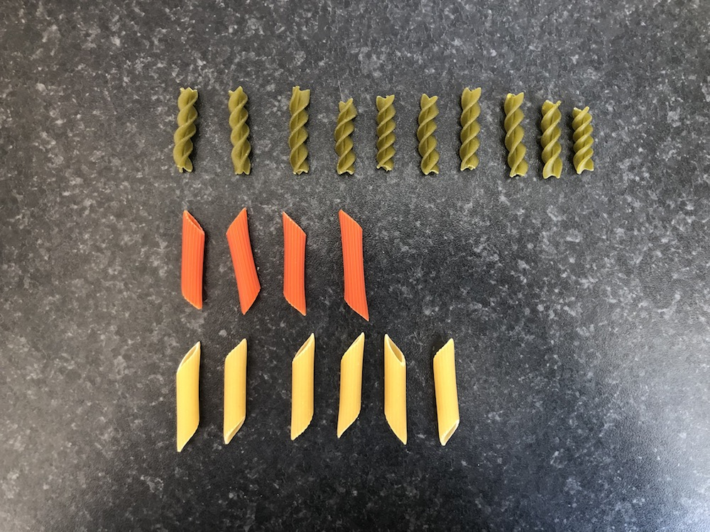

layout: true

<div class="my-footer"></div> 

---

```{r setup, include=FALSE,warning=FALSE,message=FALSE}
options(htmltools.dir.version = FALSE)
knitr::opts_chunk$set(
  message = FALSE,
  warning = FALSE,
  dev = "svg",
  cache = TRUE,
  fig.align = "center"
  #fig.width = 11,
  #fig.height = 5
)

library(tidyverse)
library(tweenr)
library(ggforce)
library(gganimate)
library(countdown)

# countdown style
countdown(
  color_border              = "#d90502",
  color_text                = "black",
  color_running_background  = "#d90502",
  color_running_text        = "white",
  color_finished_background = "white",
  color_finished_text       = "#d90502",
  color_finished_border     = "#d90502"
)

set.seed(1234)
```

# Quick "Quiz" on Last Week's Material

1\. From your ***computer*** `r emo::ji("backhand_index_pointing_right")` connect to [***www.wooclap.com/SCPOREGEXT***](https://app.wooclap.com/SCPOREGEXT)

&nbsp; &nbsp; &nbsp; ***OR***

2\. From your ***phone*** `r emo::ji("backhand_index_pointing_right")` flash QR code below

```{r, echo = F, out.width = "300px"}
knitr::include_graphics("chapter_sampling_files/figure-html/qr_code_quiz.png")
```

---

# Today - Sampling<sup>1</sup>

.footnote[
[1]: This lecture is very heavily based on the wonderful [sampling chapter](https://moderndive.com/7-sampling.html) of [ModernDive](https://moderndive.com/)]

* Fun activity to discover sampling, sampling variation and sampling distributions.

* Sampling terminology: population, sample, population parameter, point estimate or sample statistic, etc.

* Definition of an ***unbiased estimator***.

* Fundamental statistical theorem for inference: ***Central Limit Theorem***.

---

# What's the proportion of green pasta?

.center[
```{r, echo = FALSE, out.width = "600px"}

```
]

--

We could count every green pasta but that would be tedious! `r emo::ji("weary")` What else could we do?

---

# Sampling

.pull-left[
* Let's take a sample of 20 pasta.

* We made sure to select them at **random**.

* Here is what we found.

Color | Count | Proportion
:------:|:------:|:--------:
Green   |  14        |  `r format(signif(14/20,2), nsmall = 2)`
Red   |  5     |   `r format(round(5/20,2), nsmall = 2)`
Yellow   |  1    |     `r format(round(1/20,2), nsmall = 2)`

* `r format(signif(14/20,2), nsmall = 2)` can be thought of as our guess of the proportion of green pasta in the entire bowl.
]

.pull-right[
<div></div>
]

---

# Sampling Variation


* What would happen if we took a *new* sample (putting the 20 previous pasta back in the bowl)? Would we also get 14 *greens* as before?

--

* What if we repeated this activity multiple times?

--

* Probably not. The samples will vary from draw to draw.

--

* Key to this observation: these are *randomly* drawn samples.

---

# Taking 18 Samples (One per Student)

* Because we can't do this activity in class, we drew 18 samples of 20 pasta (with replacement).

--

* This is what each looked like:

 |  |  |  |  | 
:------:|:------:|:--------:|:--------:|:--------:|:--------:
 |  |  |  |  | 
 |  |  |  |  | 

---

# Taking 18 Samples (One per Student)

* Because we can't do this activity in class, we drew 18 samples of 20 pasta (with replacement) at home.

* For each sample, we computed the share of green pasta.

.pull-left[
Sample # | Count | Proportion
:------:|:------:|:--------:
1 | 14 | `r format(round(14/20,2), nsmall = 2)`
2 | 14 | `r format(round(14/20,2), nsmall = 2)`
3 | 10 | `r format(round(10/20,2), nsmall = 2)`
4 | 10 | `r format(round(10/20,2), nsmall = 2)`
5 | 6 | `r format(round(6/20,2), nsmall = 2)`
6 | 10 | `r format(round(10/20,2), nsmall = 2)`
7 | 8 | `r format(round(8/20,2), nsmall = 2)`
8 | 9 | `r format(round(9/20,2), nsmall = 2)`
9 | 11 | `r format(round(11/20,2), nsmall = 2)`
]

.pull-right[
Sample # | Count | Proportion
:------:|:------:|:--------:
10 | 8 | `r format(round(8/20,2), nsmall = 2)`
11 | 7 | `r format(round(7/20,2), nsmall = 2)`
12 | 9 | `r format(round(9/20,2), nsmall = 2)`
13 | 9 | `r format(round(9/20,2), nsmall = 2)`
14 | 14 | `r format(round(14/20,2), nsmall = 2)`
15 | 11 | `r format(round(11/20,2), nsmall = 2)`
16 | 10 | `r format(round(10/20,2), nsmall = 2)`
17 | 7 | `r format(round(7/20,2), nsmall = 2)`
18 | 13 | `r format(round(13/20,2), nsmall = 2)`
]

---

class: inverse

# Task 1

`r countdown(minutes = 10, top = 0)`

1. Create a data.frame containing the proportions of green pasta from the previous slide. Name it `pasta` and name the variable containing the proportions `prop_green`. (Hint: to create a data.frame you need to use the `data.frame()` function.)

1. Create a histogram of these proportions using `ggplot2`. Use these parameters in `geom_histogram()`: `boundary = 0.325, binwidth = 0.05`.

1. What do you observe?

---

# Sample Distribution: Histogram

.pull-left[
```{r, echo=FALSE, eval = TRUE, fig.height=8}
pasta_samples <- data.frame(replicate = 1:18, prop_green = c(0.7,0.7,0.5,0.5,0.3,0.5,0.4,0.45,0.55,0.4,0.35,0.45,0.45,0.7,0.55,0.5,0.35,0.65))

# set.seed(2)
# x = pasta_samples[,2]
# 
# df <- data.frame(x = x, y = 15)
# dfs <- list(df)
# for(i in seq_len(nrow(df))) {
#     dftemp <- tail(dfs, 1)
#     dftemp[[1]]$y[i] <- sum(dftemp[[1]]$x[seq_len(i)] == dftemp[[1]]$x[i])
#     dfs <- append(dfs, dftemp)
# }
# dfs <- append(dfs, dfs[rep(length(dfs), 3)])
# dft <- tween_states(dfs, 10, 1, 'cubic-in', 200)
# dft$y <- dft$y - 0.5
# dft <- dft[dft$y != 14.5, ]
# dft$type <- 'Animate'
# 
# p <- ggplot(dft) +
#   geom_point(aes(x, y), shape = 21, colour = "black", fill = "darkgreen", size = 12.5, stroke = 1) +
#   labs(
#     x = "Proportion of green pasta",
#     y = "Frequency"
#   ) +
#   xlim(0.25, 0.75) +
#   scale_y_continuous(breaks = seq(0,12, 2)) +
#   theme_bw(base_size = 14) +
#   transition_manual(.frame)
# p
# anim_save(filename = "img/photos/hist_building.gif", animation = p)

knitr::include_graphics("../img/photos/hist_building.gif")
```
]

--

.pull-right[
```{r, echo=FALSE, eval = TRUE, fig.height=7}
pasta_samples %>%
  ggplot(aes(x = prop_green)) +
  geom_histogram(boundary = 0.325, binwidth = 0.05, col = "white", fill = "darkgreen") +
  labs(
    x = "Proportion of green pasta",
    y = "Frequency"
  ) +
  xlim(0.25, 0.75) +
  theme_bw(base_size = 20)
```
]

---

# What Did We Just Do?

--

* Demonstrated the statistical concept of ***sampling***.

--

* *Objective*: know the proportion of green pasta

--

* *Methods*:

  1. **Census**: time-consuming (and in many cases very costly);
  
--
  
  1. **Sampling**: extract a *sample* of 20 pasta from the bowl to obtain an ***estimate***.  
  Out first ***estimate*** of the proportion of green pasta was 0.70, but it was actually larger than most other ***estimates***.
  
--

* *Important*: each *sample* was drawn ***randomly*** $\rightarrow$ samples are different from each other! $\rightarrow$ different proportions `r emo::ji("point_right")` ***sampling variation***

---

# Taking Virtual (not Real) Samples

.pull-left[
* We counted the exact number of green, red and yellow pasta in the bowl `r emo::ji("monocle")` `#confinement`

* All the pasta in the bowl are stored in a csv file [here](https://www.dropbox.com/s/qpjsk0rfgc0gx80/pasta.csv?dl=1).

```{r, echo = TRUE}
bowl <- read.csv("https://www.dropbox.com/s/qpjsk0rfgc0gx80/pasta.csv?dl=1")

head(bowl)
```
]

--

.pull-right[
* `pasta_ID`: ball identifier

* `color`: ball color

```{r, echo = TRUE}
nrow(bowl)
```

* Instead of selecting pasta with our hands, we'll take *virtual* draws from the bowl.

* We'll use the *virtual shovel* to take a sample of 50 pasta from our virtual bowl.
]

---

# Using A Virtual Shovel Once

* We will take a first sample of size 50, using the `moderndive` function `rep_sample_n`.

--

```{r}
#load moderndive package
library(moderndive)

virtual_shovel <- bowl %>% # notice that moderndive functions can be "pipped"
  rep_sample_n(size = 50) # take a sample of 50 pasta
```

.pull-left[
```{r, echo = TRUE}
# display the sample's first 6 rows
head(virtual_shovel)
```

* Column `replicate` tells us the ID of the sample. Here: `1`.
]

--

.pull-right[
```{r, echo = TRUE}
# number of observations in sample
nrow(virtual_shovel)
```
]

---

# Proportion of Green Pasta

.pull-left[
```{r}
sample_1 <- virtual_shovel %>% 
  summarize(
    # number of green pasta in sample
    num_green = sum(color == "green"),
    # number of observations in sample
    sample_n = n()) %>% 
  mutate(
    # proportion of green pasta in sample
    prop_green = num_green / sample_n)
sample_1
```
]

.pull-right[
1. Compute:
  * sum of green pasta in sample,
  * number of observations in sample (i.e. 50 in this case)

1. Compute proportion of green pasta

`r emo::ji("point_right")` `r sample_1$prop_green` are green! This is an ***estimate*** of the proportion of green pasta in the bowl. What if we try again?

What if we try many times, like, 33 times?
]

---

# Using The Virtual Shovel 33 Times

.pull-left[

33 samples (*replicates*) of size 50.

```{r}
virtual_samples <- bowl %>%
  # get 33 samples of size 50
  rep_sample_n(size = 50, reps = 33)
virtual_samples
```
]

--

.pull-right[

Compute the proportion of green pasta in each sample.

```{r}
virtual_prop_green <- virtual_samples %>% 
  group_by(replicate) %>% # calculate stat by sample
  summarize(
    num_green = sum(color == "green"),
    sample_n = n()) %>% 
  mutate(prop_green = num_green / sample_n)
virtual_prop_green
```
]


---

# (Virtual!) Sampling Variation

.pull-left[
* Just as when we did it, the virtual sampler *also* creates random samples.

* The `prop_green` column in the `virtual_prop_green` data.frame differs across samples.

* And again, we can visualize the ***sampling distribution***:

```{r,eval=FALSE}
ggplot(virtual_prop_green, aes(x = prop_green)) +
  geom_histogram(binwidth = 0.02, 
                 boundary = 0.51,
                 color = "white",
                 fill = "darkgreen") +
  scale_y_continuous(breaks = seq(0, 12, by = 2)) +
  labs(x = "Proportion of 50 pasta that were green",
       y = "Frequency",
       title = "Distribution of 33 samples of size 50") +
  theme_bw(base_size = 20)
```
]

--

.pull-right[
```{r,echo = FALSE,fig.height=6}
ggplot(virtual_prop_green, aes(x = prop_green)) +
  geom_histogram(binwidth = 0.02, 
                 boundary = 0.51,
                 color = "white",
                 fill = "darkgreen") +
  scale_y_continuous(breaks = seq(0, 12, by = 2)) +
  labs(x = "Proportion of 50 pasta that were green",
       y = "Frequency",
       title = "Distribution of 33 samples of size 50") +
  theme_bw(base_size = 20)
```
]

---

class: inverse

# Task 2 (10 minutes)

Instead of taking only 33 samples, let's take ***1000***!

1. Why do we not take 1000 samples "by hand"?

1. Load the [data](https://www.dropbox.com/s/qpjsk0rfgc0gx80/pasta.csv?dl=1) into an object `pasta`.

1. Obtain 1000 samples of size 50 using the `rep_sample_n()` function from the `moderndive` package.

1. Calculate the proportion of green pasta in each sample.

1. Plot a histogram of the obtained proportion of green pasta in each sample.

1. What do you observe? Which proportions occur most frequently? How does the shape of the histogram compare to when we took only 33 samples?

1. How likely is it that we sample 50 pasta of which less than 20% are green?

---

# Sampling Distribution of 1000 Samples

```{r, echo = FALSE, eval = TRUE, fig.height = 4.5, fig.width = 7.75}
virtual_samples <- bowl %>% 
  rep_sample_n(size = 50, reps = 1000)

virtual_prop_green <- virtual_samples %>% 
  group_by(replicate) %>% 
  summarize(
    num_green = sum(color == "green"),
    sample_n = n()) %>% 
  mutate(prop_green = num_green / sample_n)

virtual_prop_green %>% ggplot(
  aes(x = prop_green)) +
  geom_histogram(
    binwidth = 0.02,
    boundary = 0.41,
    color = "white",
    fill = "darkgreen") +
  labs(x = "Proportion of green pasta in sample",
       y = "Frequency",
       title = "Distribution of 1000 samples of size 50") +
  theme_bw(base_size = 14)
```

--

Looks remarkably close to a ***normal distribution*** $\rightarrow$ the more samples we take, the more their ***sampling distribution*** will resemble a ***normal distribution***.

---

# Role of Sample Size

Imagine you could change the size of your samples and had the option of the following sizes: 25, 50 and 100.

If your goal is still to estimate the proportion of the bowl’s pasta that are green, which shovel would you choose?

---

# Role of Sample Size

* Let's repeat what we did previously but for different sample sizes.

* Let's take 1000 samples each for $n=25,n=50,n=100$.

--

* We will use `rep_sample_n()` again.

--

.pull-left[

Generate all samples of different sizes:

```{r}
# Sample size: 25
virtual_samples_25 <- bowl %>% 
  rep_sample_n(size = 25, reps = 1000)

# Sample size: 50
virtual_samples_50 <- bowl %>% 
  rep_sample_n(size = 50, reps = 1000)

# Sample size: 100
virtual_samples_100 <- bowl %>% 
  rep_sample_n(size = 100, reps = 1000)
```
]

--

.pull-right[

Compute proportion of green pasta:

```{r}
# Sample size: 25
# The same code is used for the other sample sizes
virtual_prop_green_25 <- virtual_samples_25 %>% 
  group_by(replicate) %>% 
  summarize(
    num_green = sum(color == "green"),
    sample_n = n()) %>% 
  mutate(prop_green = num_green / sample_n)
```
]

---

# Role of Sample Size

```{r, echo = FALSE, fig.height=5, fig.width=10}

# Sample size: 50
virtual_prop_green_50 <- virtual_samples_50 %>% 
  group_by(replicate) %>% 
  summarize(
    num_green = sum(color == "green"),
    sample_n = n()) %>% 
  mutate(prop_green = num_green / sample_n)

# Sample size: 100
virtual_prop_green_100 <- virtual_samples_100 %>% 
  group_by(replicate) %>% 
  summarize(
    num_green = sum(color == "green"),
    sample_n = n()) %>% 
  mutate(prop_green = num_green / sample_n)

df = rbind(virtual_prop_green_25,virtual_prop_green_50,virtual_prop_green_100)

df %>% 
  ggplot(aes(x = prop_green)) +
    geom_histogram(data = df %>% filter(sample_n == 25), binwidth = 0.04, boundary = 0.42, color = "white", fill = "darkgreen") +
  geom_histogram(data = df %>% filter(sample_n == 50), binwidth = 0.02, boundary = 0.41, color = "white", fill = "darkgreen") +
  geom_histogram(data = df %>% filter(sample_n == 100), binwidth = 0.01, boundary = 0.405, color = "white", fill = "darkgreen") +
  scale_x_continuous(breaks = round(seq(0, 1, by = 0.2),1), limits = c(0.2,0.8)) +
  labs(
    x = "Proportion of green pasta in sample",
    y = "Frequency",
    title = "Comparing distributions of proportions of green pasta for different sample sizes"
  ) +
    facet_wrap(~sample_n, scales = "free_y", labeller = as_labeller(
        c(`25` = "1000 samples of size 25",
          `50` = "1000 samples of size 50",
          `100` = "1000 samples of size 100"))) +
    theme_bw(base_size = 14)
```

---


# Sample Size and Sampling Distributions

* The larger the sample size, the *narrower* the resulting ***sampling distribution***.

--

* In other words, there are fewer differences due to ***sampling variation***.

--

* Holding constant the number of replicates (i.e. 1000 in our case), ***bigger samples*** will yield *normal distributions* with ***smaller standard deviations***.

--

```{r, echo = FALSE}
# n = 25
sd25 = virtual_prop_green_25 %>% 
  summarize(sd = sd(prop_green))

# n = 50
sd50 = virtual_prop_green_50 %>% 
  summarize(sd = sd(prop_green))

# n = 100
sd100 = virtual_prop_green_100 %>% 
  summarize(sd = sd(prop_green))
```

Sample Size | Standard Deviation
:---------:|:--------------:
25          | `r format(round(sd25$sd,2), nsmall = 2)`
50          | `r format(round(sd50$sd,2), nsmall = 2)`
100         |`r format(round(sd100$sd,2), nsmall = 2)`

--

* Remember that the ***standard deviation*** measures the *spread* of a variable around its mean.

--

* So as the sample size increases, our ***estimates*** of the true proportion of the bowl's green pasta get more *precise*.

---

# Sampling Framework

* We used sampling for the purpose of ***estimation***.

--

* We extracted samples in order to ***estimate*** the proportion of the bowl's pasta that are green.

--

* 2 key concepts relating to sampling for estimation:

  1. The effect of ***sampling variation*** on our estimates: different samples give different estimates. 
  
  1. The effect of sample size on ***sampling variation***: the bigger the size of our sample the closer our estimate should be from the true value.

---


# Sampling Glossary `r emo::ji("book")`

.pull-left[
***Population:*** collection of individuals or observations we are interested in.  
$N = 713$ pasta.

***Population parameter:*** numerical summary quantity about the population that is unknown but that we want to know.  
*Examples:* population mean $(\mu)$, proportion of green pasta $(p)$.

***Census:*** exhaustive enumeration or counting of all $N$ individuals or observations in the population in order to compute the population parameter’s value *exactly*.

***Sampling:*** collecting sample(s) of size $n$ from the population of size $N$.
]

--

.pull-right[
* ***Point estimate*** or ***Sample statistic:*** summary statistic computed from a sample that estimates an unknown population parameter.  
*Example:* *sample proportion* of green pasta $(\hat{p})$. The "hat" on top of the $p$ indicates that it is an *estimate* of the population proportion $p$.

* ***Representative sampling:*** does the sample *look like* the population?

* ***Biased sampling:*** did all pasta have an equal chance of being included in a sample?

* ***Random sampling:*** randomly sampling in an unbiased fashion.

]

---

# Statistical Definitions

* We have been estimating $\hat{p}$ all along.

--

* We plotted the *sampling distribution* to display the *sampling variation* of the *sample proportion* $\hat{p}$.

--

* We computed the *standard deviation* of the *sampling distribution* of $\hat{p}$. This standard deviation has a special name: ***standard error*** of the *point estimate* $\hat{p}$.

--

* Let's reproduce the summary table and labelling properly:

Sample Size $(n)$ | Standard Error of $\hat{p}$
:---------:|:--------------:
25          | `r format(round(sd25$sd,2), nsmall = 2)`
50          | `r format(round(sd50$sd,2), nsmall = 2)`
100         |`r format(round(sd100$sd,2), nsmall = 2)`

* Key takeaway: as the *sample size* $n$ goes up, the “typical” error of your *point estimate* will go down, as quantified by the *standard error*.

---

# Putting It All Together

* ***Point estimates*** from ***random samples*** provide a *good guess* of the true unknown ***population parameter***.

--

* How good? Sometimes $\hat{p}$ will be far from $p$, sometimes close. There's ***sampling variation***.

--

* ***On average***, our estimates will be correct. This is because of random sampling. We say that: 
> ### $\hat{p}$ is an ***unbiased estimator*** of $p$, i.e. $\mathop{\mathbb{E}}[\hat{p}] = p$

--

* What is the true population proportion $p$ of green pasta in the population of $N=713$ pasta?

--

```{r}
sum(bowl$color == "green")/nrow(bowl)
```

--

* Let's insert the ***true population proportion*** $p=`r round(sum(bowl$color == "green")/nrow(bowl), 2)`$ into our previous plots!

---

# Visualizing Unbiasedness and Sampling Variation

```{r,echo = FALSE,fig.width=10,fig.height=5}
p <- bowl %>% 
  summarize(p = mean(color == "green")) %>% 
  pull(p)

dat_text <- data.frame(
  sample_n   = c(25, 50, 100),
  # x     = c(0.655, 0.655, 0.655),
  # y     = c(175, 95, 45),
  label = rep("True population proportion", 3)
)

df %>% 
  ggplot(aes(x = prop_green)) +
    geom_histogram(data = df %>% filter(sample_n == 25), binwidth = 0.04, boundary = 0.42, color = "white", fill = "darkgreen") +
  geom_histogram(data = df %>% filter(sample_n == 50), binwidth = 0.02, boundary = 0.41, color = "white", fill = "darkgreen") +
  geom_histogram(data = df %>% filter(sample_n == 100), binwidth = 0.01, boundary = 0.405, color = "white", fill = "darkgreen") +
  scale_x_continuous(breaks = round(seq(0, 1, by = 0.2),1), limits = c(0.2,0.8)) +
  labs(
    x = "Proportion of green pasta in sample",
    y = "Frequency",
    title = "Comparing distributions of proportions of green pasta for different sample sizes"
  ) +
    facet_wrap(~sample_n, scales = "free_y", labeller = as_labeller(
        c(`25` = "1000 samples of size 25",
          `50` = "1000 samples of size 50",
          `100` = "1000 samples of size 100"))) +
    theme_bw(base_size = 14) +
  geom_vline(xintercept = p, col = "black", size = 0.75) +
  geom_text(data = dat_text, mapping = aes(x = 0.662, y = Inf, label = label), vjust = 2, size = 3)
```

---
# Some Sampling Scenarios


Scenario | Population parameter | Notation | Point estimate | Symbol(s)
:--: | :--: | :--: |:--: | :--:
1 | Population proportion | $p$ | Sample proportion | $\widehat{p}$
2 | Population mean | $\mu$ | Sample mean | $\overline{x}$ or $\widehat{\mu}$
3 | Difference in population proportions | $p_1 - p_2$ | Difference in sample proportions | $\widehat{p}_1 - \widehat{p}_2$
4 | Difference in population means | $\mu_1 - \mu_2$ | Difference in sample means | $\overline{x}_1 - \overline{x}_2$
5 | Population regression slope | $\beta_1$ | Fitted regression slope | $b_1$ or $\widehat{\beta}_1$
6 | Population regression intercept | $\beta_0$ | Fitted regression intercept | $b_0$ or $\widehat{\beta}_0$

---

# The Central Limit Theorem (CLT)

* The fact that our sample statistics ***converge*** to a *central limit* is well known in statistics.

--

* It's due to a famous result known as the ***central limit theorem***.

--

> ### *Central Limit Theorem:* regardless of how the underlying population distribution looks like, **when sample *means* are based on larger and larger sample sizes, the sampling distribution of these sample *means* becomes both more and more normally shaped and more and more narrow**.

--

* In other words, their sampling distribution increasingly follows a ***normal distribution*** and the *variation of these sampling distributions gets smaller*, as quantified by their ***standard errors***.

---

# Central Limit Theorem - NYTimes video

.center[
<iframe width="684" height="464" src="https://www.youtube.com/embed/jvoxEYmQHNM" frameborder="0" allow="accelerometer; autoplay; encrypted-media; gyroscope; picture-in-picture" allowfullscreen></iframe>
]

---

class: title-slide-final, middle

# THANKS

To the amazing [moderndive](https://moderndive.com/) team!

---

class: title-slide-final, middle
background-image: url(../img/logo/ScPo-econ.png)
background-size: 250px
background-position: 9% 19%

# SEE YOU NEXT WEEK!


|                                                                                                            |                                   |
| :--------------------------------------------------------------------------------------------------------- | :-------------------------------- |
| <a href="mailto:florian.oswald@sciencespo.fr">.ScPored[<i class="fa fa-paper-plane fa-fw"></i>]               | florian.oswald@sciencespo.fr       |
| <a href="https://github.com/ScPoEcon/ScPoEconometrics-Slides">.ScPored[<i class="fa fa-link fa-fw"></i>] | Slides |
| <a href="https://scpoecon.github.io/ScPoEconometrics">.ScPored[<i class="fa fa-link fa-fw"></i>] | Book |
| <a href="http://twitter.com/ScPoEcon">.ScPored[<i class="fa fa-twitter fa-fw"></i>]                          | @ScPoEcon                         |
| <a href="http://github.com/ScPoEcon">.ScPored[<i class="fa fa-github fa-fw"></i>]                          | @ScPoEcon                       |

