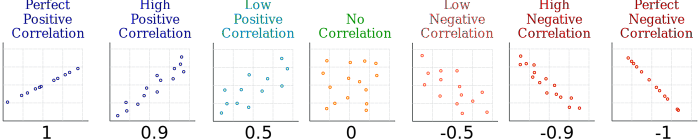

layout: true

<div class="my-footer"></div> 

---

```{r setup, include=FALSE,warning=FALSE,message=FALSE}
options(htmltools.dir.version = FALSE)
knitr::opts_chunk$set(
  message = FALSE,
  warning = FALSE,
  dev = "svg",
  cache = TRUE,
  fig.align = "center"
  #fig.width = 11,
  #fig.height = 5
)

library(countdown)

# countdown style
countdown(
  color_border              = "#d90502",
  color_text                = "black",
  color_running_background  = "#d90502",
  color_running_text        = "white",
  color_finished_background = "white",
  color_finished_text       = "#d90502",
  color_finished_border     = "#d90502"
)

#library(learnr) # this line needs to be run manually I have no idea why but otherwise I get this error message which I can't seem to solve...
# Quitting from lines 27-40 (chapter2.Rmd) 
# Error: package or namespace load failed for 'learnr':
#  .onAttach failed in attachNamespace() for 'learnr', details:
#   call: NULL
#   error: The shiny_prerendered_chunk function can only be called from within runtime: shiny_prerendered
```

# Quick "Quiz" on Last Week's Material

1\. From your ***computer*** `r emo::ji("backhand_index_pointing_right")` connect to [***www.wooclap.com/SCPOINTRO***](https://app.wooclap.com/SCPOINTRO)

&nbsp; &nbsp; &nbsp; ***OR***

2\. From your ***phone*** `r emo::ji("backhand_index_pointing_right")` flash QR code below

```{r, echo = F, out.width = "300px"}

```

---
  
# Working With Data

* Econometrics is about `data`.

```{r, echo = F, out.width = "400px"}
knitr::include_graphics("chapter_tidy_files/figure-html/data_science_pipeline.png")
```

--

* According a to [2014 NYTimes article](https://www.nytimes.com/2014/08/18/technology/for-big-data-scientists-hurdle-to-insights-is-janitor-work.html), "data scientists [...] spend from ***50 percent to 80 percent of their time*** mired in this more mundane labor of collecting and preparing unruly digital data, before it can be explored for useful nuggets."

* In the next two lectures you will learn the basics of ***tidying***, ***visualising*** and ***summarising*** data

---

layout: false
class: title-slide-section-red, middle

# Tidying Data

---
layout: true

<div class="my-footer"></div> 

---

# Intro to `dplyr`

* [`dplyr`](https://dplyr.tidyverse.org) is part of the [`tidyverse`](https://www.tidyverse.org) package family.

* [`data.table`](https://github.com/Rdatatable/data.table/wiki) is an alternative. Very fast but a bit more difficult.

* Both have pros and cons. We'll start you off with `dplyr`.

---

# `dplyr` Overview

* You *must* read through [Hadley Wickham's chapter](https://r4ds.had.co.nz/transform.html). It's clear and concise.

--

* The package is organized around a set of **verbs**, i.e. *actions* to be taken.

* We operate on `data.frames` or `tibbles` (*nicer looking* data.frames.)

--

* All *verbs* work as follows:

$$\text{verb}(\underbrace{\text{data.frame}}_{\text{1st argument}}, \underbrace{\text{what to do}}_\text{2nd argument})$$

--

* Alternatively you can (should) use the `pipe` operator `%>%`:

$$\underbrace{\text{data.frame}}_{\text{1st argument}} \underbrace{\text{ %>% }}_{\text{"pipe" operator}} \text{verb}(\underbrace{\text{what to do}}_\text{2nd argument})$$

---

# Main `dplyr` Verbs

1. `filter()`: Choose observations based on a certain value (i.e. subset)

--

1. `arrange()`: Reorder rows 

--

1. `select()`: Select variables by name

--

1. `mutate()`: Create new variables out of existing ones

--

1. `summarise()`: Collapse data to a single summary

--

1. `group_by()`: All the above can be used in conjunction with `group_by()` to use function on groups rather than entire data

---

# Data on 2016 US election polls from the `dslabs` package

* This dataset contains __real__ data on polls made during the 2016 US Presidential elections and compiled by [fivethirtyeight](fivethirtyeight.com)

```{r dslabs, echo = TRUE}
library(dslabs)
library(tidyverse)
data(polls_us_election_2016) # this data is from fivethirtyeight.com
polls_us_election_2016 <- as_tibble(polls_us_election_2016)
head(polls_us_election_2016[,1:6]) # show first 6 lines of first 6 variables
```

`r emo::ji("rotating_light")` This is a `tibble` (more informative than `data.frame`)

What variables does this dataset contain?

---

layout: true

<div class="my-footer"></div> 

# `dplyr` Verbs

.left-thin[

### Filter observations

```r
filter()
```

]

---

.right-wide[
*Example:* Which A graded poll with at least 2,000 people had Trump win at least 45% of the vote?
]

--

.right-wide[
```{r}
polls_us_election_2016 %>%
  filter(grade == "A" & samplesize > 2000 & rawpoll_trump > 45)
```
]

---

.right-wide[
Standard suite of comparison operators:
- `>`: greater than,
- `<`: smaller than,
- `>=`: greater than or equal to,
- `<=`: smaller than or equal to,
- `!=`: not equal to,
- `==`: equal to.

Logical operators:
1. `x & y`: `x` **and** `y`
1. `x | y`: `x` **or** `y`
1. `!y`: **not** `y`
]

---

.right-wide[
`R` has the convenient `x %in% y` operator (conversely `!x %in% y`), `TRUE` if `x` is *a member of* `y`.
```{r, echo = TRUE}
3 %in% 1:3
c(2,5) %in% 2:10  # also vectorized
c("S","Po") %in% c("Sciences","Po")  # also strings
```
]

---

layout: true

<div class="my-footer"></div> 

# `dplyr` Verbs

.left-thin[

### Filter

### Create new variable(s)

```r
mutate()
```

]

---

.right-wide[
*Example:* What was
1. the combined vote share of Trump and Clinton for each poll?
2. the difference between Trump's raw poll vote share and 538's adjusted vote share?
]

--

.right-wide[
```{r, echo = TRUE}
polls_us_election_2016 %>%
  mutate(trump_clinton_tot = rawpoll_trump + rawpoll_clinton,
         trump_raw_adj_diff = rawpoll_trump - adjpoll_trump) %>%
  names()
```
]

---

layout: true

<div class="my-footer"></div> 

# `dplyr` Verbs

.left-thin[

### Filter

### Mutate

### Keep some variable(s)

```r
select()
```

]

---

.right-wide[
*Example:* Only keep the variables `state, startdate, enddate, pollster, rawpoll_clinton, rawpoll_trump`
```{r, echo = TRUE}
polls_us_election_2016 %>%
  select(state,startdate,enddate,pollster,rawpoll_clinton,rawpoll_trump) %>%
  names()
```
]

---

layout: true

<div class="my-footer"></div> 

# `dplyr` Verbs

.left-thin[

### Filter

### Mutate

### Select

### Compute statistic

```r
summarise()
```

]

---

.right-wide[
*Example:* What is the maximum vote share for Trump?
```{r}
polls_us_election_2016 %>%
  summarise(max_trump = max(rawpoll_trump))
```
]

---

layout: true

<div class="my-footer"></div> 

# `dplyr` Verbs

.left-thin[

### Filter

### Mutate

### Select

### Summarise

### Apply function by group

```r
group_by()
```

]

---

.right-wide[
*Example:* What is the average vote share for Clinton by poll grade?
```{r}
polls_us_election_2016 %>%
  group_by(grade) %>%
  summarise(mean_vote_clinton = mean(rawpoll_clinton))
```
]

---
layout: true

<div class="my-footer"></div> 

---

# Chaining `r emo::ji("link")` Commands Together

Works for all `dplyr` verbs:
```{r, echo = TRUE, eval = TRUE}
polls_us_election_2016 %>%
  mutate(trump_clinton_diff = rawpoll_trump-rawpoll_clinton) %>%
  filter(trump_clinton_diff>5 &
        state == "Iowa" &
        is.na(rawpoll_johnson)) %>%
  select(pollster)
```

--

But also with other `R` commands:

.pull-left[

```{r, echo = TRUE}
polls_us_election_2016$samplesize %>% mean(na.rm = T)
```
]

--

.pull-right[

```{r,echo = TRUE}
polls_us_election_2016 %>% count()
```
]

---

# Missing Values: `NA`

.pull-left[
* Whenever a value is *missing*, we code it as `NA`.
    ```{r, echo = TRUE}
    x <- NA
    ```
* `R` propagates `NA` through operations:
    ```{r, echo = TRUE}
    NA > 5
    NA + 10
    ```
* `is.na(x)` function returns `TRUE` if `x` is an `NA`.
    ```{r, echo = TRUE}
    is.na(x)
    ```
]

--

.pull-right[
* What is confusing is that 
    ```{r, echo = TRUE}
    NA == NA
    ```

* It's easy to illustrate like that:
    ```{r, echo = TRUE}
    # Let x be Mary's age. We don't know how old she is.
    x <- NA
    
    # Let y be John's age. We don't know how old he is.
    y <- NA
    
    # Are John and Mary the same age?
    x == y
    #> [1] NA
    # We don't know!
    ```
]

---

class: inverse

# Task 1

`r countdown(minutes = 10, top = 0)`

Load the data as explained on slide 8.

1. How many polls have a missing `grade`?

1. Which polls were (i) polled by American Strategies, GfK Group or Merrill Poll, (ii) had a sample size greater than 1,000, _and_ (iii) started on October 20th, 2016?

1. Which polls (i) did not have missing poll data for Johnson, (ii) had a combined raw poll vote share for Trump and Clinton greater than 95% _and_ (iii) had a sample size greater than 1,000?

1. Which polls (i) did not poll for vote intentions for Johnson, (ii) had a difference in raw poll vote shares between Trump and Clinton greater than 5, and (iii) were done in the state of Iowa?

1. Which state had the highest average Trump vote share for polls which had at least a sample size of 2,000? (*Hint: you'll have to use `filter`, `group_by`, `summarise` and `arrange`. To obtain ranking in descending order check `arrange`'s help page.*)

---

layout: false
class: title-slide-section-red, middle

# Visualising Data

---
layout: true

<div class="my-footer"></div> 

---

background-image: url("../img/logo/ggplot2.svg")
background-position: 90% 5%
background-size: 150px

# Base `R` and `ggplot2`

* Base `R` plotting is fairly good.

* There is an extremely powerful alternative: `ggplot2` (part of the `tidyverse` suite) $\rightarrow$ what we'll be using

* Let's go back to the `gapminder` dataset to run the examples.

---

# The `gapminder` dataset: Overview

* Let's first load a dataset with these commands:
    ```{r, echo = TRUE, eval = FALSE}
    library(dslabs)
    gapminder <- gapminder
    ```
    
    ```{r, echo = FALSE, eval = TRUE}
    gapminder <- dslabs::gapminder
    ```

--

* Here are the first 3 rows and last 2 rows.
    ```{r}
    head(gapminder, n = 3)
    tail(gapminder, n = 2)
    ```

---

class: inverse

# Task 2

`r countdown(minutes = 5, top = 0)`

1. What variables does this dataset contain?

1. How are the data stored?

1. Create a new variable called `gdppercap` corresponding to `gdp` divided by `population`.

1. Compute the average population per continent per year, `mean_pop`, removing missing values and assign the output to a new object `gapminder_new`.

```{r, echo = F}
gapminder_mean <- gapminder %>%
  group_by(continent, year) %>%
  summarise(mean_pop = mean(population, na.rm = T))

gapminder_2015 <- gapminder %>%
  filter(year == "2015")
```

---

# gg is for Grammar of Graphics<sup>1</sup>

.footnote[
[1]: The following slides are taken from [Garrick Aden-Buie](https://www.garrickadenbuie.com/)'s wonderful [Gentle Guide to the Grammar of Graphics with `ggplot2`](https://pkg.garrickadenbuie.com/gentle-ggplot2/#1)
]

---

# gg is for Grammar of Graphics


.left-thin[
### Data

```r
data %>%
  ggplot()
```

or 

```r
ggplot(data)
```
]

--

.right-wide[

#### Tidy Data

1. Each variable forms a ***column***

2. Each observation forms a ***row***

3. Each observational unit forms a table
]

--

.right-wide[
#### Start by asking

1. What information do I want to use in my visualization?

1. Is that data contained in ***one column/row*** for a given data point?
]

---
layout: true

<div class="my-footer"></div> 

# gg is for Grammar of Graphics

.left-thin[
### Data
### Aesthetics

```r
+ aes()
```

]
---

.right-wide[
Map data to visual elements or parameters

- year

- population

- country
]

---

.right-wide[
Map data to visual elements or parameters

- year → **x**

- population → **y**

- country → *shape*, *color*, etc.
]

---

.right-wide[
Map data to visual elements or parameters

```r
aes(
  x = year,
  y = population,
  color = country
)
```
]

---
layout: true

<div class="my-footer"></div> 

# gg is for Grammar of Graphics

.left-thin[
### Data
### Aesthetics
### Geoms

```r
+ geom_*()
```
]

---

.right-wide[
Geometric objects displayed on the plot

```{r geom_demo, echo=FALSE, fig.width=6, fig.height=3.5,  out.width="650px"}
minimal_theme <- theme_bw() +
  theme(
    axis.text = element_blank(),
    axis.ticks = element_blank(),
    panel.grid = element_blank(),
    panel.border = element_blank(),
    axis.title = element_blank(),
    plot.title = element_text(hjust = 0.5),
    text = element_text(family = "Fira Mono"),
    plot.background = element_rect(fill = "white", color = NA),
    panel.background = element_rect(fill = "white", color = NA)
  )
set.seed(4242)
df_geom <- data_frame(y = rnorm(10), x = 1:10)
g_geom <- list()
g_geom$point <- ggplot(df_geom, aes(x, y)) + geom_point() + ggtitle("geom_point()")
g_geom$line <- ggplot(df_geom, aes(x, y)) + geom_line() + ggtitle("geom_line()")
g_geom$bar <- ggplot(df_geom, aes(x, y)) + geom_col() + ggtitle("geom_col()")
g_geom$boxplot <- ggplot(df_geom, aes(y = y)) + geom_boxplot() + ggtitle("geom_boxplot()")
g_geom$histogram <- ggplot(df_geom, aes(y)) + geom_histogram(binwidth = 1) + ggtitle("geom_histogram()")
g_geom$density <- ggplot(df_geom, aes(y)) + geom_density(fill = "grey40", alpha = 0.25) + ggtitle("geom_density()") + xlim(-4, 4)
g_geom <- map(g_geom, ~ . + minimal_theme)
cowplot::plot_grid(plotlist = g_geom)
```
]

---

.right-wide[
Here are the [some of the most widely used geoms](https://eric.netlify.com/2017/08/10/most-popular-ggplot2-geoms/)

.small[
| Type | Function |
|:----:|:--------:|
| Point | `geom_point()` |
| Line | `geom_line()` |
| Bar | `geom_bar()`, `geom_col()` |
| Histogram | `geom_histogram()` |
| Regression | `geom_smooth()` |
| Boxplot | `geom_boxplot()` |
| Text | `geom_text()` |
| Vert./Horiz. Line | `geom_{vh}line()` |
| Count | `geom_count()` |
| Density | `geom_density()` |

<https://eric.netlify.com/2017/08/10/most-popular-ggplot2-geoms/>
]
]


---

.right-wide[
Just start typing `geom_` in `RStudio` to see all the options


]

---

layout: true

<div class="my-footer"></div> 

# (Y)Our first plot!
---

.left-thin[
```{r first-plot1a, eval=FALSE}
gapminder_mean %>%
  ggplot()
```
]

.right-wide[
```{r first-plot1a-out, ref.label='first-plot1a', echo=FALSE, fig.height = 3.5, out.width="100%"}
```
]

---

.left-thin[
```{r first-plot1b, eval=FALSE}
gapminder_mean %>%
  ggplot() +
  aes(x = year, #<<
      y = mean_pop) #<<
```
]

.right-wide[
```{r first-plot1b-out, ref.label='first-plot1b', echo=FALSE, fig.height = 3.5, out.width="100%"}
```
]

---

.left-thin[
```{r first-plot1c, eval=FALSE}
gapminder_mean %>%
  ggplot() +
  aes(x = year,
      y = mean_pop) +
  geom_point() #<<
```
]

.right-wide[
```{r first-plot1c-out, ref.label='first-plot1c', echo=FALSE, fig.height = 3.5, out.width="100%"}
```
]

---

.left-thin[
```{r first-plot1, eval=FALSE}
gapminder_mean %>%
  ggplot() +
  aes(x = year,
      y = mean_pop,
      color = continent) + #<<
  geom_point()
```
]

.right-wide[
```{r first-plot1-out, ref.label='first-plot1', echo=FALSE, fig.height = 3.5, out.width="100%"}
```
]

---

.left-thin[
```{r first-plot2-fake, eval=FALSE}
gapminder_mean %>%
  ggplot() +
  aes(x = year,
      y = mean_pop,
      color = continent) +
  geom_point() +
  geom_line() #<<
```
]

.right-wide[
```{r first-plot2-fake-out, ref.label='first-plot2-fake', fig.height = 3.5, echo=FALSE, out.width="100%"}
```
]

---

.left-thin[
```{r first-plot2-line, eval=FALSE}
gapminder_mean %>%
  ggplot() +
  aes(x = year,
      y = mean_pop,
      color = continent) +
  # geom_point() + #<<
  geom_line()
```
]

.right-wide[
```{r first-plot2-line-out, ref.label='first-plot2-line', fig.height = 3.5, echo=FALSE, out.width="100%"}
```
]

---
layout: true

<div class="my-footer"></div> 

# gg is for Grammar of Graphics

.left-thin[
### Data
### Aesthetics
### Geoms
### Facet

```r
+ facet_wrap() 
+ facet_grid()
```
]
---

```{r geom_facet_setup, include=FALSE}
g <- ggplot(gapminder_mean) +
  aes(x = year,
      y = mean_pop,
      color = continent) +
  geom_point() +
  geom_line()
```

.right-wide[
```{r geom_facet, echo=TRUE, out.width="90%", fig.height = 3.5, fig.width=6}
g + facet_wrap(~ continent)
```
]

---

.right-wide[
```{r geom_grid, echo=TRUE, out.width="90%", fig.height = 3.5, fig.width=6}
g + facet_grid(~ continent)
```
]

---
layout: true

<div class="my-footer"></div> 

# gg is for Grammar of Graphics

.left-thin[
### Data
### Aesthetics
### Geoms
### Facet
### Labels

```r
+ labs()
```
]
---

.right-wide[
```{r labs-ex, echo=TRUE, out.width="90%", fig.height = 3.5, fig.width=6}
g + labs(x = "Year", y = "Average Population", color = "Continent")
```
]

---
layout: true

<div class="my-footer"></div> 

# gg is for Grammar of Graphics

.left-thin[
### Data
### Aesthetics
### Geoms
### Facet
### Labels
### Scales

```r
+ scale_*_*()
```
]
---

.right-wide[ 
`scale` + `_` + `<aes>` + `_` + `<type>` + `()`

What parameter do you want to adjust? → `<aes>` <br>
What type is the parameter? → `<type>`

- I want to change my discrete x-axis<br>`scale_x_discrete()`
- I want to change range of point sizes from continuous variable<br>`scale_size_continuous()`
- I want to rescale y-axis as log<br>`scale_y_log10()`
- I want to use a different color palette<br>`scale_fill_discrete()`<br>`scale_color_manual()`
]

---

.right-wide[
```{r scale_ex1, out.width="90%", fig.height = 3.5, fig.width=6}
g + scale_color_viridis_d()
```
]

---

.right-wide[
```{r scale_ex2, out.width="90%", fig.height = 3.5, fig.width=6}
g + scale_y_log10()
```
]

---

.right-wide[
```{r scale_ex4, out.width="90%", fig.height = 3.5, fig.width=6}
g + scale_x_continuous(breaks = seq(1950, 2020, 10))
```
]

---
layout: true

<div class="my-footer"></div> 

# gg is for Grammar of Graphics

.left-thin[
### Data
### Aesthetics
### Geoms
### Facet
### Labels
### Scales

---

layout:true

<div class="my-footer"></div> 

---

# Delving Deeper into ggplot

* Each graph is different and `ggplot2` provides a zillion options to customize your graph to perfection.

--

* Excellent cheatsheet on [project website](https://ggplot2.tidyverse.org).

--

* [Garrick Aden-Buie](https://www.garrickadenbuie.com/)'s wonderful [Gentle Guide to the Grammar of Graphics with `ggplot2`](https://pkg.garrickadenbuie.com/gentle-ggplot2/#1) from which the previous slides were taken from.

---

# Types of Plots

***Histograms:*** counts how many obserations fall within a certain bin.

--

***Boxplots:*** displays the distribution of a variable.

--

```{r, echo = F, out.width = "850px"}
knitr::include_graphics("chapter_tidy_files/figure-html/boxplot_explanation.png")
```

---

# Types of Plots

***Histograms:*** counts how many obserations fall within a certain bin.

***Boxplots:*** displays the distribution of a variable.

***Scatter plots:*** shows the association between two variables.

---

class: inverse

# Task 3

`r countdown(minutes = 10, top = 0)`

Using the `gapminder` data, create the following plots using `ggplot2`. Don't forget to label the axes.

1. A histogram of life expectancy in 2015. Within the appropriate `geom_*` set: `binwidth` to 5, `boundary` to 45, `colour` to "white" and `fill` to "#d90502".

1. Using the previous graph, facet it by continent such that each continent's plot is a new row. (*Hint: check the help for `facet_grid`.*)

1. A boxplot of average life expectancy per year by continent (removing missing values). Within the appropriate `geom_*` set: `colour` to "black" and `fill` to "#d90502". (*Hint: you need to group by both `continent` and `year`.*)

1. A scatter plot of fertility rate (y-axis) with respect to infant mortality (x-axis) in 2015. Within the appropriate `geom_*` set: `size` to 3, `alpha` to 0.5, `colour` to "#d90502".

---

layout: false
class: title-slide-section-red, middle

# Summarising

---

layout: true

<div class="my-footer"></div> 

---

# Summarising Data


* One can learn only a limited amount from **looking** at a `data.frame`. `r emo::ji("mag")`

--

* Even if you *could* see all rows of the dataset, you would not know very much **about it**.

--

* We need to **summarise** the data for us to learn from it.

--

* In general, we can compute summary statistics and/or visualise the data with plots.

--

* Let's now turn to summary statistics!

--

* In particular, let's look at two features: *central tendency* and *spread*.

---

# Central Tendency


.pull-left[
`mean(x)`: the average of all values in `x`.
$$\bar{x} = \frac{1}{N}\sum_{i=1}^N x_i$$

```{r}
x <- c(1,2,2,2,2,100)
mean(x)
mean(x) == sum(x) / length(x)
```
]

--

.pull-right[
`median`: the value $x_j$ below and above which 50% of the values in `x` lie. $m$ is the median if
    $$\Pr(X \leq m) \geq 0.5 \text{ and } \Pr(X \geq m) \geq 0.5$$
    
The median is robust against *outliers*.

```{r}
median(x)
```
]

---

# Spread

.pull-left[
Another interesting feature is how much a variable is *spread out* about it's center (the mean in this case).

The *variance* is such a measure.
    $$Var(X) = \frac{1}{N} \sum_{i=1}^N(x_i-\bar{x})^2$$
    
Consider two `normal distributions` with equal mean at `0`:
]

--

.pull-right[
```{r,echo = FALSE,fig.height=4,message = FALSE,warning = FALSE}
ggplot(data = data.frame(x = c(-5, 5)), aes(x)) +
  stat_function(fun = dnorm, n = 101, args = list(mean = 0, sd = 1), aes(color = "1"), size = 2) +
  stat_function(fun = dnorm, n = 101, args = list(mean = 0, sd = 2), aes(color = "4"), size = 2) +
  ylab(NULL) +
  scale_y_continuous(breaks = NULL) +
  scale_color_manual("Variance:", values = c("#d90502","#DE9854")) +
  theme_bw() +
  theme(legend.position = c(0.02,0.98),
        legend.justification = c(0,1),
        text = element_text(size=20))
```

Compute with:
```{r,eval = FALSE}
var(x)
range(x)   # range
```
]
---

# Tabulating Data

`table(x)` is a useful function that counts the occurence of each unique value in `x`:
```{r}
table(gapminder$continent)
```

--

The same can be achieved using the `count` function (from `dplyr`)
```{r}
gapminder %>% count(continent)
```

---

# Tabulating Data


Given two variables, `table` produces a contingency table:
```{r}
gapminder_new <- gapminder %>%
  filter(year == 2015) %>%
  mutate(fertility_above_2 = (gapminder_2015$fertility > 2.1)) # dummy variable for fertility rate above replacement level fertility
table(gapminder_new$fertility_above_2,gapminder_new$continent)
```

--

With `prop.table`, we can get proportions:
```{r,eval=FALSE}
# proportions by row
prop.table(table(gapminder_new$fertility_above_2,gapminder_new$continent), margin = 1)
# proportions by column
prop.table(table(gapminder_new$fertility_above_2,gapminder_new$continent), margin = 2) 
```

* `r emo::ji("warning")` To obtain `table`s or `crosstable`s with `NA`s, use the `useNA = "always"` or `useNA = "ifany"`

---

# Tabulating Data

Again the `count` function can get you there as well:

```{r}
gapminder_new %>%
  count(continent, fertility_above_2)
```

Note that `count` will display `NA`s only if there are some.

---

# How are x and y related? Covariance and Correlation


```{r x-y-corr,echo=FALSE,message=FALSE,warning=FALSE,fig.align='center',fig.height = 4,fig.width=8}
plot(fertility ~ infant_mortality,
    data = gapminder_new,
    xlab   = "Infant mortality",
    ylab   = "Fertility rate",
    main   = "Relationship between fertility and infant mortality in 2015",
    col = "#d90502")
```

Two main statistics to characterise the relationship between $x$ and $y$:
1. Covariance
2. Correlation

---

# Covariance

* The covariance is a measure of __joint variability__ of two variables.
    $$Cov(x,y) = \frac{1}{N} \sum_{i=1}^N(x_i-\bar{x})(y_i-\bar{y})$$

--

* The `cov` function computes the covariance:

```{r}
cov(gapminder_new$fertility,gapminder_new$infant_mortality, use = "complete.obs")
```

--

* Difficult to interpret because sensitive to the variables' dispersions from the mean

---

# Correlation

* The correlation is a measure of the strength of the __linear association__ between two variables.
    $$Cor(x,y) = \frac{Cov(x,y)}{\sqrt(Var(x))\sqrt(Var(y))}$$

--

* The `cor` function computes the correlation:

```{r}
cor(gapminder_new$fertility,gapminder_new$infant_mortality, use = "complete.obs")
```

---

# Correlation

* **Correlation is always between -1 and 1!**

--

```{r, echo = F, out.width = "100%"}

```

.footnote[
*Source: [mathisfun](https://www.mathsisfun.com/data/correlation.html)*
]

---

# Correlation

```{r, echo = F, out.extra = 'style="border: none;"'}
knitr::include_url("https://gustavek.shinyapps.io/corr_continuous/")
```

---

class: inverse

# Task 4

`r countdown(minutes = 10, top = 0)`

1. Compute the mean of population in 1960 and assign to object `mean`. Read the help for `mean` to remove `NA`s.

1. Compute the median of population in 1960 and assign to object `median`. Is it greater or smaller than the average?

1. Create a density plot using `geom_density` of population in 1960. A density plot is a way of representing the distribution of a numeric variable. Add a vertical line containing the value of `mean` and another one containing the value of `median`. Use `geom_vline` to do so and use `as.numeric` around `mean` and `median`. What do you observe?

1. Compute the correlation between fertility rate and infant mortality in 2015. To drop `NA`s in either variable set the argument `use` to "pairwise.complete.obs" in your `cor()` function. Is this correlation consistent with the graph you produced in Task 3?

In your free time, you can do this tutorial:
```{r, echo = TRUE, eval=FALSE}
library(ScPoApps) # this may take a while to install
runTutorial('chapter2')
```

---

class: title-slide-final, middle
background-image: url(../img/logo/ScPo-econ.png)
background-size: 250px
background-position: 9% 19%

# SEE YOU NEXT WEEK!


|                                                                                                            |                                   |
| :--------------------------------------------------------------------------------------------------------- | :-------------------------------- |
| <a href="mailto:florian.oswald@sciencespo.fr">.ScPored[<i class="fa fa-paper-plane fa-fw"></i>]               | florian.oswald@sciencespo.fr       |
| <a href="https://github.com/ScPoEcon/ScPoEconometrics-Slides">.ScPored[<i class="fa fa-link fa-fw"></i>] | Slides |
| <a href="https://scpoecon.github.io/ScPoEconometrics">.ScPored[<i class="fa fa-link fa-fw"></i>] | Book |
| <a href="http://twitter.com/ScPoEcon">.ScPored[<i class="fa fa-twitter fa-fw"></i>]                          | @ScPoEcon                         |
| <a href="http://github.com/ScPoEcon">.ScPored[<i class="fa fa-github fa-fw"></i>]                          | @ScPoEcon                       |

